嵌入式科普(43)一文理解嵌入式中Cache的关键点
===

[toc]

# 一、概述
- 简介Cache，对比CM、CR、CA内核中cache的区别、用法、注意事项
- 本文重点是对Cache相关的关键概念的理解

# 二、资料来源
- 见/doc文件夹

# 三、为什么需要Cache
Cache是位于CPU和主内存之间的小容量高速存储器，主要作用是缓解CPU和内存之间的速度差异。**现代CPU的速度远远超过内存访问速度**，如果没有Cache，CPU大部分时间都在等待内存数据，性能会大幅下降。

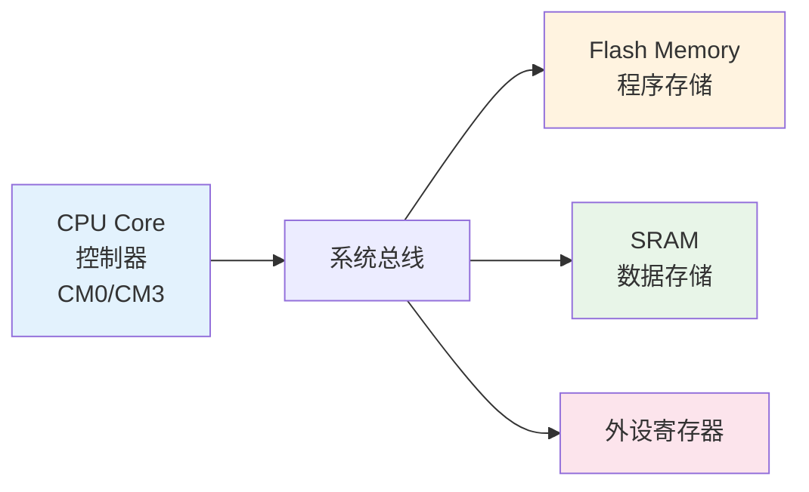
```mermaid
graph LR
    A[CPU Core<br>控制器<br>CM0/CM3] --> B[系统总线]
    B --> C[Flash Memory<br>程序存储]
    B --> D[SRAM<br>数据存储]
    B --> E[外设寄存器]
    
    style A fill:#e3f2fd
    style C fill:#fff3e0
    style D fill:#e8f5e8
    style E fill:#fce4ec
```
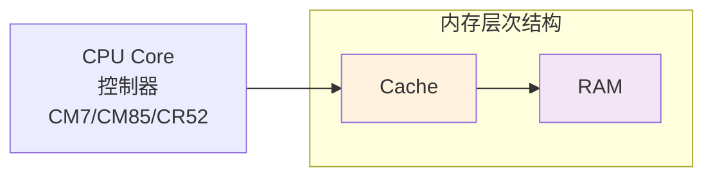
```mermaid
graph LR
    A[CPU Core<br>控制器<br>CM7/CM85/CR52] --> B[Cache]
    B --> C[RAM]
    
    subgraph "内存层次结构"
        B
        C
    end
    
    style B fill:#fff3e0
    style C fill:#f3e5f5
```
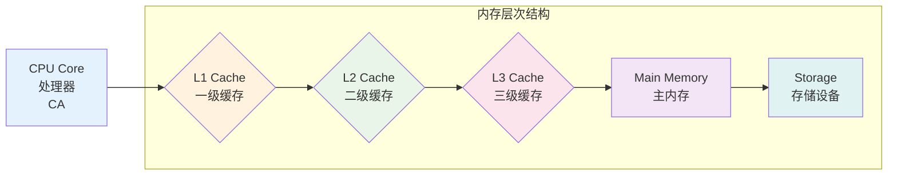
```mermaid
graph LR
    A[CPU Core<br>处理器<br>CA] --> B{L1 Cache<br>一级缓存}

    subgraph "内存层次结构"
        B --> C{L2 Cache<br>二级缓存}
        C --> D{L3 Cache<br>三级缓存}
        D --> E[Main Memory<br>主内存]
        E --> F[Storage<br>存储设备]
    end
    
    style A fill:#e3f2fd
    style B fill:#fff3e0
    style C fill:#e8f5e8
    style D fill:#fce4ec
    style E fill:#f3e5f5
    style F fill:#e0f2f1
```
ARM内核在Cache设计上有着显著差异：

- Cortex-M0/M3：通常无Cache，依赖Flash加速器
- Cortex-M4：无集成Cache，可能由芯片厂商实现
- Cortex-M33：可选Cache，通常作为外设实现
- Cortex-M7/M85：集成Cache，通过SCB寄存器管理

# 四、ARM Cortex内核Cache对比

| 特性 | Cortex-M4 | Cortex-M33 | Cortex-M7 | Cortex-M85 | Cortex-R52 | Cortex-A55 | RISC-V (MCU类) | RISC-V (MPU类) |
|------|-----------|------------|-----------|------------|------------|------------|----------------|----------------|
| **架构类型** | 专有ISA | 专有ISA | 专有ISA | 专有ISA | 专有ISA | 专有ISA | 开源ISA | 开源ISA |
| **架构版本** | Armv7-M | Armv8-M | Armv7-M | Armv8.1-M | Armv8-R | Armv8.2-A | RV32IMC / RV64IMC | RV64GC |
| **Cache 位置** | ❌ 无集成 | ❌ 无集成 | ✅ 内核集成 | ✅ 内核集成 | ✅ 内核集成 | ✅ 内核集成 | 实现特定 | ✅ 内核集成 |
| **L1 I-Cache** | ❌ 无 | ❌ 无 | ✅ 0-64KB | ✅ 0-64KB | ✅ 4-64KB | ✅ 16-64KB | ✅ 可选(4-64KB) | ✅ 通常32-64KB |
| **L1 D-Cache** | ❌ 无 | ❌ 无 | ✅ 0-64KB | ✅ 0-64KB | ✅ 4-64KB | ✅ 16-64KB | ✅ 可选(4-64KB) | ✅ 通常32-64KB |
| **L2 Cache** | ❌ 无 | ❌ 无 | ❌ 无 | ❌ 无 | ✅ 可选 | ✅ 可选 | ❌ 通常无 | ✅ 通常128KB-2MB |
| **Cache 管理** | **厂商实现 <CR>Flash-Cache** | **厂商实现 <CR>I/D-Cache** | **SCB寄存**器 | **SCB寄存器** | 复杂一致性 | **MMU管理** | CSR寄存器+定制 | MMU+CSR寄存器 |
| **一致性协议** | - | - | - | - | AMBA ACE | AMBA CHI | TileLink(常见) | TileLink/定制 |
| **管理指令** | - | - | SCB访问 | SCB访问 | CP15指令 | CP15指令 | fence/cbo指令 | fence/cbo指令 |
| **ECC 支持** | ❌ 无 | ❌ 无 | ❌ 无 | ✅ 可选 | ✅ 强制 | ✅ 可选 | 实现特定 | ✅ 通常支持 |
| **TCM 支持** | ❌ 无 | ❌ 无 | ✅ 0-16MB | ✅ 0-16MB | ✅ 紧耦合内存 | ❌ 无 | 实现特定 | ❌ 通常无 |
| **设计灵活性** | ❌ 低 | ❌ 低 | ❌ 低 | ❌ 低 | ❌ 低 | ❌ 低 | ✅ 高 | ✅ 高 |
| **典型芯片** | STM32F4 <CR>STM32G4 | STM32U/H5 <CR>RA6 | STM32H7 | RA8系列 | 工业/汽车 | 网关/HMI/AI | HPM | JH7110, K230 |


## 4.1 读操作流程

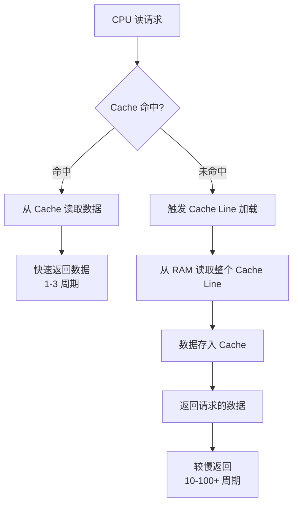
```mermaid
graph TD
    A[CPU 读请求] --> B{Cache 命中?}
    
    B -->|命中| C[从 Cache 读取数据]
    C --> D[快速返回数据<br>1-3 周期]
    
    B -->|未命中| E[触发 Cache Line 加载]
    E --> F[从 RAM 读取整个 Cache Line]
    F --> G[数据存入 Cache]
    G --> H[返回请求的数据]
    H --> I[较慢返回<br>10-100+ 周期]
```

## 4.2 写操作策略流程
写通 vs 写回策略
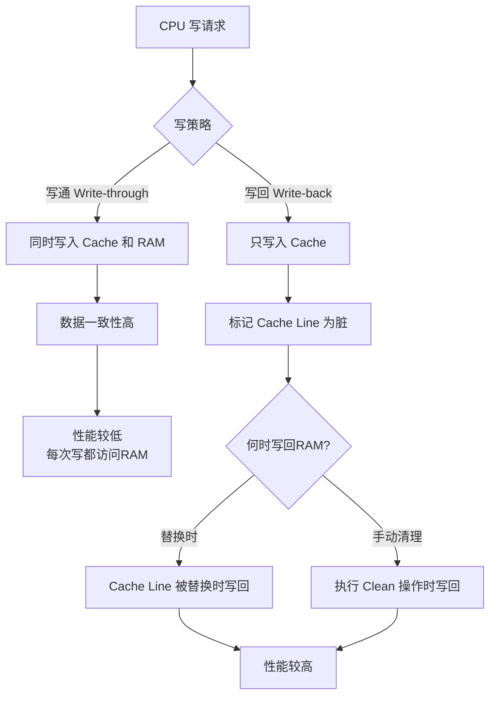
```mermaid
graph TD
    A[CPU 写请求] --> B{写策略}
    
    B -->|写通 Write-through| C[同时写入 Cache 和 RAM]
    C --> D[数据一致性高]
    D --> E[性能较低<br>每次写都访问RAM]
    
    B -->|写回 Write-back| F[只写入 Cache]
    F --> G[标记 Cache Line 为脏]
    G --> H{何时写回RAM?}
    
    H -->|替换时| I[Cache Line 被替换时写回]
    H -->|手动清理| J[执行 Clean 操作时写回]
    
    I --> K[性能较高]
    J --> K
```

## 4.3 Cache Line 操作流程
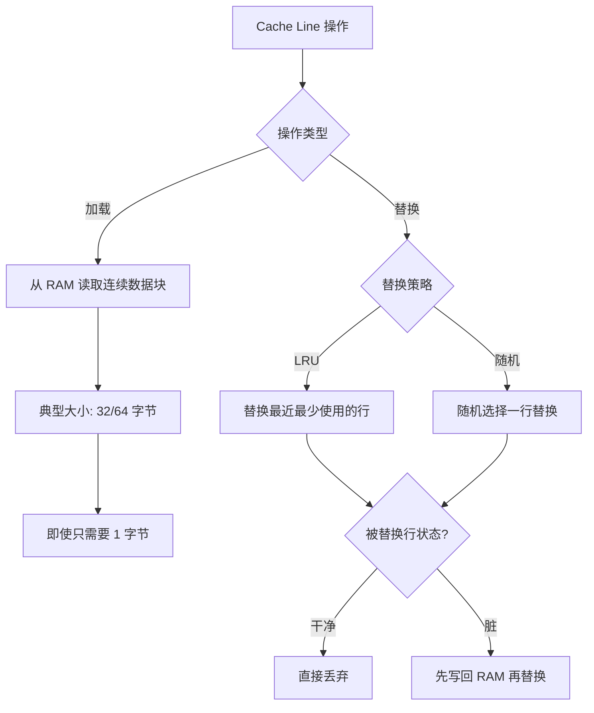
```mermaid
graph TD
    A[Cache Line 操作] --> B{操作类型}
    
    B -->|加载| C[从 RAM 读取连续数据块]
    C --> D[典型大小: 32/64 字节]
    D --> E[即使只需要 1 字节]
    
    B -->|替换| F{替换策略}
    F -->|LRU| G[替换最近最少使用的行]
    F -->|随机| H[随机选择一行替换]
    
    G --> I{被替换行状态?}
    H --> I
    
    I -->|干净| J[直接丢弃]
    I -->|脏| K[先写回 RAM 再替换]
```

## 4.4 写分配策略流程
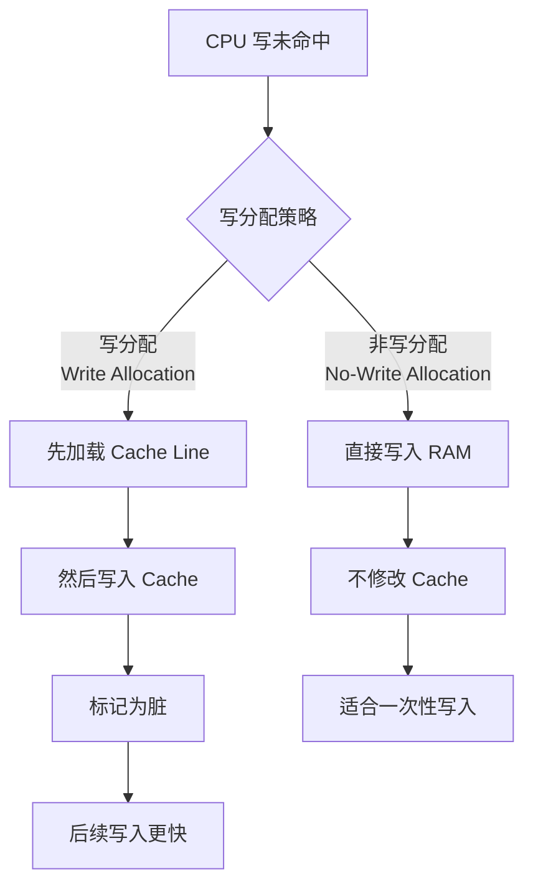
```mermaid
graph TD
    A[CPU 写未命中] --> B{写分配策略}
    
    B -->|写分配<br>Write Allocation| C[先加载 Cache Line]
    C --> D[然后写入 Cache]
    D --> E[标记为脏]
    E --> F[后续写入更快]
    
    B -->|非写分配<br>No-Write Allocation| G[直接写入 RAM]
    G --> H[不修改 Cache]
    H --> I[适合一次性写入]
```

## 4.5 Clean 操作流程
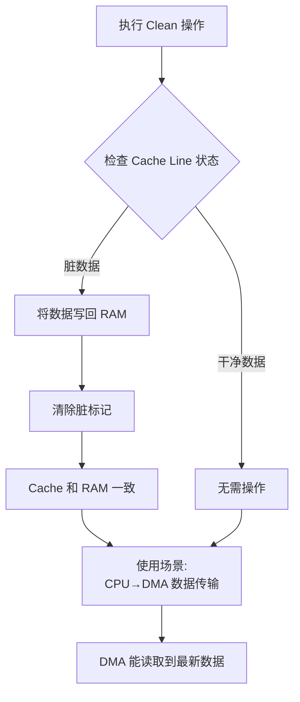
```mermaid
graph TD
    A[执行 Clean 操作] --> B{检查 Cache Line 状态}
    
    B -->|脏数据| C[将数据写回 RAM]
    C --> D[清除脏标记]
    D --> E[Cache 和 RAM 一致]
    
    B -->|干净数据| F[无需操作]
    
    E --> G[使用场景:<br>CPU→DMA 数据传输]
    F --> G
    
    G --> H[DMA 能读取到最新数据]
```


## 4.6 Invalidate 操作流程
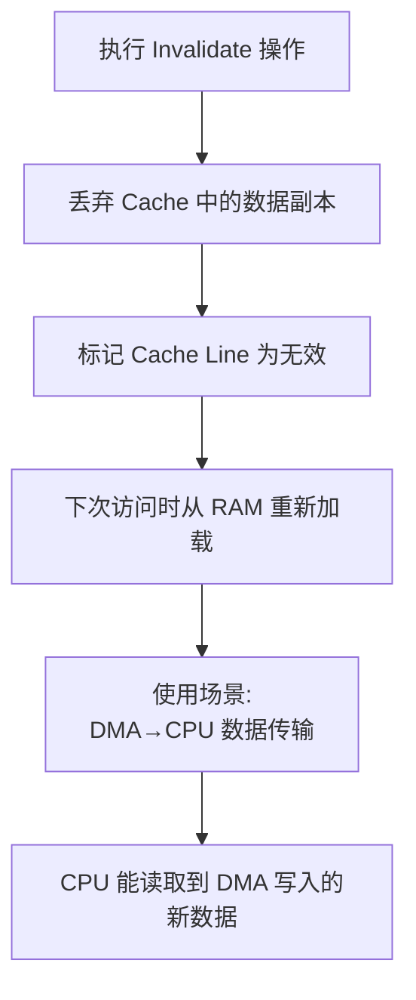
```mermaid
graph TD
    A[执行 Invalidate 操作] --> B[丢弃 Cache 中的数据副本]
    
    B --> C[标记 Cache Line 为无效]
    C --> D[下次访问时从 RAM 重新加载]
    
    D --> E[使用场景:<br>DMA→CPU 数据传输]
    E --> F[CPU 能读取到 DMA 写入的新数据]
```

## 4.7 完整的数据一致性维护流程
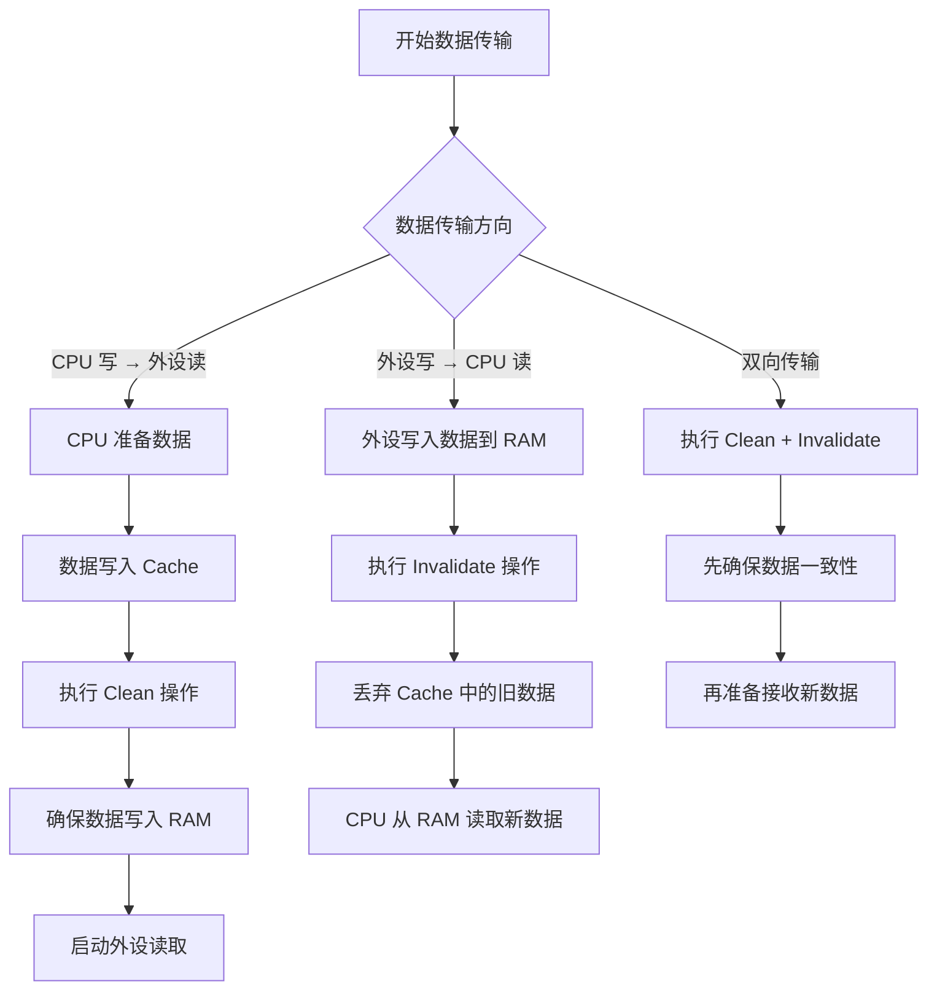
```mermaid
graph TD
    A[开始数据传输] --> B{数据传输方向}
    
    B -->|CPU 写 → 外设读| C[CPU 准备数据]
    C --> D[数据写入 Cache]
    D --> E[执行 Clean 操作]
    E --> F[确保数据写入 RAM]
    F --> G[启动外设读取]
    
    B -->|外设写 → CPU 读| H[外设写入数据到 RAM]
    H --> I[执行 Invalidate 操作]
    I --> J[丢弃 Cache 中的旧数据]
    J --> K[CPU 从 RAM 读取新数据]
    
    B -->|双向传输| L[执行 Clean + Invalidate]
    L --> M[先确保数据一致性]
    M --> N[再准备接收新数据]

```

## 4.8 实际应用场景示例
DMA 传输场景
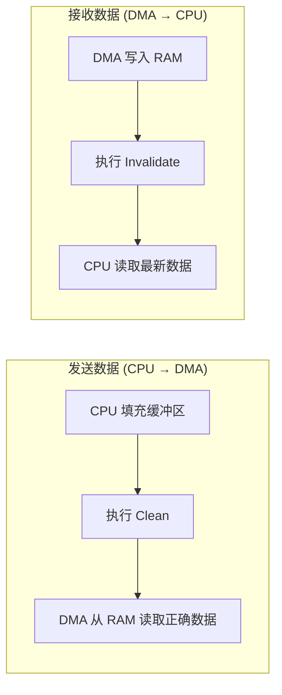
```mermaid
graph LR
    subgraph "发送数据 (CPU → DMA)"
        A[CPU 填充缓冲区] --> B[执行 Clean]
        B --> C[DMA 从 RAM 读取正确数据]
    end
    
    subgraph "接收数据 (DMA → CPU)"
        D[DMA 写入 RAM] --> E[执行 Invalidate]
        E --> F[CPU 读取最新数据]
    end
```

## 4.9 实际代码

- CM内核的SCB接口

| 场景 | 操作 | 目的 | 代码示例 |
|------|------|------|----------|
| **CPU → 外设** | Clean | 确保外设看到最新数据 | `SCB_CleanDCache_by_Addr()` |
| **外设 → CPU** | Invalidate | 确保 CPU 看到外设更新 | `SCB_InvalidateDCache_by_Addr()` |
| **双向传输** | Clean+Invalidate | 完整的所有权转移 | `SCB_CleanInvalidateDCache_by_Addr()` |
| **代码更新** | Invalidate ICache | 确保执行最新指令 | `SCB_InvalidateICache()` |
| **多核数据同步** | 内存屏障 | 保证访问顺序 | `__DSB(), __DMB(), __ISB()` |

- Linux内核中的Cache管理API
```
// 常用Cache操作函数
void dmac_clean_range(const void *start, const void *end);
void dmac_inv_range(const void *start, const void *end);
void dmac_flush_range(const void *start, const void *end);

// 内存屏障
dmb(ish);    // 数据内存屏障
dsb(sy);     // 数据同步屏障
isb();       // 指令同步屏障

// 高级API
dma_sync_single_for_device()   // DMA到设备前
dma_sync_single_for_cpu()      // DMA后CPU访问前
```

## 4.10 总结

| 类别 | 术语 | 英文 | 解释 | 应用场景 |
|------|------|------|------|----------|
| **读操作** | 读命中 | Read Hit | CPU 需要的数据在 Cache 中 | 快速数据访问，1-3 周期 |
| **读操作** | 读未命中 | Read Miss | CPU 需要的数据不在 Cache 中 | 触发缓存行填充 |
| **读操作** | 缓存行填充 | Cache Line Fill | 从内存加载整个 Cache Line | 读未命中时的处理 |
| **写操作** | 写通 | Write-through | 同时写入 Cache 和内存 | 需要强一致性的场景 |
| **写操作** | 写回 | Write-back | 只写入 Cache，延迟写回内存 | 高性能写入场景 |
| **写操作** | 脏数据 | Dirty Data | 已修改但未写回内存的数据 | Write-back 策略特有 |
| **分配策略** | 写分配 | Write-allocate | 写未命中时先加载数据到 Cache | 具有局部性的数据 |
| **分配策略** | 非写分配 | No-write-allocate | 写未命中时直接写入内存 | 一次性写入数据 |
| **维护操作** | 清理 | Clean | 将脏数据写回内存 | CPU→DMA 数据传输 |
| **维护操作** | 无效化 | Invalidate | 丢弃 Cache 中的数据 | DMA→CPU 数据传输 |
| **维护操作** | 清理+无效化 | Clean+Invalidate | 先写回再丢弃 | 双向数据交换 |

# 五、常见芯片架构
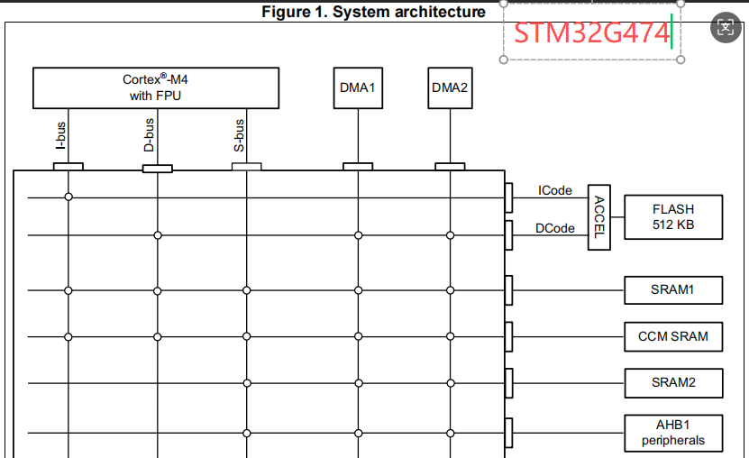
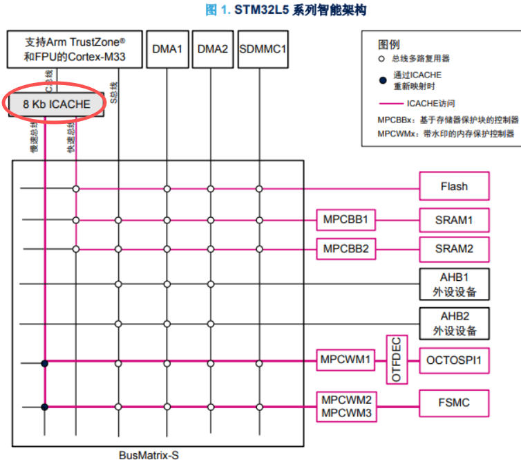
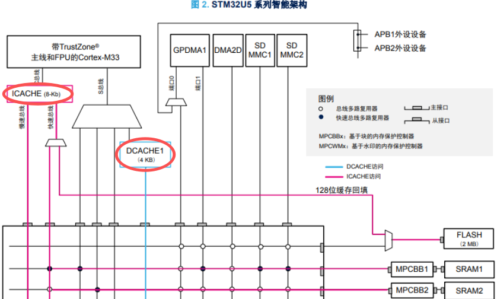
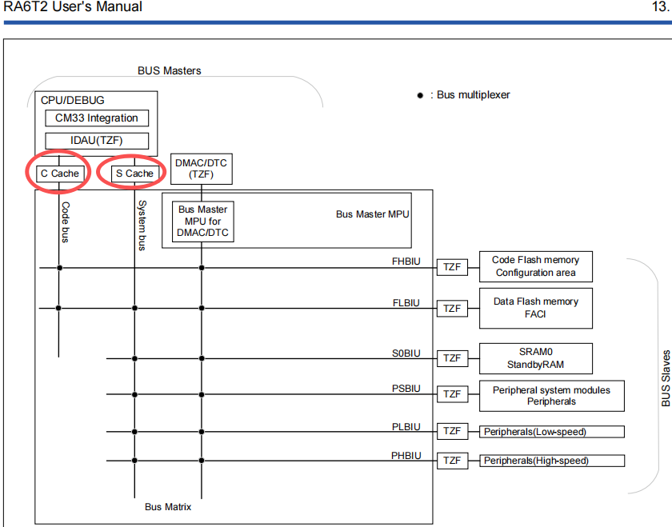
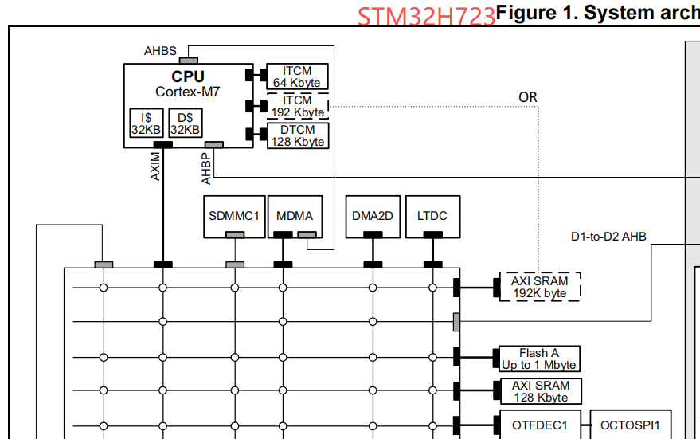
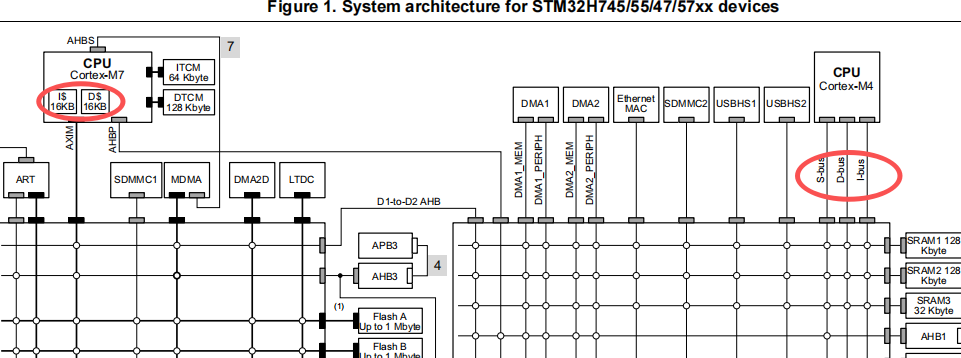
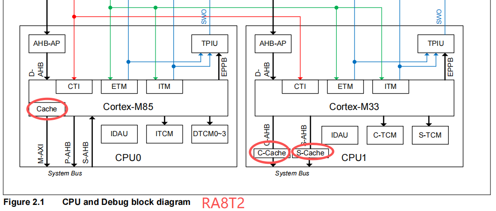
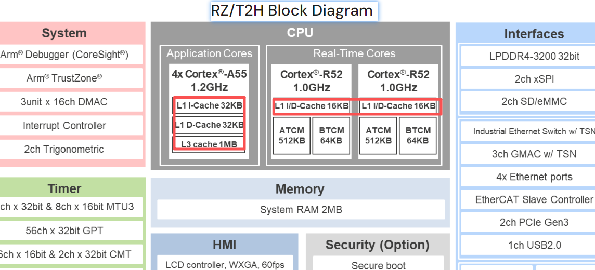
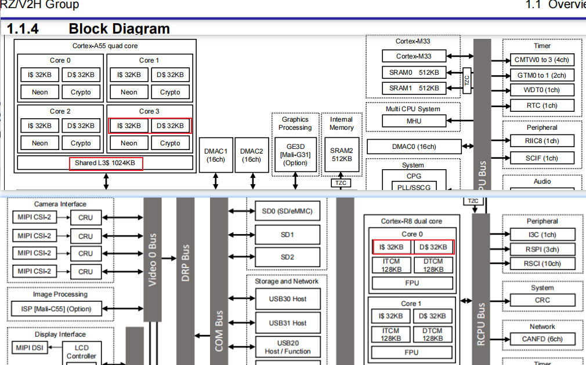
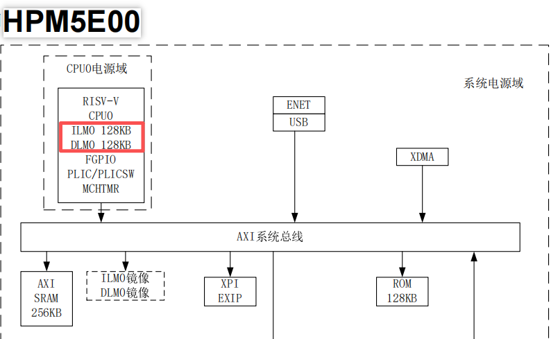

# 六、总结
- **现代CPU的速度远远超过内存访问速度**，需要Cache提升性能
- CM0 CM3通常没有Cache；CM44 CM33可能有FlashCache和外设Cache；CM7 CM85等Cache在内核中，通过SCB操作；CA等内核有多级Cache，通过Linux内核API操作。
- 当数据在CPU和其他主控（DMA、其他CPU核心、外设）之间**共享**时，就需要考虑Cache一致性问题，通常办法如下：
    - 1.使用SCB API、内核API Clean/Invalidate处理
    - 2.在CM7 CM85 CR52等具备多块内存的芯片上，使用非共享内存解决一致性问题
    - 3.Cache Though写通可以简单的解决一致性问题，但会降低性能