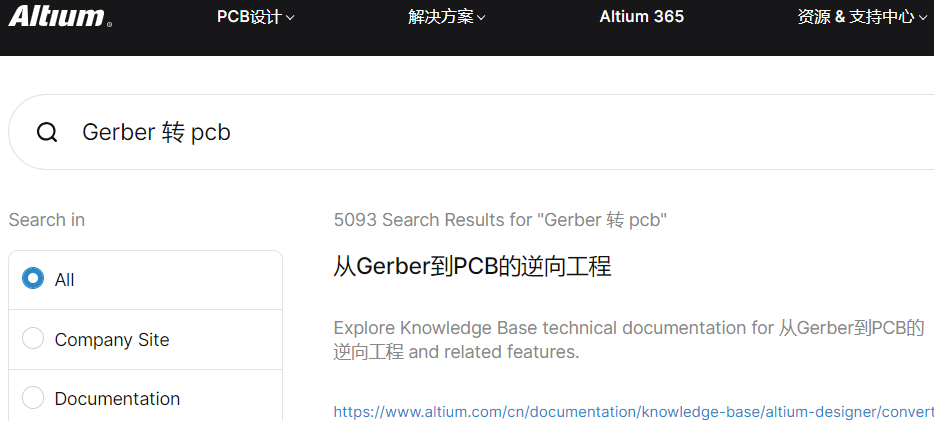
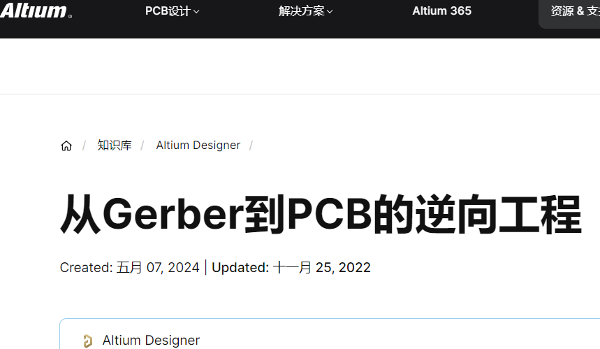
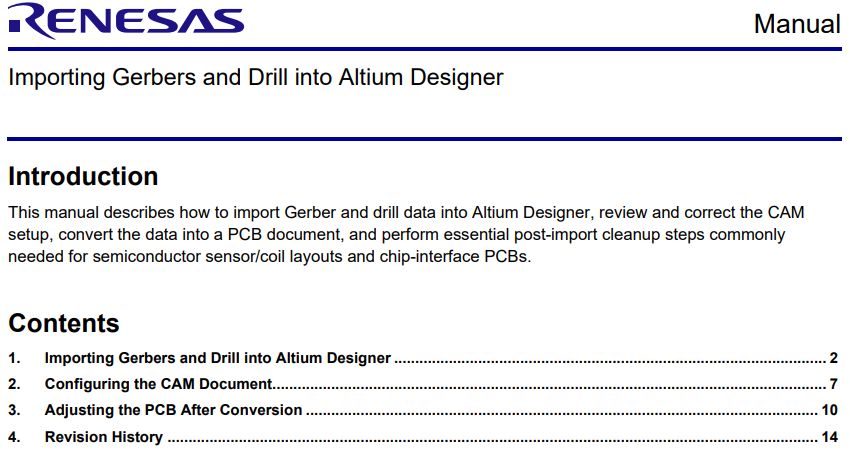
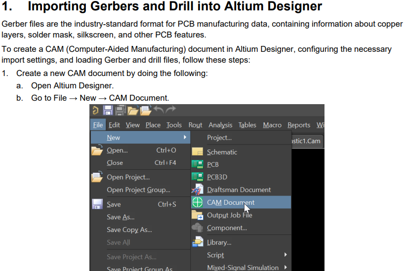
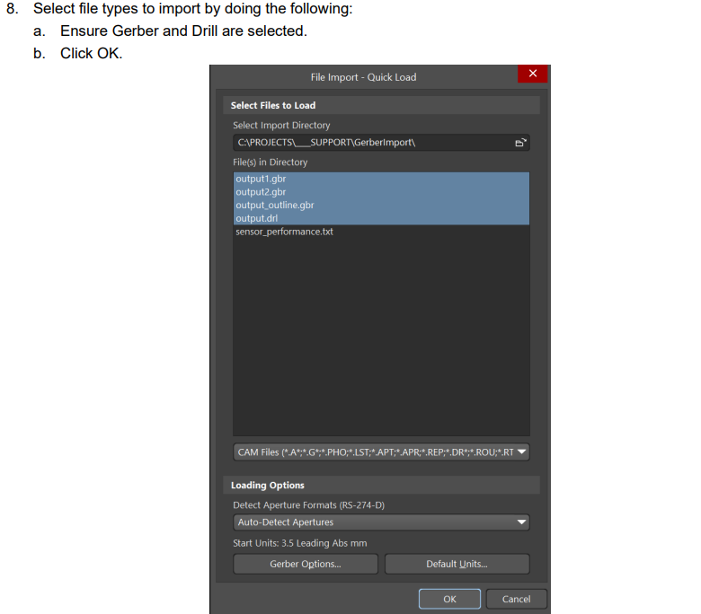
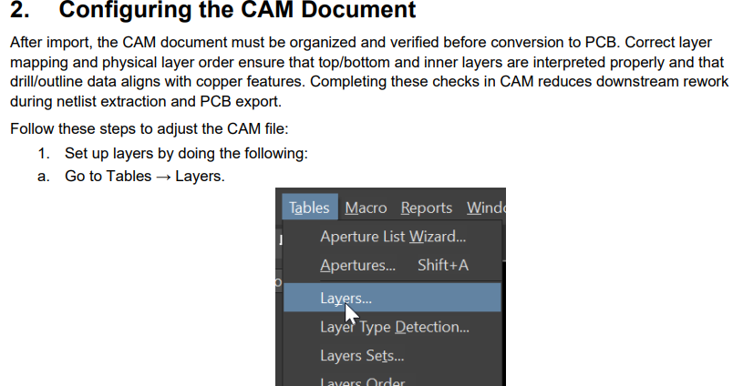
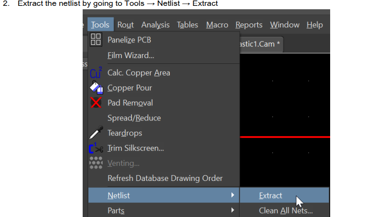
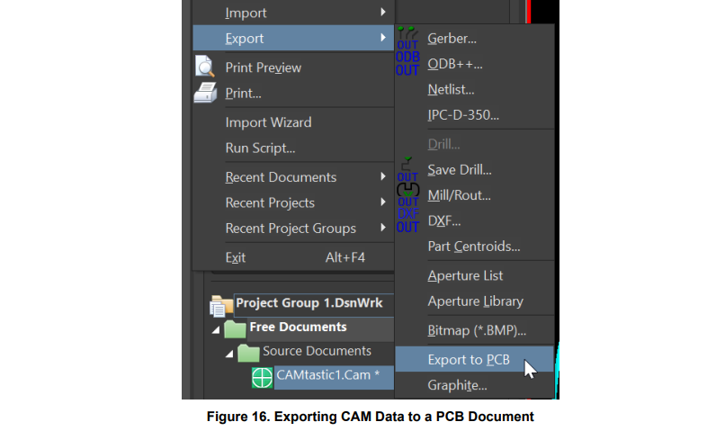
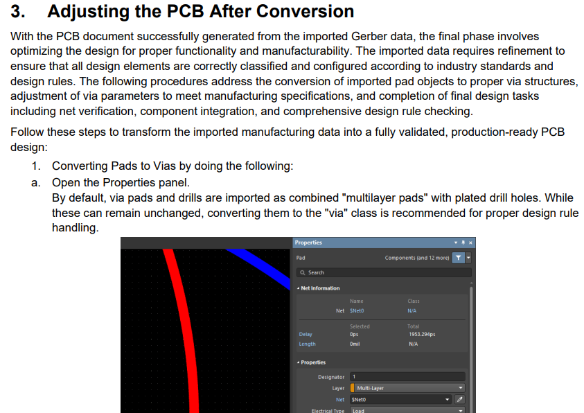
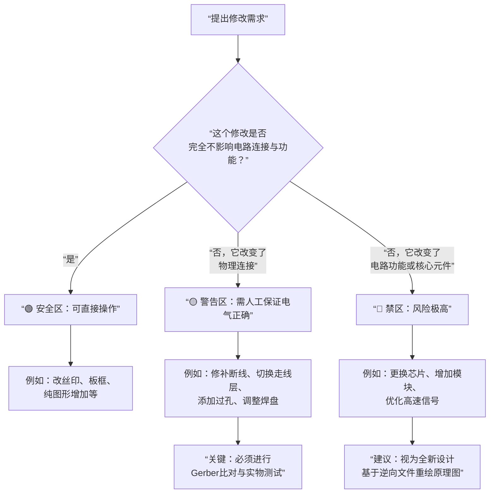

嵌入式科普(44)gerber转pcb官方介绍
===

[toc]

# 一、概述
- gerber到底能不能抓pcb？
- pcb工程和pcb文件有什么差异？
- 瑞萨（Altium）官方的gerber转pcb文档

# 二、资料来源
- altium官网：
https://www.altium.com/cn/search?s=Gerber+%E8%BD%AC+pcb\&radio-nn=all
https://www.altium.com/cn/documentation/knowledge-base/altium-designer/convert-gerber-odb-fabrication-data-back-to-pcb

- 瑞萨官网：
https://www.renesas.cn/zh/search?keywords=altium
https://www.renesas.cn/zh/document/tra/import-sensing-element-altium?queryID=8955b44629a6bc94a812b0530d9c8ffb

# 三、瑞萨(Altium)官网的gerber转pcb资料

# 四、pcb和gerber正反向对比
| 对比维度 | 正向输出 (设计 → 制造) | 逆向重建 (制造 → 近似设计) |
| :---: | :---: | :---: |
| **起点** | 完整、智能的 PCB 工程文件 | 离散的制造图纸（Gerber + Drill） |
| **终点** | 标准化的制造文件集 | 一个新的、不完整的 PCB 文件 |
| **信息完整性** | 主动丢弃设计智能（逻辑、语义、规则） | 永久缺失设计智能，只能猜测性补全 |
| **过程本质** | 有损转换 | 推测性重建（依赖人工解读） |
| **文件性质** | 制造指令 | 设计草稿（需大量修复才能用于新设计） |
| **可编辑性** | 不可编辑（仅图形） | **可进行有限的图形和物理结构编辑** |

# 五、总结
- gerber可以转pcb，但会损失一些功能，可以进行有限的修改
- 所谓“逆向”工程能支持更多的修改吗？