嵌入式科普(46)LVGL Pro与瑞萨e2studio集成免费商用指南
===
[toc]

# 一、目的/概述
[瑞萨与LVGL合作，为瑞萨客户**免费提供LVGL Pro商用授权**](https://mp.weixin.qq.com/s/7owRqseJF4a80du1PTItqQ)。
本文旨在详细介绍如何：

1.  什么是LVGL Pro，瑞萨e2如何集成？如何免费？
2.  下载并安装LVGL Pro编辑器
3.  将LVGL Pro插件集成到e² studio
4.  配置Windows下必要的WSL和Podman环境
5.  创建第一个LVGL Pro工程，并实现实时预览

# 二、什么是LVGL Pro  
LVGL Pro是一个功能完备的工具包，可高效地用于构建、测试、共享和发布嵌入式用户界面。

它由4种主要工具组成：

- 这是一款功能强大的**XML编辑器**，具备自动完成功能，可用于描述UI组件、界面、测试用例、动画效果、数据绑定等内容。在输入XML代码时，编辑器会实时显示精确到像素的预览效果。此外，该编辑器还能生成C代码，并能重新编译预览结果以运行自定义C代码。在这些页面中，您可以了解更多关于XML以及编辑器的信息。

- **Online Share**是Editor的在线版本，它可以从GitHub仓库加载XML文件，从而无需搭建任何开发环境即可轻松共享开发的用户界面。欲了解更多信息，请点击此处。

- **CLI（命令行界面）**是一种工具，能够验证XML文件并从中生成C代码，或在CI/CD环境中运行UI测试。欲了解更多信息，请点击此处。

- 这是一款**Figma插件**，可帮助您从Figma元素中提取样式属性，并将其同步到编辑器或命令行界面中。欲了解更多信息，请点击此处。


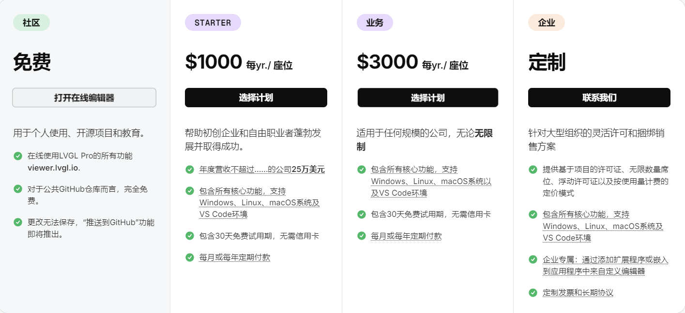

# 三、资料来源
*   LVGL官方文档：[LVGL 9.6 documentation](https://docs.lvgl.io/master/index.html)
*   LVGL Pro安装指南：[LVGL Pro and XML](https://docs.lvgl.io/master/xml/index.html)
*   瑞萨集成LVGL Pro：[Renesas - LVGL 9.6 documentation](https://docs.lvgl.io/master/xml/integration/renesas-dev-tools.html#)
*   LVGL 下载：[Download LVGL Pro](https://pro.lvgl.io/#download)
*   [瑞萨携手LVGL PRO，打造嵌入式图形界面开发一体化解决方案](https://mp.weixin.qq.com/s/7owRqseJF4a80du1PTItqQ)
*   [Renesas Ready Ecosystem Partner Solution LVGL Pro Embedded UI Editor](https://www.renesas.cn/zh/products/microcontrollers-microprocessors/ra-cortex-m-mcus/ra-partners/lvgl-pro)

# 四、环境要求
*   **硬件**：瑞萨RA系列开发板（如RA8P1）
*   **操作系统**：Windows 10/11 (必须)
*   **IDE**：Renesas e² studio (版本 2025-07或更高)
*   **FSP版本**：v6.0或更高（需包含LVGL组件）
*   **其他软件**：
    *   Windows Subsystem for Linux (WSL)
    *   Podman (由LVGL Editor自动管理)
    *   LVGL_Pro_Editor-1.1.1-windows
    *   LVGL_Pro_e2.studio_plugin.v1.0.1
    *   lvglio_emscripten-sdl2_0.2.0-amd64


# 五、下载与安装步骤
## 5.1 下载LVGL Pro编辑器
1.  访问 [pro.lvgl.io/#download](https://pro.lvgl.io/#download)
2.  根据操作系统下载对应的 **Editor Desktop App**（例如Windows版 `lvgl-editor-*.exe`）
3.  双击安装，按提示完成

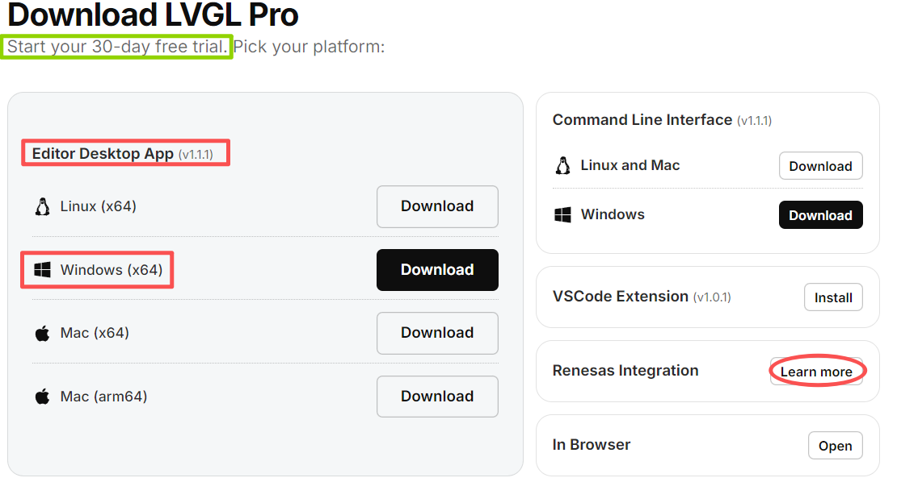
*图：LVGL官网下载页面，红框内为Renesas Integration插件和Editor Desktop App*


## 5.2 安装e² studio插件

1.  在上述下载页面，找到 **Renesas Integration** 区域，下载插件压缩包（`LVGL_Pro_e2.studio_plugin.v*.zip`）
2.  **务必解压**到一个单独的文件夹（例如 `D:\lvgl_plugin`），确保文件夹内包含 `features` 和 `plugins` 子目录
3.  打开e² studio，点击 `Help` → `Install New Software...`
4.  点击 `Add...` → `Local...`，选择刚才解压的文件夹，命名后点击 `Add`
5.  勾选出现的插件项，按提示完成安装并**重启IDE**
6.  重启后，工具栏应出现LVGL图标

- [LVGL Pro and XML-Integration-Renesas](https://docs.lvgl.io/master/xml/integration/renesas-dev-tools.html)
- [LVGL_Pro_e2.studio_plugin](https://github.com/lvgl/lvgl_editor/releases/download/v1.1.0/LVGL_Pro_e2.studio_plugin.v1.0.1.zip)

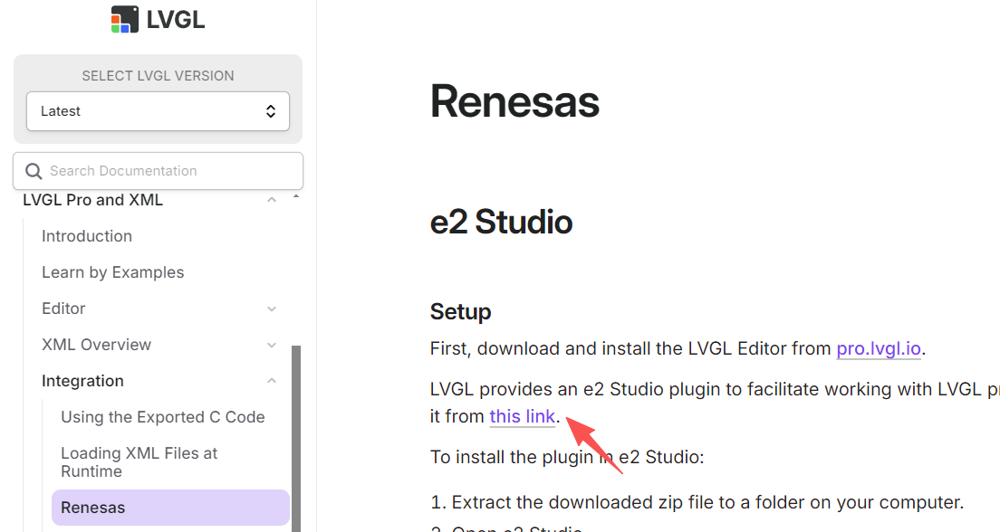
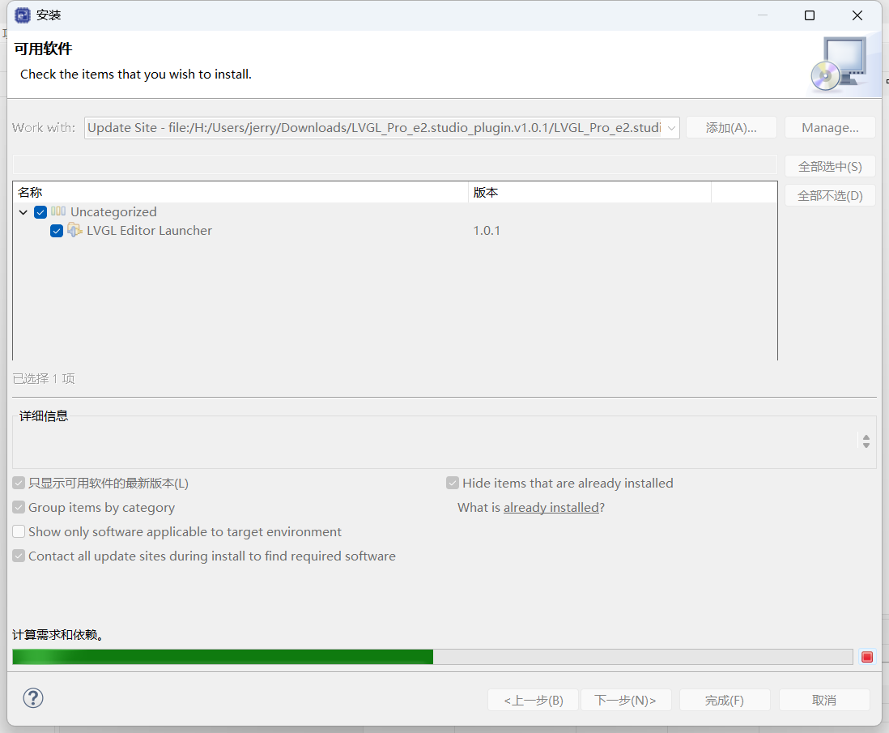


# 六、WSL与容器环境配置
LVGL Pro的预览功能依赖Linux容器环境，Windows下必须配置WSL和Podman。

## 6.1 安装WSL
1.  以**管理员身份**打开PowerShell
2.  执行命令：`wsl --install`，安装默认Ubuntu发行版
3.  安装后**重启电脑**
4.  验证：`wsl -l -v`，应看到Ubuntu处于Running状态

**注意：盗版Windows可能无法安装WSL，建议下载安装微软win11 iso**

## 6.2 安装Podman（自动化）
1.  **无需手动安装**。首次在e² studio中点击LVGL图标启动编辑器，并尝试预览时，编辑器会自动检测并创建名为 `podman-machine-default` 的虚拟机
2.  此过程可能需要几分钟，请耐心等待
3.  添加LVGL Editor安装目录下面podman到环境变量

## 6.3 配置网络加速
如果预览时因网络问题拉取镜像失败（`i/o timeout`），需在Podman虚拟机内配置国内镜像加速器：
1. 在PowerShell中进入虚拟机：`podman machine ssh`
2. 编辑配置文件：`sudo vi /etc/containers/registries.conf`
3. 添加以下内容（使用`docker.1ms.run`作为示例加速源）

## 6.4 podman导入images
先下载lvglio_emscripten-sdl2_0.2.0-amd64，然后导入podman
```
podman load -i lvglio_emscripten-sdl2_0.2.0-amd64.tar
```

# 七、创建第一个LVGL工程（RA8P1）
## 7.1 新建瑞萨工程
e² studio中新建Renesas RA C/C++工程，选择芯片型号（如R7FA8P1）

在FSP配置中，确保已添加LVGL组件

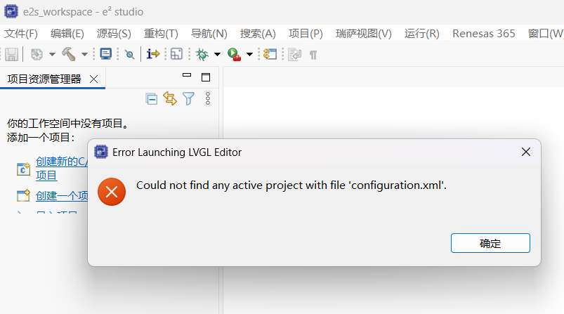
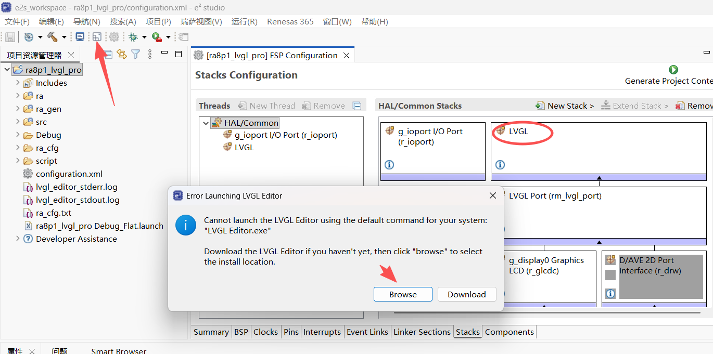

## 7.2 启动LVGL Pro编辑器
点击e² studio工具栏的LVGL图标

首次启动需指定LVGL Editor可执行文件路径（lvgl-editor.exe）

编辑器将自动在工程根目录创建 ui 文件夹

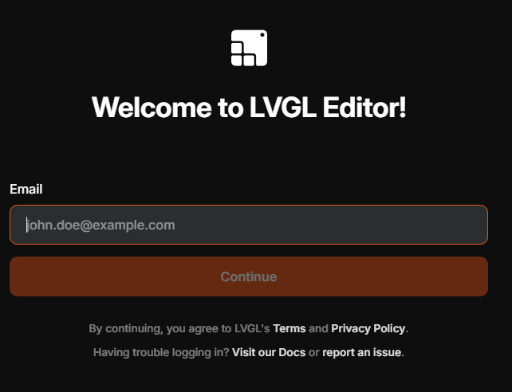
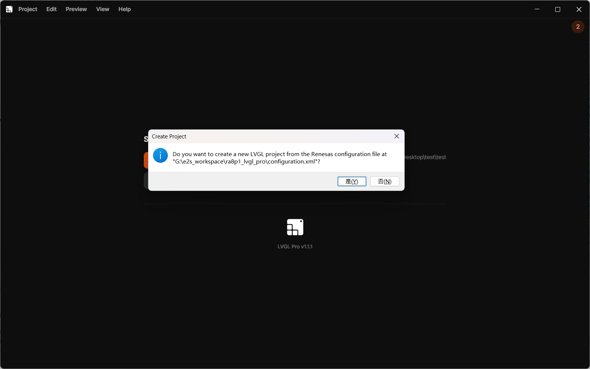
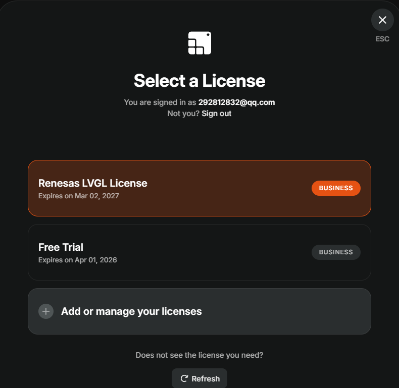
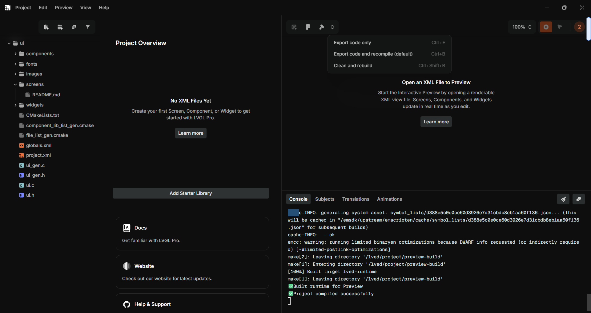

## 7.3 创建并预览Hello World
在编辑器左侧文件树中，右键 screens 文件夹 → Create new screen，命名为 screen_hello_world.xml

```
<screen>
    <styles>
        <style name="style_main" bg_color="0x00688a" />
    </styles>
    <view>
        <style name="style_main" />
        <lv_button align="center" style_bg_color="0x111">
            <lv_label text="Hello world" />
        </lv_button>
    </view>
</screen>
```
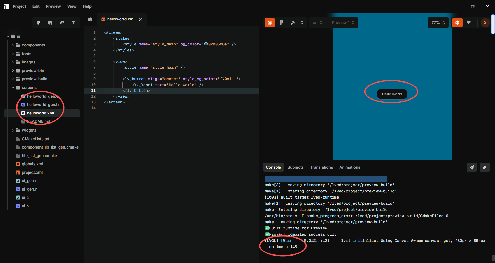


# 八、总结

- LVGL Pro为瑞萨用户提供了免费商用的可视化GUI开发途径，显著提升开发效率。

- 集成的关键在于正确安装e² studio插件、配置WSL和Podman环境。

- 编辑器与IDE的深度集成（自动创建ui文件夹、代码自动同步）简化了工作流程。


