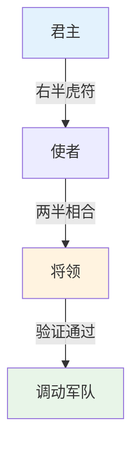
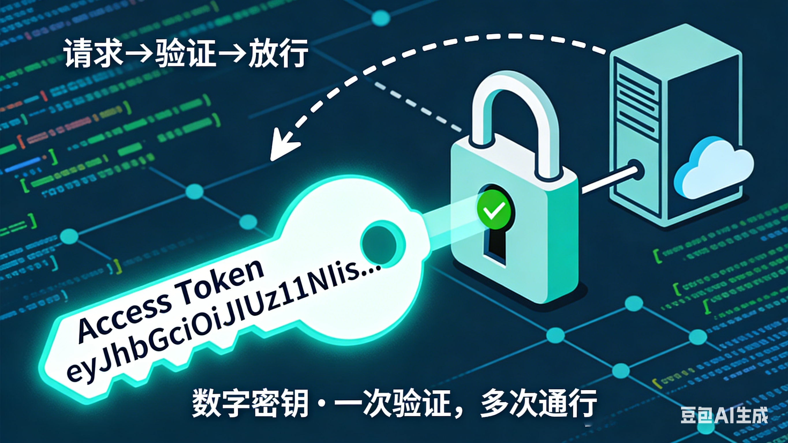
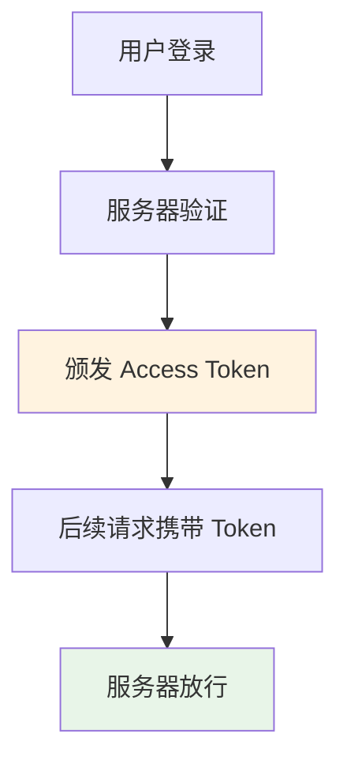
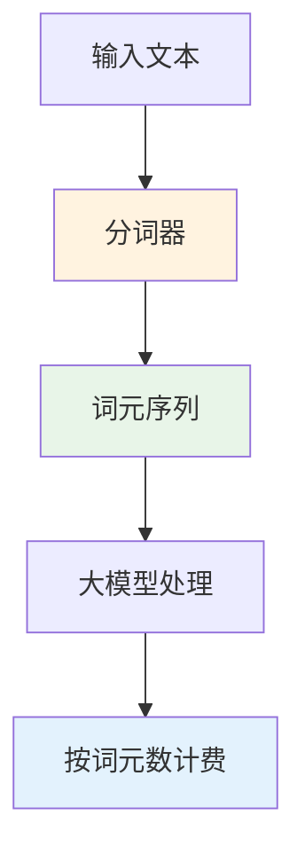

嵌入式科普(47)一文理解 Token 的前世今生：从虎符到词元
===
[toc]

---
> 同一个英文单词，为何在计算机里叫“令牌”，在 AI 里叫“词元”？  
> 本文带你穿越千年，看懂 Token 的演变逻辑。
---

# 一、概述

- 简介 Token 在三个时代的核心含义：古代信物、计算机令牌、AI 词元  
- 对比不同时期的中文翻译及其背后的技术范式  
- 本文重点是对 Token 概念演变的理解，以及翻译如何反映本质变化

# 二、资料来源

- 历史文献：《史记·魏公子列传》（虎符典故）  
- 计算机科学：RFC 6749（OAuth 2.0 令牌规范）  
- AI 技术：OpenAI API 文档、NLP 分词原理  
- 中文译名考证：技术社区讨论及主流产品翻译实践

# 三、为什么要追溯 Token 的含义

在技术领域，同一个英文术语在不同场景下可能承担截然不同的角色。如果沿用旧译名，容易造成误解：

- 在安全场景中，Token 是“钥匙”，用于鉴权；  
- 在 AI 场景中，Token 是“砖块”，用于计量。

若不区分，开发者可能会困惑：“为什么我的访问令牌（Access Token）要按个数收费？”  
明确 Token 在各阶段的本质，有助于准确理解技术文档和架构设计。

# 四、Token 的千年演变：三个关键时代

## 4.1 古代：Token = 虎符 / 信物

**核心含义**：实物凭证，验证身份与权限。

古代 Token 表现为实物信物。中国最典型的例子是 **虎符**。虎符分为两半，皇帝持右半，将领持左半；调兵时必须左右相合，方可发令。成语“符合”即源于此。

在西方，古希腊的 **tessera** 陶片也扮演类似角色——士兵凭它进入营地，观众凭它入场观看角斗。

**中文翻译**：在历史小说或译作中，这类信物常被直译为 **“令牌”** 或 **“信物”**。例如《冰与火之歌》中文版中，“信使令牌”就是传递命令的凭证。

## 4.2 计算机时代：Token = 访问令牌
**核心含义**：数字密钥，授权与认证。

进入计算机领域，Token 被借用到网络安全中。最典型的是 **Access Token（访问令牌）**。

当你登录微信、支付宝或任何网站时，服务器会返回一串字符。后续每次请求带上它，服务器就能识别你的身份，无需重复输入密码。

这个阶段的 Token 本质是一把“钥匙”，翻译为 **“令牌”** 非常贴切——它既继承了古代信物的认证功能，又数字化了。

## 4.3 AI 时代：Token = 词元
**核心含义：最小语义单元，计量单位。**

大模型出现后，Token 的含义发生了根本转变。模型不认识文字，需要将自然语言切分成它能处理的最小单元——这个单元就叫 Token。

“我爱你”可能被切成 3 个 Token（我、爱、你）。

“ChatGPT”可能被切成 1 个 Token。

一个汉字可能占 1 个或 2 个 Token，取决于分词算法。

它既不是严格意义上的“字”，也不是“词”，而是**最小的语义承载单元**。技术界将其译为 **“词元”**——“词”指向语言，“元”指基本元素。

此时的 Token 不再是钥匙，而是**计量单位**：模型的收费按词元数算，能力上限按上下文词元长度衡量。

# 五、Token 演变对比表

|时代	|典型场景	|核心含义	|中文译名	|本质作用|
|:-:|:-:|:-:|:-:|:-:|
|**古代**	|虎符、tessera	|实物信物	|令牌 / 信物	|验证身份与权限|
|**计算机**	|Access Token	|数字密钥	|访问令牌	|认证与授权|
|**AI**	|大模型分词	|语义单元	|词元	|量化输入与输出|

# 六、一个中文词语的类比：“经济”的变迁
中文里也有一个词，含义随时代发生了巨大变化——**“经济”**。

- **古代**：“经济”意为“经世济民”，指治国安邦的才能。如《红楼梦》中“学问经济”，即指治世之能。

- **近现代**：被借用来翻译西方的 economy，变成了今天我们说的“经济活动、GDP、市场经济”。

同一个词，从“治国抱负”变成了“资源配置”，跨度之大，不亚于 Token 从“虎符”到“词元”的演变。

# 七、总结
|类别	|时代	|关键词	|翻译	|应用场景|
|:-:|:-:|:-:|:-:|:-:|
|信物时代	|古代	|虎符、tessera|	令牌	|军事调令、入场凭证|
|认证时代	|计算机	|Access Token	|访问令牌	|登录、API 调用|
|量化时代	|AI	|词元	|词元	|模型计费、上下文长度|

- **现代 CPU 的速度远远超过内存访问速度**，所以需要 Cache 来提升性能——这个逻辑与 Token 的演变无关，但说明技术术语总是随需求而变。

- Token 的每一次含义转变，都对应一次技术范式的跃迁：从物理信物到数字钥匙，再到语义砖块。

- 翻译也随之调整：从“令牌”到“词元”，精准反映了本质变化。

当你在文档中看到“上下文 128K 词元”时，你不仅知道这是 128K 个最小语义单元，更知道这个词背后站着虎符、访问令牌和大模型的分词器。