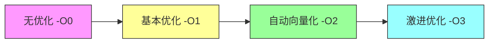

嵌入式科普(48)嵌入式SIMD技术介绍：SIMD、NEON、Helium
===
[toc]

# 一、概述

1、在嵌入式领域，为了提升数据处理性能，**SIMD**（Single Instruction Multiple Data）技术被广泛应用。

2、本文介绍SIMD、NEON、Helium等技术的概念和联系，为后续NEON性能测试报告提供基础知识。

# 二、SIMD技术

## 2.1 传统标量计算 vs SIMD向量计算

### 传统标量计算（Scalar）

CPU一次只处理**一个**数据：

```
数据：     a[0]  a[1]  a[2]  a[3]  a[4]  a[5]  a[6]  a[7]
            ↓     ↓     ↓     ↓     ↓     ↓     ↓     ↓
操作：    [+b[0] [+b[1] [+b[2] [+b[3] [+b[4] [+b[5] [+b[6] [+b[7]
            ↓     ↓     ↓     ↓     ↓     ↓     ↓     ↓
结果：    c[0]  c[1]  c[2]  c[3]  c[4]  c[5]  c[6]  c[7]

需要8条指令，CPU串行执行8次
```

### SIMD向量计算（Vector）

CPU一次处理**多个**数据：

```
数据：  a[0]a[1]a[2]a[3]  a[4]a[5]a[6]a[7]
        └──────────┘        └──────────┘
              ↓                  ↓
         [+b[0..3]           [+b[4..7]
              ↓                  ↓
        c[0]c[1]c[2]c[3]    c[4]c[5]c[6]c[7]

只需要2条指令，理论性能提升4倍
```

### 对比图

**传统标量计算（8次循环）：**
```
┌─────────────────────────────────────────────────┐
│                 CPU 执行单元                     │
├─────────────────────────────────────────────────┤
│  循环1: 加载a[0] → 加法 → 存储c[0]               │
│  循环2: 加载a[1] → 加法 → 存储c[1]               │
│  循环3: 加载a[2] → 加法 → 存储c[2]               │
│  ...                                            │
│  循环8: 加载a[7] → 加法 → 存储c[7]               │
├─────────────────────────────────────────────────┤
│  总计：8次循环，8次加载，8次加法，8次存储          │
└─────────────────────────────────────────────────┘
```

**SIMD向量计算（1次循环）：**
```
┌─────────────────────────────────────────────────┐
│              128位 NEON 寄存器                   │
├─────────────────────────────────────────────────┤
│  ┌────────────────────────────────────────────┐  │
│  │D0: a[0]a[1]a[2]a[3] │D1: b[0]b[1]b[2]b[3] │  │
│  └────────────────────────────────────────────┘  │
│                      ↓                          │
│            [vaddq_s32 向量加法]                  │
│                      ↓                          │
│  ┌────────────────────────────────────────────┐  │
│  │    c[0]c[1]c[2]c[3] (结果)                │  │
│  └────────────────────────────────────────────┘  │
├─────────────────────────────────────────────────┤
│  总计：1次循环，1次加载，1次加法，1次存储         │
└─────────────────────────────────────────────────┘
```

**执行对比：**
```
传统:  [■][■][■][■][■][■][■][■] → 8个时钟周期
       ═════════════════════��═
       
SIMD:  [■■■■] → 2个时钟周期
       ══════
```

## 2.2 性能对比

| 指标 | 传统标量 | SIMD | 提升 |
|------|----------|------|------|
| **指令数** | 8条 | 2条 | **4x** |
| **循环次数** | 8次 | 1次 | **8x** |
| **带宽需求** | 高 | 低 | **4x** |
| **功耗** | 高 | 低 | ↓ |

## 2.3 SIMD的优势

| 优势 | 说明 |
|------|------|
| **并行处理** | 一条指令处理多个数据 |
| **提升性能** | 理论上有N倍性能提升 |
| **降低功耗** | 减少指令decode开销 |
| **节省带宽** | 减少内存访问次数 |

## 2.4 常见的SIMD指令集

| 指令集 | 架构 | 典型处理器 |
|--------|------|----------|
| **NEON** | ARM | Cortex-A/R系列 |
| **Helium** | ARM | Cortex-M55/M85 |
| **SSE/AVX** | x86 | Intel/AMD |
| **AltiVec** | PowerPC | NXP T系列 |
| **DSP** | 多家 | TI C6000等 |

# 三、ARM NEON

## 3.1 NEON简介

**NEON**是ARM的SIMD指令集扩展，主要用于：
- **Cortex-A系列**：手机、平板、嵌入式
- **Cortex-R系列**：实时控制器（如RZN2L）

## 3.2 NEON特性

| 特性 | 说明 |
|------|------|
| **128位向量寄存器** | 16个（D0-D15）或32个 |
| **数据类型** | 8/16/32/64位整数、单精度浮点 |
| **指令数量** | 约200条 |
| **并行度** | 最多4×32位或8×16位 |

## 3.3 NEON寄存器

```
NEON寄存器：
  D0-D15 (64位) 或
  Q0-Q7 (128位)

示例：
  D0 = [byte0 | byte1 | ... | byte7]
  Q0 = [word0 | word1 | word2 | word3]  (128位)
```

## 3.4 NEON代码示例

```c
#include <arm_neon.h>

// C代码（标量）
void add_array_c(int32_t *c, const int32_t *a, const int32_t *b, int n) {
    for (int i = 0; i < n; i++) {
        c[i] = a[i] + b[i];
    }
}

// NEON代码（向量）
void add_array_neon(int32_t *c, const int32_t *a, const int32_t *b, int n) {
    int i;
    for (i = 0; i <= n - 4; i += 4) {
        int32x4_t va = vld1q_s32(a + i);
        int32x4_t vb = vld1q_s32(b + i);
        int32x4_t vc = vaddq_s32(va, vb);
        vst1q_s32(c + i, vc);
    }
}
// 性能提升：约2-4倍
```

# 四、Helium (MVE)

## 4.1 Helium简介

**Helium**是ARM针对**Cortex-M**微控制器的SIMD技术，原名**MVE**（Helium Vector Extension）：

| 特性 | NEON | Helium |
|------|------|-------|
| 向量宽度 | 128位 | 128位 |
| 目标 | Cortex-A/R | Cortex-M55/M85 |
| 浮点支持 | 必须 | 可选 |
| 整数支持 | 必须 | 必须 |

## 4.2 Helium特点

1. **专为微控制器设计**：低功耗、小面积
2. **可选浮点单元**：灵活配置
3. **与DSP指令集兼容**：Cortex-M7兼容

## 4.3 Helium代码示例

```c
#include <arm_math.h>

// Helium DSP
float dot_product_mve(float *a, float *b, int n) {
    float32x4_t sum = vdupq_n_f32(0.0f);
    for (int i = 0; i < n; i += 4) {
        sum = vfmaq_f32(sum, vld1q_f32(a + i), vld1q_f32(b + i));
    }
    return vaddvq_f32(sum);
}
```

# 五、NEON vs Helium vs DSP

## 5.1 技术对比

| 特性 | NEON | Helium | 传统DSP |
|------|------|-------|---------|
| **架构** | ARMv7/v8 | ARMv8.1-M | 各厂商 |
| **位宽** | 128位 | 128位 | 32-64位 |
| **寄存器** | 16×64/32×128 | 16×128 | 8-32×32 |
| **性能** | 最高 | 中等 | 较低 |
| **适用** | Cortex-A/R | Cortex-M55 | TI/NXP |

## 5.2 选择建议

| 场景 | 推荐技术 |
|------|---------|
| **高端嵌入式**（RZN2L） | NEON |
| **微控制器** | Helium |
| **低成本DSP** | 传统DSP |
| **通用CPU** | AVX/SSE |

# 六、编译器优化

## 6.1 自动向量化

现代编译器支持**自动向量化**，自动将C代码编译为SIMD指令：

```bash
# 编译选项
-mcpu=cortex-r52 -mfpu=neon-fp-armv8 -O2
```

## 6.2 向量化级别



# 七、总结

## 7.1 核心要点

| 技术 | 说明 |
|------|------|
| **SIMD** | 单指令多数据并行技术 |
| **NEON** | ARM Cortex-A/R的SIMD |
| **Helium** | ARM Cortex-M的SIMD |

## 7.2 联系

```
SIMD（概念）
  ├─ ARM实现 → NEON（Cortex-A/R）
  │           └─ Helium（Cortex-M）
  ├─ x86实现 → SSE/AVX
  └─ DSP → TI C6000等
```

## 7.3 后续

> 详细性能测试数据和分析见[二十五、RZN2L NEON性能测试分析报告](https://mp.weixin.qq.com/mp/appmsgalbum?__biz=MzkxNDQyMTU4Mg==&action=getalbum&album_id=3167963498191110153#wechat_redirect)
