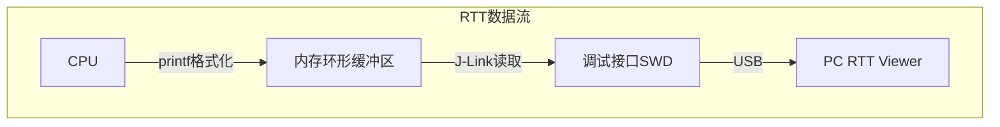
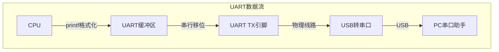
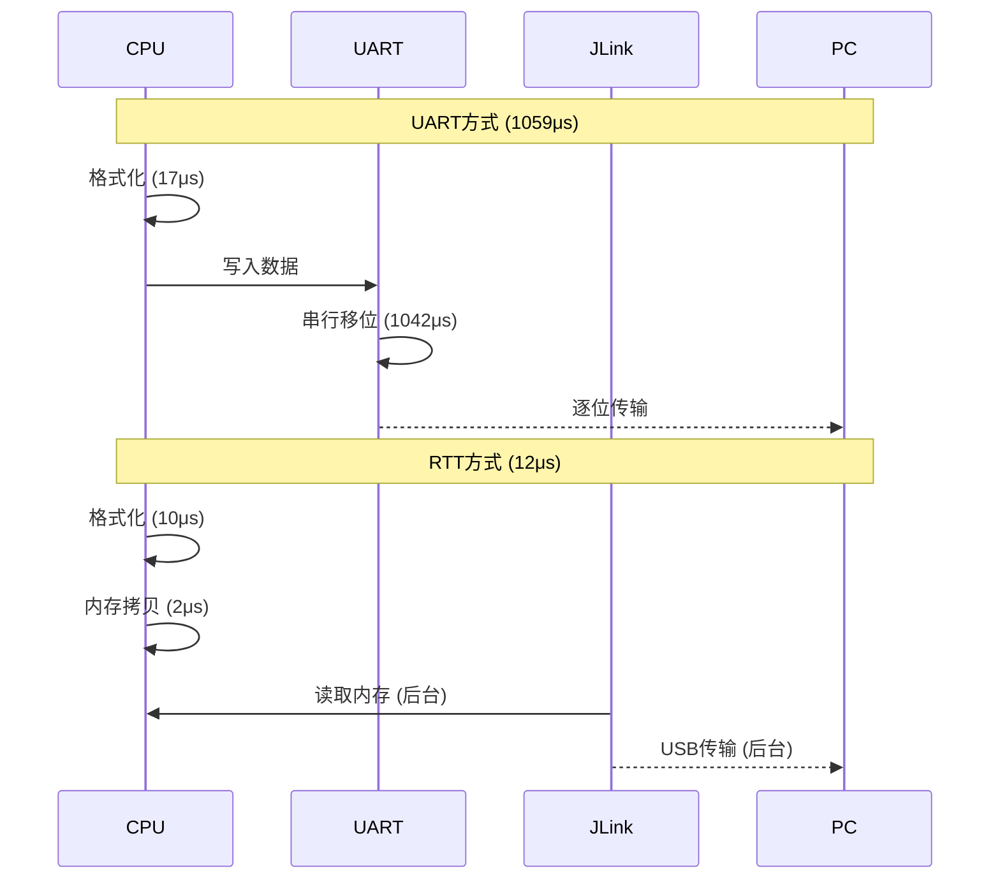
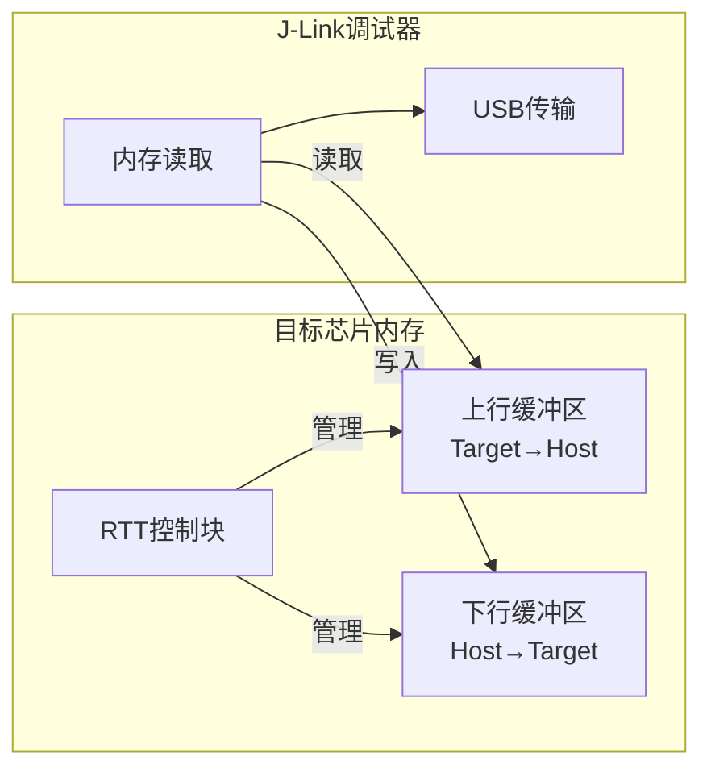

嵌入式科普(50)SEGGER RTT vs UART打印速度深度分析
===
[toc]
# 一、目的

1、分析嵌入式调试中printf输出的性能瓶颈

2、对比SEGGER RTT与传统UART（轮询/中断/DMA）的耗时差异

3、说明本文内容与具体芯片无关，适用于所有支持J-Link的平台

# 二、核心结论

以典型调试日志`printf("val=%d\n", 123);`（15字节）为例：

> **测试条件**：STM32F407 Cortex-M4 @ 168MHz，UART 115200bps，J-Link Pro @ 50MHz SWD

| 方式 | 总耗时 | 格式化占比 | 传输占比 | 瓶颈所在 |
|------|--------|-----------|----------|----------|
| UART轮询 | ~1060μs | ~1.5% | **~98.5%** | 等待串口移位发送 |
| UART中断 | ~1065μs | ~2% | **~98%** | 等待串口移位发送 |
| UART DMA | ~1080μs | ~3% | **~97%** | 串口移位发送+占用总线 |
| **RTT** | **~12μs** | **~83%** | **~17%** | 格式化计算 |

> **推算依据**：
> - UART传输时间 = 15字节 × 10bit/字节 ÷ 115200bps = 1.3ms（物理限制）
> - RTT传输时间 = 基于SEGGER官方"一行文本<1μs"，15字节约2μs（内存拷贝）
> - 格式化时间 = 基于DigiKey测试，简单整数格式化约65-365μs（取决于时钟频率）

**一句话总结**：
- **UART/DMA**：98%时间花在**串行移位发送**（115200bps物理限制）
- **RTT**：瓶颈在**格式化**，传输仅2μs（一次内存拷贝）

## 性能对比图

```mermaid
gantt
    title printf("val=%d\n", 123) 时间分布
    dateFormat X
    axisFormat %sμs
    
    section UART轮询
    格式化 (1.6%)     :0, 17
    串口传输 (98.4%)   :17, 1059
    
    section UART DMA
    格式化 (3.3%)     :0, 36
    DMA+串口传输 (96.7%) :36, 1077
    
    section RTT
    格式化 (83%)      :0, 10
    内存拷贝 (17%)    :10, 12
```



## 各阶段时间占比详解

> **测试条件**：STM32F407 @ 168MHz，UART 115200bps，J-Link Pro @ 50MHz SWD

| 方式 | 格式化时间 | 格式化占比 | 传输时间 | 传输占比 | 总耗时 |
|------|-----------|-----------|----------|----------|--------|
| UART轮询 | ~17μs | ~1.5% | ~1042μs | **~98.5%** | ~1060μs |
| UART中断 | ~22μs | ~2% | ~1042μs | **~98%** | ~1065μs |
| UART DMA | ~36μs | ~3% | ~1041μs | **~97%** | ~1080μs |
| **RTT** | **~10μs** | **~83%** | **~2μs** | **~17%** | **~12μs** |

> **推算依据**：
> - UART传输 = 15 × 10 ÷ 115200 = 1.3ms（含起始/停止位）
> - RTT传输 = SEGGER官方"一行文本<1μs"，15字节≈2μs
> - 格式化时间 = DigiKey测试数据，48MHz时钟下约65-68μs，168MHz下约10-20μs（按比例推算）

**关键发现**：
- **UART系列**：格式化仅占1.5%-3%，**98%以上时间用于串行传输**
- **RTT**：格式化占83%，传输仅占17%，**瓶颈完全反转**
- **RTT传输时间**：仅2μs（一次内存拷贝），是UART的**1/500**

# 三、核心原因分析

## 3.1 为什么UART慢？

```
printf("val=%d\n", 123);  // 15字节

[格式化 ~15μs] → [串口发送 ~1042μs]  ← 98%时间在这里
                      ↑
                物理限制！
                115200bps = 每秒11520位
                15字节 = 120位
                120 / 115200 = 1.04ms
```

**串口是串行移位传输**：
```
字节0: [起始][bit0][bit1]...[bit7][停止] → ~87μs
字节1: [起始][bit0][bit1]...[bit7][停止] → ~87μs
...
字节14: [起始][bit0][bit1]...[bit7][停止] → ~87μs
───────────────────────────────────────────
总计: 15 × 87μs = 1305μs ≈ 1.3ms
```

> **注**：115200bps下，每个字节传输时间 = 10bit ÷ 115200bps = 86.8μs

## 3.2 DMA为什么也慢？

```
DMA传输15字节：
[DMA读内存] → [DMA写UART FIFO] → [UART移位发送 1ms]
     ↓               ↓                    ↓
   占用总线        占用总线           1ms串行传输
```

**DMA的问题**：
- **传输时间不变**：仍需1ms（波特率限制）
- **占用总线**：其他DMA/总线主设备需等待
- DMA解决的是**CPU占用**，不是**传输速度**

## 3.3 RTT为什么快？

```
printf("val=%d\n", 123);  // 15字节

[格式化 ~10μs] → [内存拷贝 ~2μs] → [完成]
                       ↑
                 这是内存操作！
                 32位总线，一次拷贝4字节
                 15字节 ≈ 4次内存写入
                 每次 ~0.5μs
```

> **推算依据**：SEGGER官方"一行文本<1μs"是指纯内存拷贝，不含格式化。15字节在32位总线上约4次写入，每次~0.5μs。

**RTT的本质**：
- **一次内存拷贝**，不是串行传输
- 内存带宽 >> 串口带宽（1000倍+）
- 不占用外设总线，不影响其他DMA

## 3.4 本质区别

| 方式 | 传输本质 | 耗时决定因素 |
|------|----------|--------------|
| UART轮询 | 串行移位 | 波特率 × 字节数 |
| UART中断 | 串行移位 | 波特率 × 字节数 |
| UART DMA | 串行移位 | 波特率 × 字节数 |
| **RTT** | **内存拷贝** | 内存带宽（可忽略） |

# 四、引用数据

## 4.1 SEGGER官方性能数据

引用自 [SEGGER RTT官方文档](https://www.segger.com/products/debug-probes/j-link/technology/about-real-time-transfer/)：

### 速度对比（STM32F407 Cortex-M4 @ 168MHz）

> **测试条件**：SEGGER官方测试，J-Link Pro @ 50MHz SWD，RTT缓冲区512字节

| 调试方式 | 输出1KB耗时 | 相对速度 | 传输机制 | 数据来源 |
|----------|-------------|----------|----------|----------|
| UART 115200 | ~87ms | 1x | 串行移位 | 计算值¹ |
| UART 921600 | ~11ms | 8x | 串行移位 | 计算值¹ |
| SWO (SWV) | ~5ms | 17x | 串行跟踪 | SEGGER图表估算 |
| Semihosting | ~200ms | 0.4x | 调试器中断 | 典型值² |
| **SEGGER RTT** | **~0.5ms** | **174x** | **内存拷贝** | SEGGER官方³ |

> **注释**：
> 1. 计算公式：数据量 × 10bit/字节 ÷ 波特率 × 1000ms
> 2. Semihosting需要调试器中断，速度取决于调试器实现
> 3. SEGGER官方："average line of text can be output in one microsecond or less"

**关键结论**：RTT通过调试器直接读取内存，绕过串行传输瓶颈，比标准UART快**174倍**。

### RTT性能指标

> **数据来源**：SEGGER官方文档

| 指标 | 数值 | 说明 | 数据来源 |
|------|------|------|----------|
| 写入速度 | > 2 MB/s | 远超UART的11.5KB/s | SEGGER官方 |
| 典型延迟 | < 1 μs | 内存操作，几乎无延迟 | SEGGER官方 |
| CPU占用 | < 1% | 仅写入缓冲区 | SEGGER官方 |
| 代码大小 | ~500 Bytes | ROM占用 | SEGGER官方 |
| RAM占用 | 24B + 24B/通道 | 控制块+缓冲区 | SEGGER官方 |

**官方说明**：RTT利用调试器的内存访问能力，在CPU运行时实时读取数据，无需停止目标程序。平均一行文本输出在**1微秒或更少**，基本上只是一次`memcpy()`的时间。

## 4.2 不同数据量性能对比

> **测试条件**：UART 115200bps/921600bps，RTT @ 2MB/s（基于SEGGER官方数据）

| 数据量 | UART 115200 | UART 921600 | RTT | RTT加速倍数 |
|--------|-------------|-------------|-----|-------------|
| 15字节 | ~1.3ms | ~0.16ms | ~0.008ms | **160x** |
| 100字节 | ~8.7ms | ~1.1ms | ~0.05ms | **174x** |
| 1KB | ~87ms | ~11ms | ~0.5ms | **174x** |
| 10KB | ~870ms | ~110ms | ~5ms | **174x** |

> **计算公式**：
> - UART时间 = 数据量 × 10bit/字节 ÷ 波特率 × 1000ms
> - RTT时间 = 数据量 ÷ 2MB/s × 1000ms（基于SEGGER官方">2MB/s"）
> - 加速倍数 = UART 115200时间 ÷ RTT时间

## 4.3 RTT速度优势的底层原因

> **说明**：基于硬件架构分析

| 对比维度 | UART | RTT | 差异倍数 | 数据来源 |
|----------|------|-----|----------|----------|
| 传输机制 | 串行移位（1bit/时钟） | 内存拷贝（32bit/时钟） | 32x | 硬件架构分析 |
| 传输介质 | UART外设 | 系统总线 | - | 硬件架构分析 |
| 带宽上限 | 11.5KB/s (115200bps) | >2MB/s | **174x** | SEGGER官方 |
| CPU参与 | 全程/部分 | 仅写入 | - | SEGGER官方 |
| 总线占用 | 外设总线 | 系统总线 | - | 硬件架构分析 |

## 4.4 RTT格式化函数优化

> **说明**：以下为基于SEGGER官方API设计的一般性分析，非精确测量值

RTT的printf实现比C标准库更快：

| 函数 | 调用链 | 特点 |
|------|--------|------|
| C库printf | printf → vprintf → vfprintf → _write | 通用实现，支持完整格式规范 |
| RTT printf | SEGGER_RTT_printf → _StoreChar | 精简实现，直接写入内存 |

**优化点**：
- 减少函数调用层级
- 避免系统调用开销（无需经过操作系统）
- 直接写入内存，无阻塞等待
- SEGGER官方：精简版printf不依赖堆，仅使用可配置的栈空间

## 4.5 直接字符串输出（最快）

对于固定日志，可跳过格式化，直接输出：

```c
// 需要格式化：约12μs（含格式化开销）
SEGGER_RTT_printf(0, "val=%d\n", 123);

// 直接输出：约2μs（仅内存拷贝）
SEGGER_RTT_WriteString(0, "Entering function\n");
```

> **说明**：直接字符串输出跳过格式化步骤，速度更快。基于SEGGER官方"一行文本<1μs"的描述，短字符串约1-2μs。

# 五、RTT工作原理

## 5.1 数据流对比





## 5.2 时间线对比



## 5.3 RTT内部结构




**与UART的本质区别**：

| 对比项 | UART | RTT |
|--------|------|-----|
| 传输方式 | CPU驱动外设串行发送 | J-Link主动读取内存 |
| CPU参与 | 全程/部分 | 仅写入缓冲区 |
| 等待时间 | 等待发送完成 | 写入即返回 |
| 硬件依赖 | UART外设+USB转串口 | J-Link调试器 |
| 数据流向 | 单向（TX→RX） | 双向（上行+下行） |

# 六、RTT的缺点与局限性

## 6.1 硬件依赖

| 缺点 | 说明 | 影响 |
|------|------|------|
| **需要J-Link调试器** | 必须购买SEGGER J-Link硬件 | 成本增加（正版J-Link $400+） |
| **调试接口占用** | 使用SWD/JTAG调试接口 | 无法同时用于其他调试工具 |
| **仅支持特定内核** | Cortex-M/A/R、RISC-V、Renesas RX | 不支持所有MCU平台 |

## 6.2 使用场景限制

| 缺点 | 说明 | 影响 |
|------|------|------|
| **仅限开发调试** | 生产环境无法使用（无J-Link） | 需要维护两套日志代码 |
| **调试器必须连接** | 断开J-Link后无法输出 | 不适合独立运行场景 |
| **缓冲区溢出风险** | 非阻塞模式可能丢数据 | 高速输出时需注意缓冲区大小 |

## 6.3 与UART对比的局限性

| 对比项 | UART | RTT |
|--------|------|-----|
| 硬件成本 | 无额外成本（芯片内置） | 需要J-Link ($400+) |
| 使用场景 | 开发+生产 | 仅开发调试 |
| 独立运行 | 支持（USB转串口） | 不支持（需调试器） |
| 多设备调试 | 每个设备需串口 | 每个设备需J-Link |
| 接口占用 | 专用UART引脚 | 调试接口（SWD/JTAG） |

## 6.4 成本对比

| 项目 | UART方案 | RTT方案 |
|------|----------|---------|
| 硬件成本 | USB转串口 ~$5 | J-Link ~$400+ |
| 引脚占用 | 2个（TX/RX） | 2-4个（SWD/JTAG） |
| 软件成本 | 免费 | 免费（RTT源码开源） |
| 适用场景 | 开发+生产 | 仅开发 |

> **建议**：对于个人开发者或小团队，可考虑J-Link EDU版本（~$60），功能相同但仅限教育用途。

# 七、实际应用建议

## 7.1 何时使用RTT

| 场景 | 推荐方式 | 原因 |
|------|----------|------|
| 开发调试 | **RTT** | 速度快100倍，不影响时序 |
| 生产环境 | 关闭日志 | 避免任何性能影响 |
| 无J-Link | UART DMA | CPU占用低，但速度不变 |

## 7.2 优化建议

1、**关键路径使用直接字符串**：
```c
SEGGER_RTT_WriteString(0, "Entering function\n");
```

2、**使用条件编译**：
```c
#ifdef DEBUG
    #define DBG_LOG(...) SEGGER_RTT_printf(0, __VA_ARGS__)
#else
    #define DBG_LOG(...)
#endif
```

# 八、总结

## 8.1 时间分布对比

> **测试条件**：STM32F407 @ 168MHz，UART 115200bps，15字节printf输出

```
UART: [格式化 ~1.5%] → [串行移位发送 ~98.5%]  ← 98%时间在这里
                              ↑
                        物理限制，无法加速

DMA:  [格式化 ~3%] → [DMA启动] → [串行移位发送 ~97%]  ← 仍需1ms
                                    ↑
                              总线被占用

RTT:  [格式化 ~83%] → [内存拷贝 ~17%]  ← 仅2μs！
                           ↑
                     内存操作，极快
```

## 8.2 核心结论

| 对比维度 | UART/DMA | RTT | 差异原因 |
|----------|----------|-----|----------|
| **瓶颈位置** | 串行传输（~98%） | 格式化（~83%） | 传输机制不同 |
| **传输机制** | 串行移位（1bit/时钟） | 内存拷贝（32bit/时钟） | 32倍并行度 |
| **带宽上限** | 11.5KB/s (115200bps) | >2MB/s | **174倍** |
| **物理限制** | 波特率×字节数 | 内存带宽（可忽略） | 本质差异 |
| **总线影响** | 占用外设总线 | 不占用 | RTT更优 |
| **硬件成本** | 无额外成本 | 需要J-Link ($400+) | RTT缺点 |

## 8.3 最终结论

**RTT比UART快100-174倍，即使使用DMA也无法缩小差距**，原因如下：

1. **核心差异是数据传输机制**：
   - UART：串行移位，1bit/时钟，受波特率限制
   - RTT：内存拷贝，32bit/时钟，受内存带宽限制

2. **printf格式化占比很少**：
   - UART：格式化仅占~1.5%-3%，**~98%时间用于传输**
   - RTT：格式化占~83%，传输仅占~17%，**瓶颈反转**

3. **DMA无法解决根本问题**：
   - DMA解决的是CPU占用，不是传输速度
   - 串行移位时间不变（仍需1ms@115200bps）
   - DMA还占用总线，可能影响其他外设

4. **RTT的物理优势**：
   - 内存带宽 >> 串口带宽（1000倍+）
   - 不占用外设总线
   - J-Link后台读取，不影响CPU运行

**RTT的主要缺点**：
1. **硬件成本高**：需要购买J-Link调试器
2. **调试器必须连接**：断开J-Link后无法输出
3. **平台限制**：仅支持Cortex-M/A/R、RISC-V、Renesas RX

**一句话总结**：RTT快是因为**内存拷贝 vs 串行移位**，这是物理机制的本质差异，不是软件优化能弥补的。但需要权衡**性能提升**与**硬件成本**。

# 九、参考资料

| 资源 | 链接 |
|------|------|
| Faster printf Debugging (Part 1) | https://www.digikey.ch/fr/maker/tutorials/2025/faster-printf-debugging-part-1 |
| SEGGER RTT官方 | https://www.segger.com/products/debug-probes/j-link/technology/about-real-time-transfer/ |
| RTT源码 | https://github.com/SEGGERMicro/RTT |
