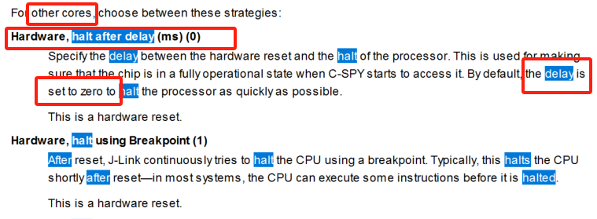

嵌入式科普(10)IAR debug reset delay
===
[toc]
# 一、目的/概述
- 1、还热乎的经验/采坑，跟大家分享，以后少踩坑
- 2、解决问题的思路分析过程
- 3、扩展到I-jet、j-link之外调试器的结论和总结
  
# 二、问题描述
问题：R52内核主控MPU例程，使用IAR Flash模式j-link无法debug在线调试（默认I-jet）。
与之对比的该例程RAM模式、其他例程Flash模式、M4内核等其他MCU均无改问题。

# 三、解决办法
修改该例程IAR-属性-Debugger-J-Link/J-Trace-Setup-Reset；
Hardware, halt after delay (ms) ，300
（默认：software，0）

# 四、分析原理
- 经过我查询论坛、IAR官网、IAR帮助文档，对比分析了其他各种例程。非常遗憾，水平有限，我没有解决改问题！
- 现在知道答案了，我们在回头分析！

## 4.1 halt after delay是什么
我们知道答案，很快就能从IAR帮助文档中找到。尽快启动，默认0

## 4.2 M3/M4内核如何配置
M3/M4内核没有上述功能，无法配置delay

## 4.3 新建M3/M4内核工程验证
如IAR帮助文档一样，无halt after delay功能，无delay功能

## 4.4 I-jet delay after
- IAR帮助文档有介绍i-jet delay，但无默认值

## 4.5 I-jet 默认值

## 4.6 st-link
st-link无delay

## 4.7 DAP
DAP默认与I-jet一样

## 4.8 TI-stellaris
TI-stellaris无delay

## 4.9 TI-msp
TI-msp无delay

## 4.10 TI-xds
TI-xds无delay

# 五、总结
- IAR debug的j-link、i-jet、dap都reset delay功能，并且j-link只针对非coretex M内核
- 通过IAR帮助文档能得到reset delay一般尽快启动
- i-jet、dap默认delay 200ms，j-link默认0。我们跟进什么修改延时数值？
- 该例程默认i-jet，我们修改为j-link是否能分析出200ms延时呢？
- 该例程对比同等例程为何不需要delay？
- R52（非CM）的、IAR的、J-link的、使用SDRAM的、FLASH启动的改例程需要reset delay。我们不能总结到delay与sdram有关系
- 具体系统如何启动，如何产生delay，到底是200还是300呢？有经验的朋友讨论吧

