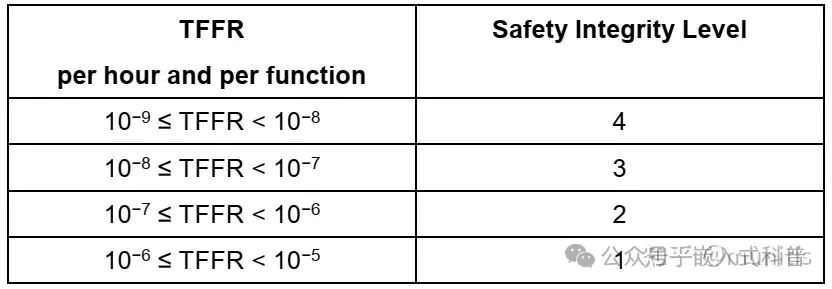
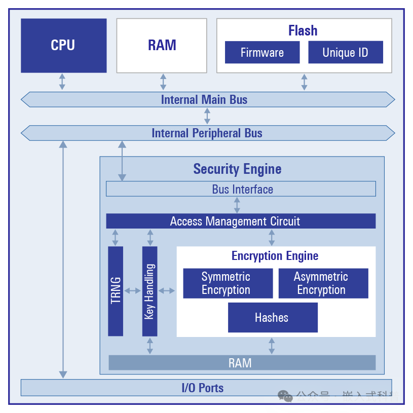

嵌入式科普(11)315加油机“偷油”偷税与信息安全和功能安全
===
[toc]
# 一、引用文章“偷油”又偷税！
引用今年315人民日报公众号：“偷油”又偷税！有些加油站竟然这样干，文章提到2023年查处加油机作弊违法案件829件，涉案金额10.87亿元，移送司法机关42件。分为3个部分：

（1）加油机作弊有产业链
（2）问题加油机一键作弊监管难
（3）加大全链条打击力度
没有提到增加加油机的信息安全和功能安全

# 二、信息安全和功能安全
引用知乎：浅谈功能安全与信息安全的区别https://zhuanlan.zhihu.com/p/346389240

功能安全和信息安全的分级要求分别用SIL（safety integrity level）（轨道交通功能安全完整性等级）和SL(security level)（工控信息安全等级）表示。

.jpg)

# 三、嵌入式领域信息安全
.jpg)

## 3.1 加密
数字签名，加密和解密，对称加密和非对称加密，然后详细介绍了 MD5，SHA-1，HMAC，DES/AES，RSA 和 ECC 等等加密算法

## 3.2 IOT和OTA
物联网和空中升级
## 3.3 芯片的安全技术
加密安全 IP、不可变存储、真实安全启动和防篡改保护
产品生命周期管理
安全加密引擎（SCE7/9）
NIST、CAVP、PSA 2、SESIP等认证
## 3.4 内核的安全技术
ARM  Security IP TrustZone：ARM：What is TrustZone?https://developer.arm.com/documentation/102418/0101/What-is-TrustZone-?lang=en

PRODUCTS Security IP：
https://www.arm.com/products/silicon-ip-security
 

.png)

renesas安全密钥管理工具https://www.renesas.cn/cn/zh/document/mat/security-key-management-tool-v105-users-manual
.png)

---引用：人民日报，ARM，知乎