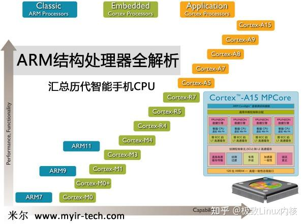
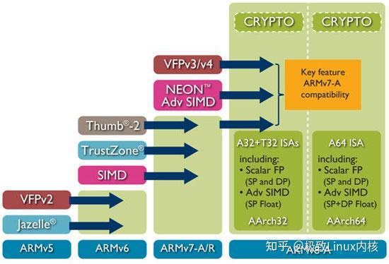
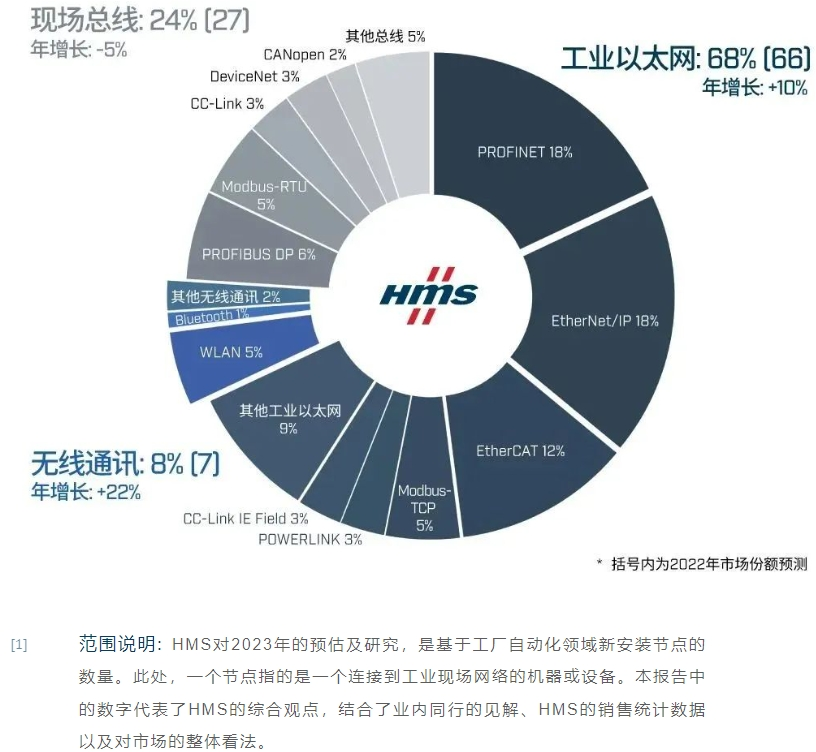
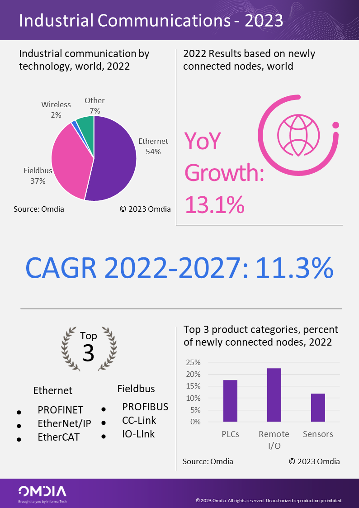
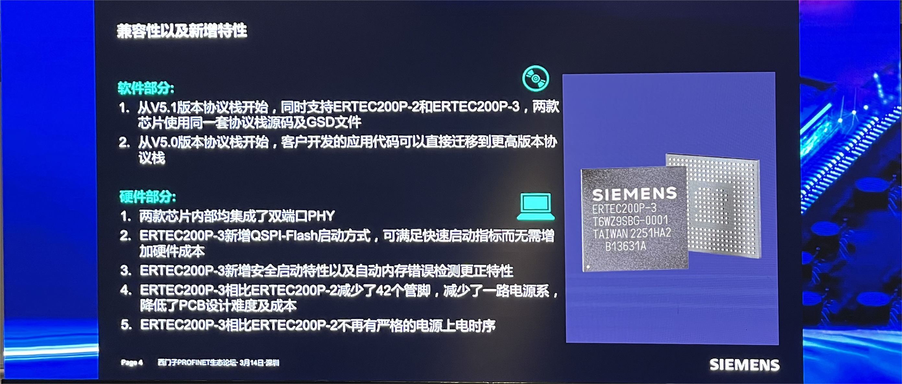
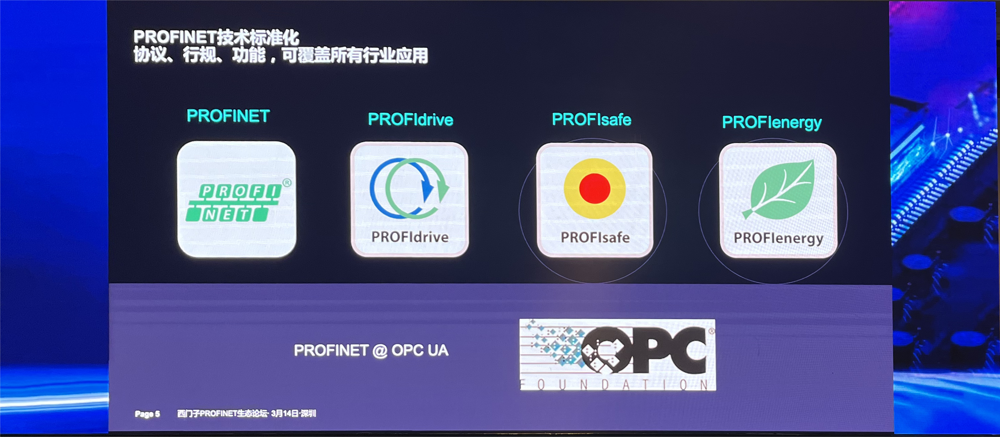
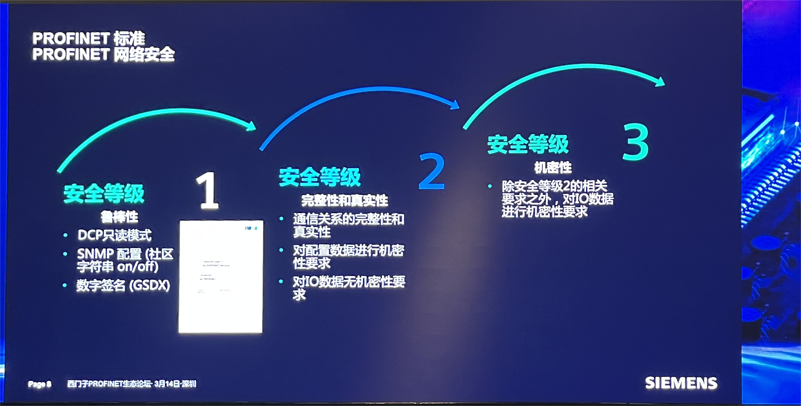
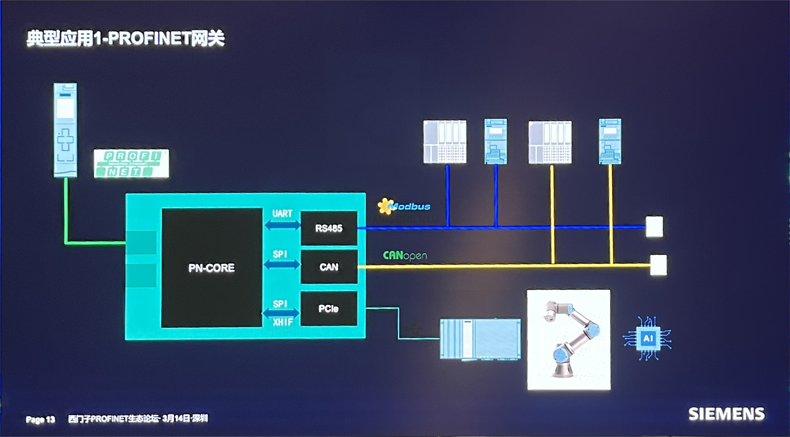
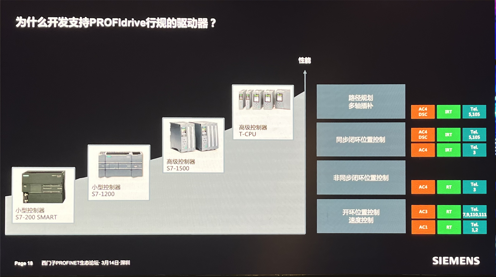
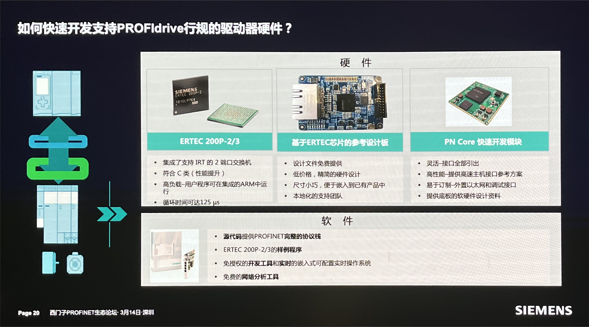

嵌入式科普(12)西门子PROFINET ERTECH 200P-3路演
===
[toc]
# 一、路演观后感/总结
- 老罗砸西门子冰箱时候的傲慢 -> 路演的谦逊
- 国外工程师包吃住差旅 -> 要做“生态”
- 芯片资料极难检索，官网逻辑混乱
- 通讯芯片，而不是“主控”
- ERTECH 200P-3比200P-2优势明显，但不是里程碑式的
  引用 知乎 ARM架构处理器解析【最全的一篇！】：
  https://zhuanlan.zhihu.com/p/587529714
  
  
- PLC S7-1500之后才支持PN IRT
- PROFINET分为控制器（主站）和驱动器（从站）
- 硬件：200P-3内置phy*2、3路电源时序，但需要外挂SDRAM、Flash
- 软件：eclipse、ecos、PN stack、PN profile、TIA
- PN driver 3.0是什么？主要开发控制器（主站）？能开放驱动器（从站）？

# 二、分享两个公众号
## 2.1 HMS工业网络
年度必看 | 2023全球工业网络市场份额预测报告：
https://mp.weixin.qq.com/s/u32HJKTXGfWM1moKsd7m9Q

## 2.2  Omdia
Omdia洞察 | 2023 年工业通信分析：
https://mp.weixin.qq.com/s/1Xa7x7s-8XuSV4k-NpVrLQ

# 三、ERTECH 200P-3资料
- ERTECH 200P-3 官网：https://support.industry.siemens.com/cs/document/109827047/delivery-release-for-ertec-200p-3-(enhanced-real-time-ethernet-controller)?dti=0&dl=en&lc=zh-WW

- PROFINET综合文档:
https://support.industry.siemens.com/cs/document/109748923/-profinet%E7%BB%BC%E5%90%88%E6%96%87%E6%A1%A3?dti=0&lc=zh-CN
- [Datasheet_ERTEC200P-3_V1_0.pdf](./DOC/Datasheet_ERTEC200P-3_V1_0.pdf)
- [ERTEC_200P-3_Manual_V1.1.pdf](./DOC/ERTEC_200P-3_Manual_V1.1.pdf)
- [PROFINETv1.chm](./DOC/PROFINETv1.chm)

# 四、ERTECH 200P-3路演分享

