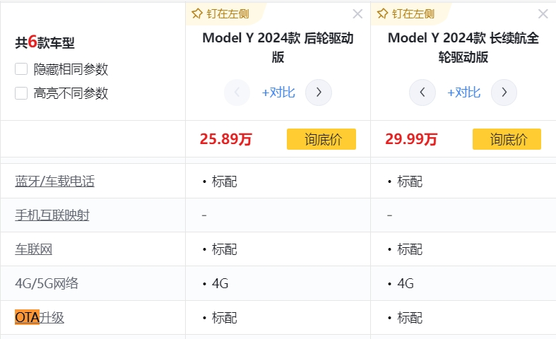
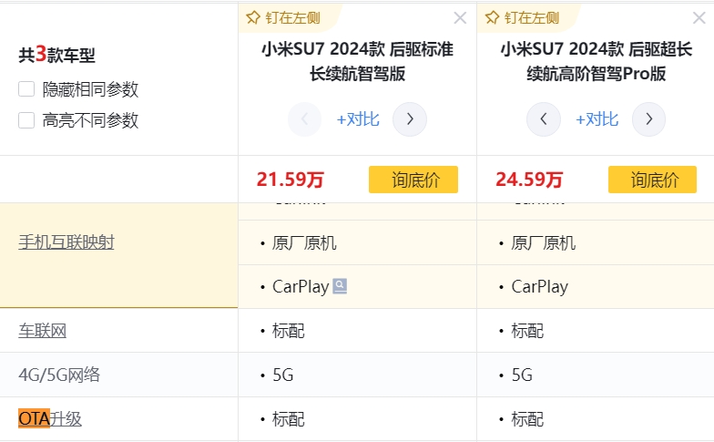
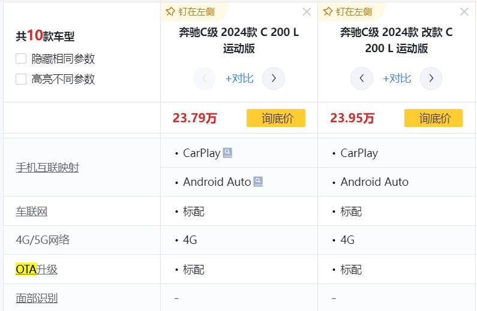
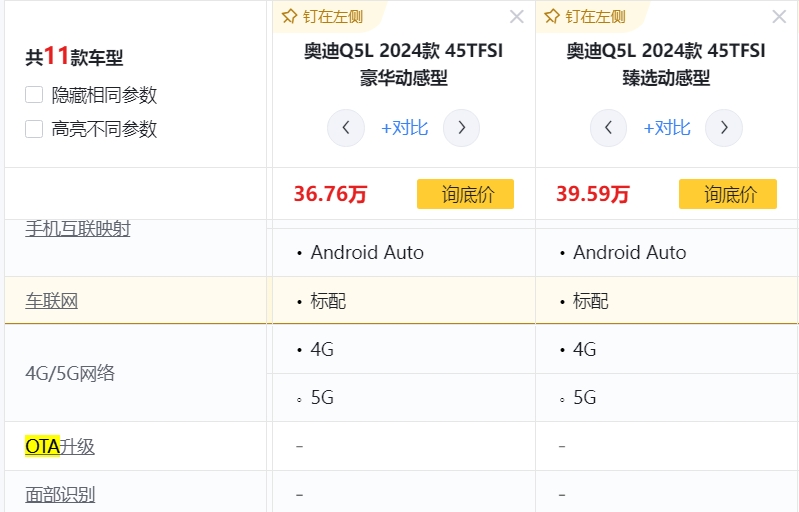
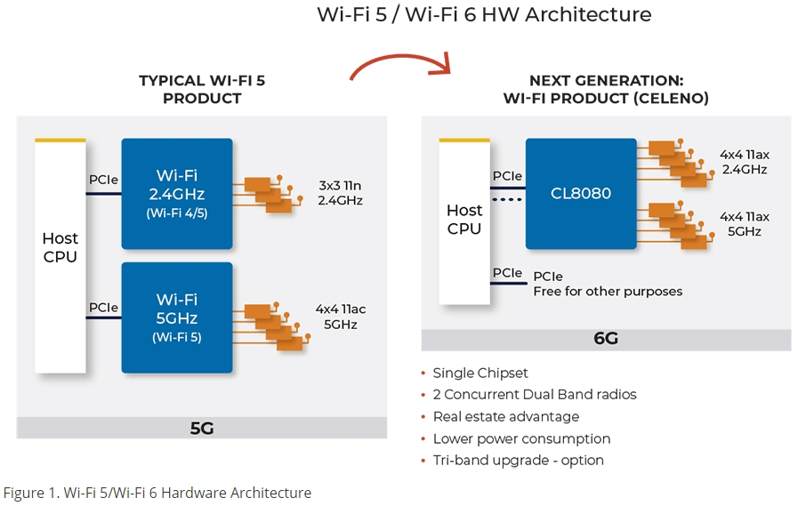
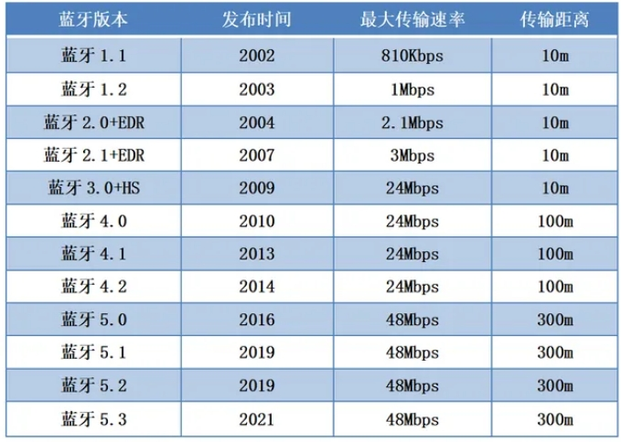
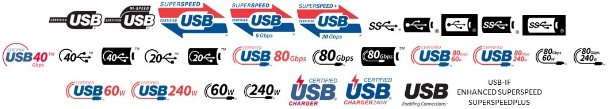

嵌入式科普(13)汽车OTA---这些年被大众熟知的嵌入式词语
===
[toc]

# 一、OTA（Over-The-Air）
- OTA技术最早源自于美国军方的通信领域，用于描述通过无线电信号传输软件更新的过程。随着移动通信和互联网的发展，OTA逐渐成为通过无线网络进行软件和固件更新的常见技术。

- OTA技术使设备可以通过无线网络更新固件和软件，无需使用传统的连接方式。OTA为设备的升级和维护带来了便利，提高了用户体验。
- **大众熟知的原因**：新能源汽车的普及是推动OTA技术被大众熟知的重要原因之一。通过OTA技术，车辆软件可以随时更新，保持最新状态，为用户提供更加安全、便捷的驾驶体验。这种便捷的软件升级方式为新能源汽车的普及和发展提供了重要支持，进一步推动了汽车行业朝着智能化、互联网化的方向发展。

# 二、WIFI（Wireless Fidelity）
- WIFI技术提供了无线连接到互联网的便利，为我们的设备和生活带来了高速稳定的网络连接。

- WIFI使我们可以随时随地与世界保持联系，享受无线网络的便利。
可以查阅WIFI联盟的官方网站（www.wi-fi.org）了解最新的WIFI标准和技术发展。
- WIFI连接方式简单，广泛应用于各种设备和场景。
- **大众熟知的原因**：WIFI技术的普及使得无线网络连接变得普遍，人们可以随时随地享受高速稳定的网络连接，成为现代生活中不可或缺的一部分。

# 三、蓝牙(Bluetooth、Ble)
- 蓝牙技术让设备之间可以无线连接，实现数据传输和通信功能，广泛应用于耳机、音箱、智能家居设备等领域。

- 蓝牙技术提供了便捷的设备间连接方式，方便数据传输和通信。
- 可以访问蓝牙联盟的官方网站（www.bluetooth.com）了解蓝牙技术的规范和应用案例。
- **BLE**：蓝牙标准不断更新，支持更多功能和更稳定的连接。
- **大众熟知的原因**：蓝牙技术的广泛应用使得人们习惯了无线连接设备的便利，如耳机、音箱等产品都普遍支持蓝牙连接，提高了用户体验和便利性。

# 四、USB（Universal Serial Bus）
- USB接口是一种通用的连接标准，用于数据传输和充电，广泛应用于各种设备中。

- USB提供了方便快捷的连接方式，支持高速数据传输和充电功能。
可以浏览USB实施者论坛的官方网站（www.usb.org）了解USB标准的最新动向和规范。
- CDC、HID、USB、MSC，USB3.0，USB充电等等：接口标准化，确保设备兼容性和稳定性。
- **大众熟知的原因**：USB接口几乎存在于每个人的日常生活中，从电脑、手机到各种外设设备，USB接口的普及和标准化使得设备之间的连接变得简单可靠，成为人们生活中不可或缺的一部分。

