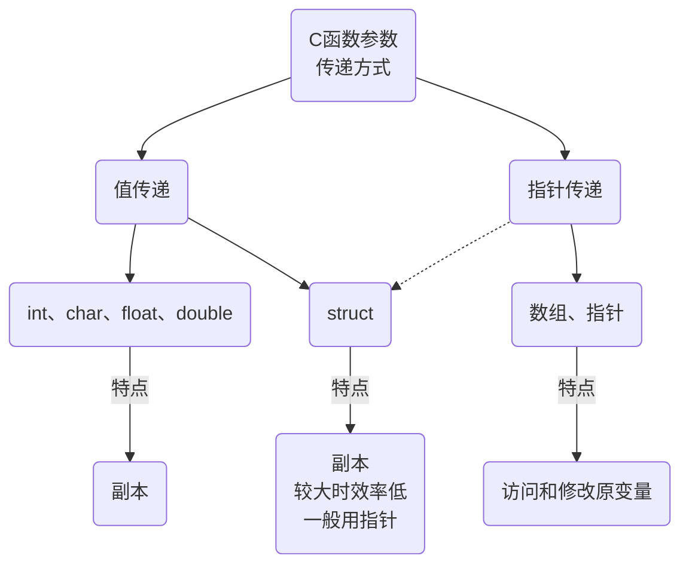

嵌入式科普(16)c语言函数参数的传递方式
===
[toc]
# 一、概述
- c语言函数参数分类简介
- 为【八、e2studio VS STM32CubeIDE之const修饰库函数形参】做铺垫

# 二、C函数参数

## 2.1 一张图讲清


## 2.2 按数据类型分类：
### 2.2.1 基本数据类型参数：
int、char、float、double 等基本数据类型可以直接作为函数的参数。
特点：参数是通过值传递的，即函数接收到的是参数值的一个副本，对参数值的修改不会影响到原变量。
### 2.2.2 数组参数：
在C语言中，数组作为函数参数时通常会退化为指向数组首元素的指针。
特点：传递的是地址，而不是数组本身，因此在函数内部可以修改数组元素的值。通常还需要传递数组的大小作为另一个参数。
### 2.2.3 结构体参数：
结构体可以作为整体作为函数的参数。
特点：如果结构体较大，按值传递会导致较大的性能开销，因此通常选择传递结构体的指针。
### 2.2.4 指针参数：
指针本身可以作为函数的参数，用于传递变量的地址。
特点：通过指针参数，函数可以访问和修改原变量的值。
### 2.2.5 函数指针参数：
函数指针也可以作为函数的参数，用于实现回调函数等高级功能。
特点：允许将函数作为参数传递给另一个函数，增加了程序的灵活性和模块化。

## 2.3 按传递方式分类：
### 2.3.1 值传递：
默认情况下，C语言中的函数参数是通过值传递的。
特点：函数接收到的是参数值的一个副本，对参数值的修改不会影响到原变量。
### 2.3.2 指针传递（或引用传递）：
通过传递指针或引用，函数可以访问和修改原变量的值。
特点：提高了函数的灵活性，但也需要额外注意内存管理和指针操作的正确性。

# 三、例程
## 3.1 值传递-副本的地址不同
```
#include <stdio.h>  
  
// 这是一个函数，它接收一个整数作为参数（值传递）  
void printValueAndAddress(int value) {  
    printf("Inside function:\n");  
    printf("Value: %d\n", value);  
    printf("Address of value (local variable): %p\n", (void*)&value);  
}  
  
int main() {  
    int a = 5;  
    printf("Before function call:\n");  
    printf("Value: %d\n", a);  
    printf("Address of a: %p\n", (void*)&a);  
      
    printValueAndAddress(a); // 传递的是a的副本  
      
    printf("After function call:\n");  
    printf("Value: %d\n", a);  
    printf("Address of a: %p\n", (void*)&a);  
      
    return 0;  
}
```
```
Before function call:  
Value: 5  
Address of a: 0x20001000  
Inside function:  
Value: 5  
Address of value (local variable): 0x20000ffc  
After function call:  
Value: 5  
Address of a: 0x20001000
```

## 3.2 结构体的传递效率
```
#include <stdio.h>  
#include <time.h>  
  
typedef struct {  
    int data[1000];  
} LargeStruct;  
  
// 这是一个函数，它接收指向结构体的指针（指针传递）  
void modifyStructByPointer(LargeStruct *structPtr) {  
    for (int i = 0; i < 1000; ++i) {  
        structPtr->data[i] = i;  
    }  
}  
  
// 这是一个函数，它接收结构体的副本（值传递）  
void modifyStructByValue(LargeStruct structVal) {  
    for (int i = 0; i < 1000; ++i) {  
        structVal.data[i] = i;  
    }  
    // 注意：由于是值传递，这里的修改不会影响main中的原始结构体  
}  
  
int main() {  
    clock_t start, end;  
    double cpu_time_used;  
      
    LargeStruct myStruct;  
      
    // 使用指针传递修改结构体  
    start = clock();  
    modifyStructByPointer(&myStruct);  
    end = clock();  
    cpu_time_used = ((double) (end - start)) / CLOCKS_PER_SEC;  
    printf("Time taken by pointer: %f seconds\n", cpu_time_used);  
      
    // 使用值传递（虽然这里的修改没有意义，但仅为了对比时间）  
    start = clock();  
    modifyStructByValue(myStruct); // 注意：这里的修改不会影响myStruct  
    end = clock();  
    cpu_time_used = ((double) (end - start)) / CLOCKS_PER_SEC;  
    printf("Time taken by value: %f seconds\n", cpu_time_used);  
      
    return 0;  
}
```

### 3.3 数组参数
```
#include <stdio.h>  
  
// 函数声明中使用了数组类型，但实际上接收的是指向数组首元素的指针  
void printArray(int myArray[], int length) {  
    for (int i = 0; i < length; i++) {  
        printf("%d ", myArray[i]);  
    }  
    printf("\n");  
}  
  
int main() {  
    int myArray[] = {1, 2, 3, 4, 5};  
    int length = sizeof(myArray) / sizeof(myArray[0]); // 计算数组长度  
      
    // 调用函数，传递数组和长度  
    printArray(myArray, length);  
      
    return 0;  
}
```

