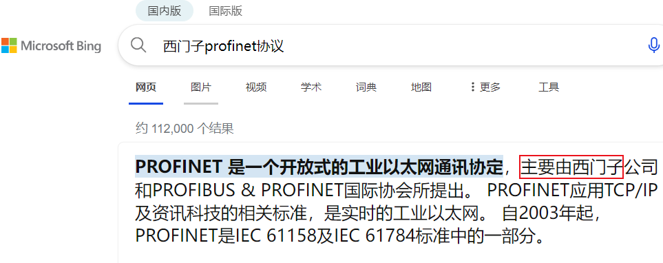

**嵌入式科普(1)PROFINET ?≈ 西门子**
[toc]
# 一、PROFINET/PROFIBUS和西门子是否划等号
## 1.1 先看看所以引擎和AI

## 1.2 PI协会

## 1.3 PROFINET简介

## 1.4 逻辑关系和如何实现PROFINET

## 1.5 资料来源

    - [PI](https://www.profibus.com)
    - [PI中国](http://pi-china.org.cn/)
    - [西门子PROFINET](https://www.siemens.com/cn/zh/products/automation/industrial-communication/profinet/pb-2-pn.html)
    - [西门子支持中心](https://www.ad.siemens.com.cn/club/bbs/bbs_story.aspx?b_id=144)
    - [Industry Mall](https://mall.industry.siemens.com/mall/zh/cn/Catalog/Products/10361491?activeTab=ProductInformation&tree=CatalogTree)
    - [profinet](https://www.profinet.com)
    - [上车](http://pi-china.org.cn/wp-content/uploads/2021/08/%E5%AE%9E%E7%8E%B0PROFINET%E7%AE%80%E4%BE%BF%E6%96%B9%E6%B3%95.pdf)
    - [port](https://www.port.de/en.html)
    - [goal](https://portgmbh.atlassian.net/wiki/spaces/GOALR/overview?homepageId=171770510)
    - [RZN2L](https://www.renesas.cn/cn/zh/products/microcontrollers-microprocessors/rz-mpus/rzn2l-integrated-tsn-compliant-3-port-gigabit-ethernet-switch-enables-various-industrial-applications)
    - [netx90](https://legacy.hilscher.com/fileadmin/cms_upload/zh-CHS/Resources/pdf/netX-90_Datasheet_10-2019_CN.pdf)

