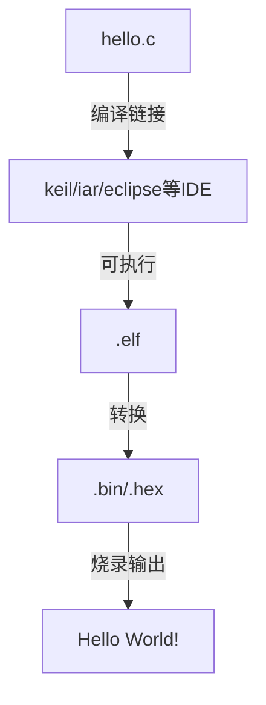
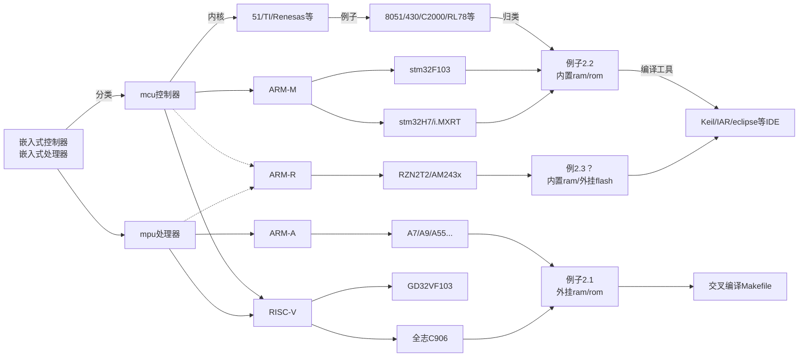

嵌入式科普(21)c代码究竟是如何一步步运行的之编译
===
[toc]
# 一、概述
- 从我们敲下代码到运行程序经历了哪些步骤：**编译->链接->执行**
- 我们从最简单步骤扩展到每个细节，分别介绍其中的最关键的步骤
- 这里面包含的知识点太多，范围也不同。我们通过类比，介绍其中的关键点，以便我们日后再深入各个细节，从而解决实际问题

# 二、最简单的两个例子
## 2.1 linux输出Hello World 


上面例子展示了在linux中从敲下代码到运行程序的过程，但是他究竟是如何一步步的实现的呢？

## 2.2 stm32(arm)输出Hello World 


上面例子展示了在stm32(arm)中从敲下代码到运行程序的过程，但是他究竟是如何一步步的实现的呢？

## 2.3 嵌入式控制器和处理器分类(TI/NXP/ST/Renesas)



# 三、编译的过程
## 3.1 linux gcc hello.c -o hello
1. **预处理**（生成预处理后的文件）：
   虽然 GCC 没有直接输出预处理后文件的选项，但你可以通过重定向输出到一个文件来查看预处理后的内容。

   ```bash
   gcc -E hello.c -o hello.i
   ```
   `-E` 选项告诉 GCC 只进行预处理并停止。

2. **编译**（生成汇编代码）：
   使用 `-S` 选项告诉 GCC 生成汇编代码并停止。

   ```bash
   gcc -S hello.c -o hello.s
   ```
   或者如果你已经有了预处理后的文件 `hello.i`，你也可以这样编译它：

   ```bash
   gcc -S hello.i -o hello.s
   ```

3. **汇编**（生成目标文件）：
   使用 `-c` 选项告诉 GCC 只进行编译和汇编并生成目标文件。

   ```bash
   gcc -c hello.c -o hello.o
   ```
   或者如果你已经有了汇编代码文件 `hello.s`，你也可以这样汇编它：

   ```bash
   gcc -x assembler -c hello.s -o hello.o
   ```
   `-x assembler` 选项告诉 GCC 接下来的文件是汇编代码。

4. **链接**（生成可执行文件）：
   默认情况下，如果你不提供 `-c`、`-S` 或 `-E` 选项，GCC 会执行所有的步骤并生成可执行文件。但如果你已经有了目标文件并想单独链接它，你可以这样做：

   ```bash
   gcc hello.o -o hello
   ```

   或者如果你有多个目标文件需要链接：

   ```bash
   gcc hello1.o hello2.o -o hello
   ```

在实际使用中，我们通常只调用 `gcc hello.c -o hello` 来完成从源代码到可执行文件的整个过程，而不需要手动执行这些单独的步骤。这些步骤只是为了教学目的而分开说明的。

## 3.2 stm32cubeide gcc
1. **gcc -c**
   ```
   arm-none-eabi-gcc "C:/Users/jerry/STM32Cube/Repository/STM32Cube_FW_H7_V1.11.1/Drivers/STM32H7xx_HAL_Driver/Src/stm32h7xx_hal.c" -mcpu=cortex-m7 -std=gnu11 -g3 -DDEBUG -DUSE_HAL_DRIVER -DSTM32H723xx -DSTM32_THREAD_SAFE_STRATEGY=2 -c -I../Core/Inc -IC:/Users/jerry/STM32Cube/Repository/STM32Cube_FW_H7_V1.11.1/Drivers/STM32H7xx_HAL_Driver/Inc -IC:/Users/jerry/STM32Cube/Repository/STM32Cube_FW_H7_V1.11.1/Drivers/STM32H7xx_HAL_Driver/Inc/Legacy -IC:/Users/jerry/STM32Cube/Repository/STM32Cube_FW_H7_V1.11.1/Drivers/CMSIS/Device/ST/STM32H7xx/Include -IC:/Users/jerry/STM32Cube/Repository/STM32Cube_FW_H7_V1.11.1/Drivers/CMSIS/Include -I../Core/ThreadSafe -O0 -ffunction-sections -fdata-sections -Wall -fstack-usage -fcyclomatic-complexity -MMD -MP -MF"Drivers/STM32H7xx_HAL_Driver/stm32h7xx_hal.d" -MT"Drivers/STM32H7xx_HAL_Driver/stm32h7xx_hal.o" --specs=nano.specs -mfpu=fpv5-d16 -mfloat-abi=hard -mthumb -o "Drivers/STM32H7xx_HAL_Driver/stm32h7xx_hal.o"
   ```
   这条命令是一个使用 `arm-none-eabi-gcc`（ARM 嵌入式 GCC）编译器的完整命令，用于编译 STM32H7xx 的 HAL（硬件抽象层）驱动源文件 `stm32h7xx_hal.c`。我将逐一解释命令中的各个部分：

    1). **`arm-none-eabi-gcc`**：这是 ARM 嵌入式 GCC 编译器的名称，用于编译 ARM 架构的裸机或嵌入式系统代码。
    2). **源文件**：`"C:/Users/jerry/STM32Cube/Repository/STM32Cube_FW_H7_V1.11.1/Drivers/STM32H7xx_HAL_Driver/Src/stm32h7xx_hal.c"` 是要编译的源文件路径。
    3). **目标 CPU**：`-mcpu=cortex-m7` 指定了目标 CPU 是 Cortex-M7。
    4). **C 标准**：`-std=gnu11` 指定了使用 GNU 11 标准的 C 语言。
    5). **调试信息**：`-g3` 设置了调试信息的级别。
    6). **定义宏**：`-DDEBUG`, `-DUSE_HAL_DRIVER`, `-DSTM32H723xx`, `-DSTM32_THREAD_SAFE_STRATEGY=2` 等定义了编译时使用的宏。
    7). **编译到目标文件**：`-c` 选项告诉编译器只编译源文件，不执行链接操作，生成目标文件（`.o` 文件）。
    8). **包含目录**：`-I` 选项后面跟着的是包含头文件的目录路径。
    9). **优化级别**：`-O0` 表示不进行优化。
    10). **函数和数据段**：`-ffunction-sections -fdata-sections` 允许链接器丢弃未使用的函数和数据。
    11). **警告和错误**：`-Wall` 打开所有常用的警告。
    12). **其他编译器选项**：`-fstack-usage`, `-fcyclomatic-complexity` 等是额外的编译器选项，用于生成栈使用情况和圈复杂度等信息。
    13). **依赖生成**：`-MMD -MP -MF"Drivers/STM32H7xx_HAL_Driver/stm32h7xx_hal.d" -MT"Drivers/STM32H7xx_HAL_Driver/stm32h7xx_hal.o"` 是用于生成依赖文件的选项。
    14). **规格文件**：`--specs=nano.specs` 使用了 `nano.specs` 链接器规格文件，这通常用于嵌入式系统以减小生成的代码大小。
    15). **浮点单元和 ABI**：`-mfpu=fpv5-d16 -mfloat-abi=hard` 设置了浮点单元和浮点 ABI（应用程序二进制接口）。
    16). **Thumb 模式**：`-mthumb` 告诉编译器使用 Thumb 指令集（一种 16 位/32 位混合的 ARM 指令集）。
    17). **输出文件**：`-o "Drivers/STM32H7xx_HAL_Driver/stm32h7xx_hal.o"` 指定了生成的目标文件路径和名称。

2. **gcc -o "h723.elf" @"objects.list"**
   
    ```
    arm-none-eabi-gcc -o "h723.elf" @"objects.list" -mcpu=cortex-m7 -T"E:\st_workspace\h723\STM32H723VETX_FLASH.ld" --specs=nosys.specs -Wl,-Map="h723.map" -Wl,--gc-sections -static --specs=nano.specs -mfpu=fpv5-d16 -mfloat-abi=hard -mthumb -u _printf_float -Wl,--start-group -lc -lm -Wl,--end-group
    ```

    1).**@"objects.list"**：包含要链接的所有目标文件的列表。
    2).**-T"E:\st_workspace\h723\STM32H723VETX_FLASH.ld"**：指定链接脚本文件，它定义了内存布局和段分配。
    3).**--specs=nosys.specs**：使用 nosys.specs 链接器规格文件，这通常用于不包含标准 C 库（如 libc）的嵌入式系统。
    4).**-Wl,-Map="h723.map"**：生成链接映射文件。
    5).**-Wl,--gc-sections**：允许链接器丢弃未使用的段。
    6).**-static**：尝试静态链接所有库（但在这个上下文中可能有些混淆，因为通常与嵌入式系统不兼容）。
    7).**--specs=nano.specs（再次指定）**：这在此上下文中可能是多余的，因为通常只会在编译或链接的某个阶段指定一次。
    8).**-u _printf_float**：强制链接器包含 _printf_float 符号，这通常与浮点数打印有关。
    9).**-Wl,--start-group -lc -lm -Wl,--end-group**：将 libc 和 libm 库放在链接器组中，以确保它们之间的循环依赖被正确解析。

3. **arm-none-eabi-size  h723.elf**
4. **arm-none-eabi-objdump -h -S h723.elf  > "h723.list"**

# 四、总结
- mpu编译和链接由gcc完成(Makefile、sh、/lib)
- mcu编译和链接由IDE完成
- 处于mcu与mpu中间的如RZT2/N2、STM32H7、iMXRT116需要重点关注链接过程

  