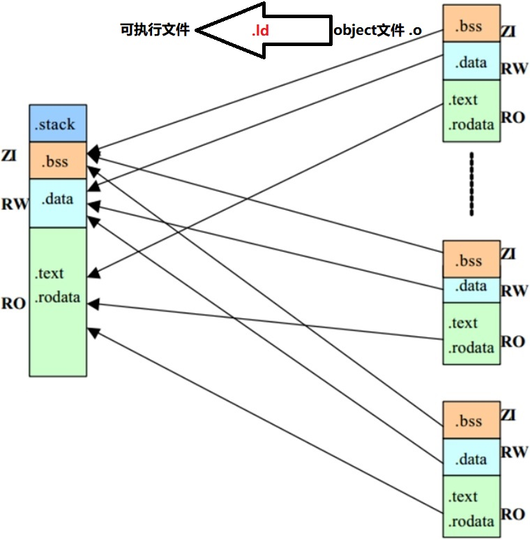
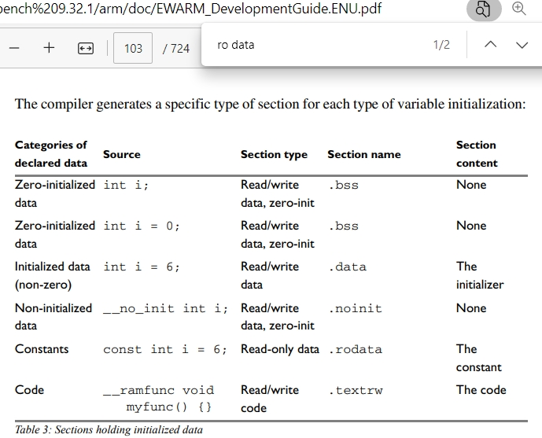

嵌入式科普(22)c代码究竟是如何一步步运行的之链接
===
[toc]
# 一、概述
- C代码的链接过程是一个将源代码转换为可执行文件的**复杂过程**
- 主要工作由编译工具gcc完成，只谈3个重要概念**静态库、动态库、链接文件.ld**
- 重点谈谈**链接脚本**.ld(GCC)、.icf(IAR)、.sct(Keil)

# 二、链接过程的目的
- 上一节介绍了狭义上的**编译的主要目的**：多个.c文件变成多个.o文件，主要由编译器完成。
- **链接过程的主要目的**：将多个单独编译的目标文件（object files，通常具有 `.o` 扩展名）以及可能需要的`库文件`（如静态库或动态库）组合成一个单一的可执行文件或共享库。这个过程解决了符号引用问题，即确保程序中的函数调用、变量引用等能够正确地映射到它们在目标文件或库文件中的定义。具体来说，链接过程包括以下几个关键步骤：

1. **符号解析**：链接器会检查目标文件和库文件中的符号（如函数名、变量名等），并确定它们之间的引用关系。这包括检查符号的定义（在哪个文件中定义）和引用（在哪个文件中使用）。

2. **重定位**：在符号解析之后，链接器会修改目标文件中的符号引用，将它们转换为最终的内存地址。这是因为在编译阶段，编译器无法知道符号在内存中的最终地址，只能使用相对地址或占位符。链接器通过解析符号并分配内存地址，将这些相对地址或占位符替换为实际的内存地址。

3. **内存分配**：链接器会根据链接脚本（如GCC中的`.ld`文件）的指令，为目标文件和库文件中的不同段（如代码段、数据段、BSS段等）分配内存地址。链接脚本定义了这些段的起始地址、大小和对齐方式等属性。

4. **文件合并**：最后，链接器会将所有目标文件和库文件中的代码和数据段合并到最终的可执行文件或共享库中。对于静态库，链接器会将其中的目标文件直接包含到最终的可执行文件中；对于动态库，链接器会在最终的可执行文件中留下指向这些库的引用。

通过链接过程，开发人员可以确保程序中的函数调用、变量引用等能够正确地找到它们在内存中的位置，从而实现程序的正确执行。此外，链接过程还可以进行**代码优化和内存管理，以提高程序的性能和效率**。

# 三、链接过程框图
```mermaid 
graph TB  
    A[源代码文件]  
    B[编译器]  
    C[.o目标文件]  
    D[静态库]  
    E[动态库]  
    F[链接器]  
    G[链接脚本]  
    H[可执行文件或共享库]  
  
    A --> B  
    B --> C  
    C --多个--> F  
    D --.O--> F  
    E --库的引用--> F  
    G --控制--> F  
    F --> H  
  ```

# 四、链接脚本
这些链接脚本的语法不同，要了解的知识也很多，我也没有全理解。因为非常重要，**代码优化和内存管理，以提高程序的性能和效率**，想成为厉害嵌入式工程师必会的知识技能。为了不误人子弟，给出官网资料供大家学习。

- .ld(GCC)：https://ftp.gnu.org/old-gnu/Manuals/ld-2.9.1/html_node/ld_toc.html#TOC1
- .icf(IAR)：https://www.iar.com/zh/knowledge/support/technical-notes/linker/how-do-i-place-a-group-of-functions-or-variables-in-a-specific-section
 https://www.iar.com/zh/knowledge/support/technical-notes/linker/how-do-i-place-a-group-of-functions-or-variables-in-a-specific-section
- .sct(Keil)：https://developer.arm.com/documentation/101754/0622/?lang=en
  


## 4.1 GCC .ld
### 4.1.1 参考资料
https://www.cnblogs.com/solo666/p/16639842.html
https://blog.csdn.net/a2529280665/article/details/121576020
https://www.cnblogs.com/solo666/p/16619167.html
### 4.1.2 一张框图

### 4.1.3 一句概况
把对象object(.o)放到段/节(section)里面，再指定到区域(region)地址上，也就是ram和flash的地址。

### 4.1.4 两种重要概念

#### 4.1.4.1 数据段(标准段名)

##### 代码段（Text Segment/Code Segment）
也称为.text段，它包含程序的机器代码指令。

##### 数据段（Data Segment）
    - 已初始化数据段（Initialized Data Segment）：也称为.data段，它包含程序在编译时已知其初始值的全局和静态变量。
    - 未初始化数据段（Uninitialized Data Segment/BSS Segment）：也称为.bss段，它包含未明确初始化为特定值的全局和静态变量。在运行时，这些变量会被自动初始化为0（或null指针，对于指针变量）。.bss段在输出文件中不占用空间，因为它只包含大小信息，实际的空间在程序加载时由操作系统分配并清零。
    - 
##### 堆（Heap）
这是一个运行时动态分配内存的区域，通常由malloc、calloc和realloc等函数管理。堆的大小可以在运行时增长和缩小。

##### 栈（Stack）
这是一个用于函数调用和局部变量分配的区域。每个线程通常都有自己的栈。栈的大小在程序启动时设置，并在程序运行期间保持不变（尽管某些系统允许调整栈的大小）。
  
还有一些不是标准的术语或符号。

#### 4.1.4.2 内存区域或段(逻辑术语)
##### Code
代表执行的代码，即机器码，与 .text 段对应。
##### RW data
代表已初始化的读写数据，即带有初始值的全局变量和静态变量，与 .data 段对应。
##### ZI data
代表零初始化数据，即未初始化的全局变量和静态变量，在程序开始时会被初始化为零，与 .bss 段对应。
##### RO data
代表只读数据，包括常量数据和字符串字面量，它们存储在只读内存中。在ARM的集成开发环境中，RO Data段可能包括 .constdata 或 .rodata 等段。

### 4.1.5 实战资料
我们在另一个系列有提到过：[八、e2studio VS STM32CubeIDE之内存使用情况窗口](https://mp.weixin.qq.com/s?__biz=MzkxNDQyMTU4Mg==&mid=2247485023&idx=1&sn=ae71d222afae5278e6bd5f3827664df6&chksm=c16fe47ef6186d68345fc12f4070d2c989324440bcf18da92bf99dd918936ab25c5c14a81a53&token=1146246006&lang=zh_CN#rd)
#### STM32CubeIDE Build Analyzer

#### e2studio Memory Usage

高手必会！

## 4.2 IAR .icf
### 4.2.1 官方资料
[EWARM_DevelopmentGuide.ENU.pdf](./DOC/EWARM_DevelopmentGuide.ENU.pdf)




### 4.2.2 .ld和.icf对比
||代码举例|gcc|iar|
|:-:|:-:|:-:|:-:|
|链接脚本|-|.ld|.icf|
|代码保存到flash|myAppInit(){;}; |-|ro code|
|代码运行到ram|myAppInit(){;};|.text|**rw code**|
|const变量|const ini i = 6;|.rodata*|.rodata|
|初始化全局变量|static int i= 6;|.data|.data|
|保存到flash|static int i= 6;|.data|**.data_init**|
|未初始化全局变量|int i;|.bss|.bss|
|局部变量|myAppInit(){ini i;};|.stack*|.stack*|
|动态内存|char *p=malloc(1);|.heap|HEAP|

## 4.3 Keil .sct
略

# 五、总结
- 在linux(mpu:coretex A7)交叉编译、mcu(coretex M4)IDE编译不太需要关注链接脚本
- 在介于mpu和mcu之间的芯片（coretex M7/M85/R4/R52），经常需要重点关注链接脚本。因为既要性能、又要实时性、还要低成本，所以往往有多块存储空间
- 链接脚本最核心的就是section、object等概念，代码和详细化分。
- 后续我们会在一个典型芯片（瑞萨RZN2L）详细分享

