嵌入式科普(25)Home Assistant米家集成意味着IOT的核心是智能设备
===
[toc]
# 一、概述
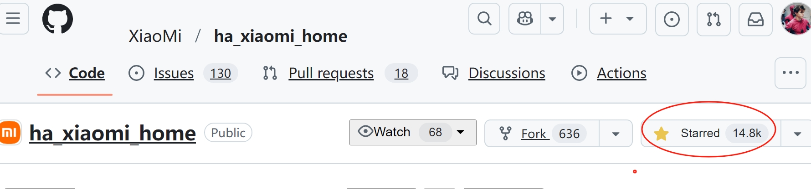
- 小米Home Assistant 米家集成开源一周star近15k，迭代4个版本，12个贡献者
- 本文科普一下Home Assistant（简称HA）、米家集成，以及带来的好处

# 二、一张图说尽HA
- 智能设备有众多品牌，但我只有一个家
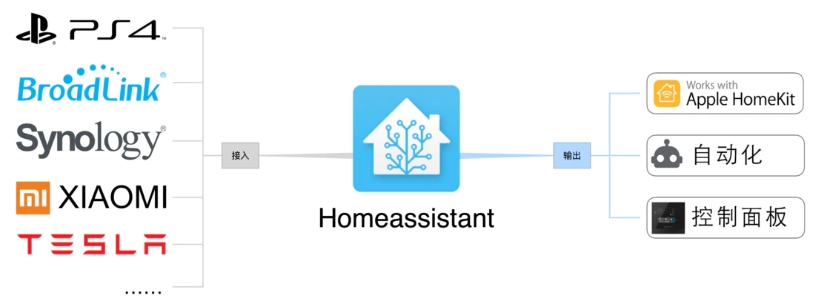

# 三、HA的相关资料
- HA是开源项目，论坛有一个非常美的翻译“瀚思彼岸”
    https://github.com/home-assistant
    https://www.hachina.io/
    https://bbs.hassbian.com

# 四、米家集成划重点
- 智能设备有众多品牌，但我只有一个家。米家智能设备大概是智能家居众多品牌中最接地气的。
https://github.com/XiaoMi/ha_xiaomi_home/blob/main/doc/README_zh.md
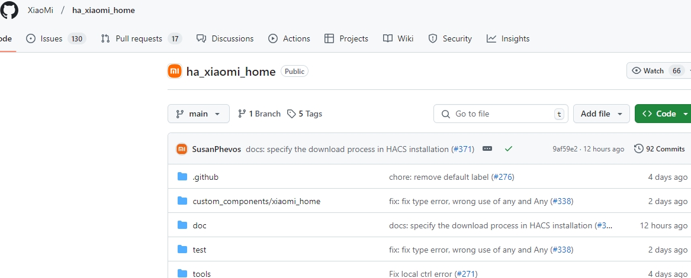
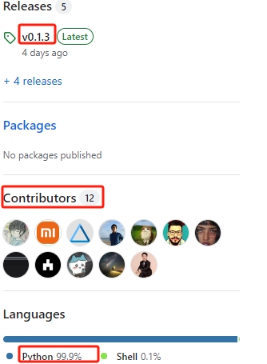
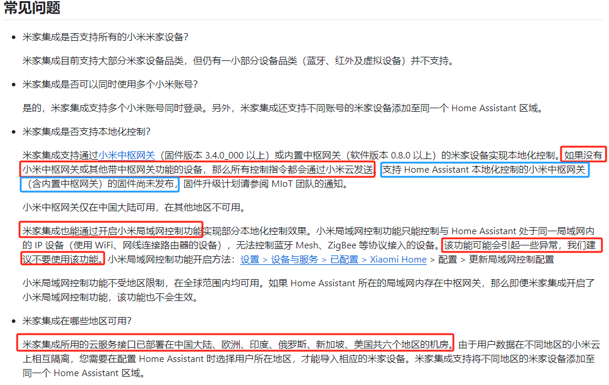
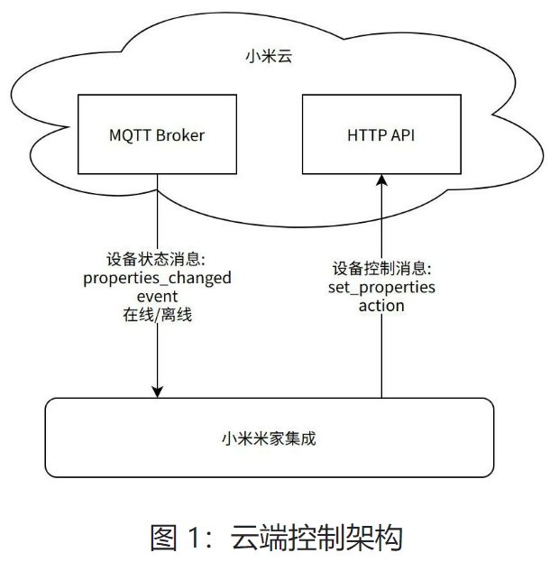
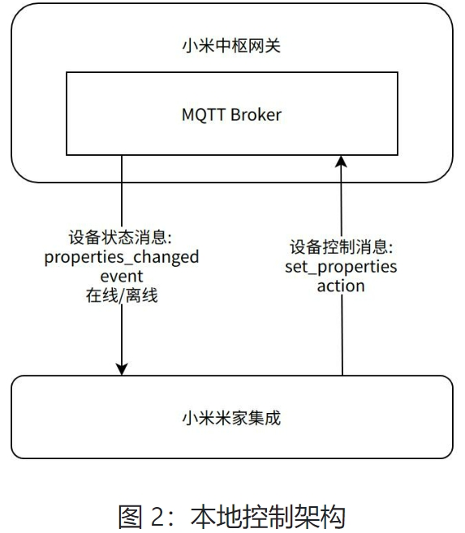
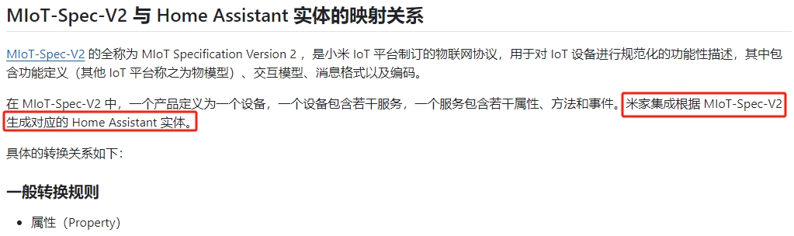
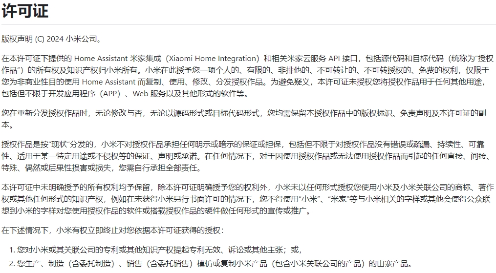
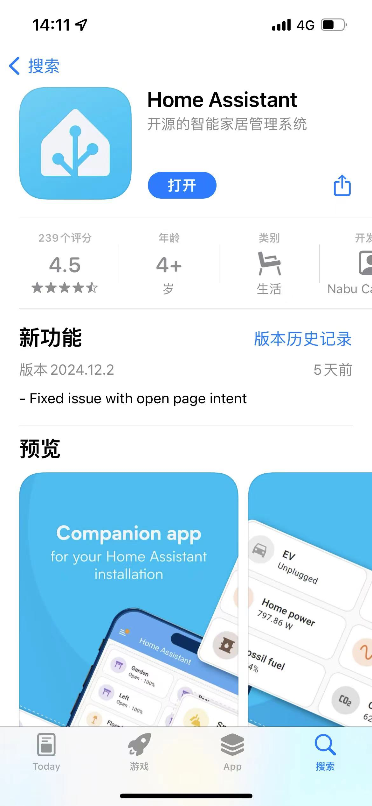
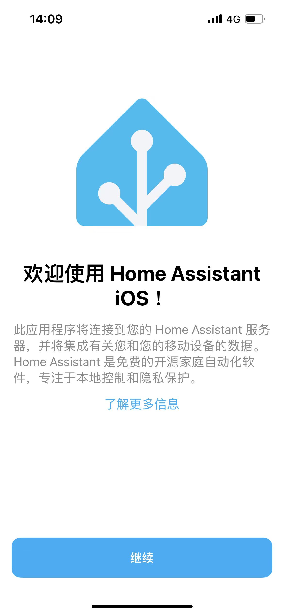
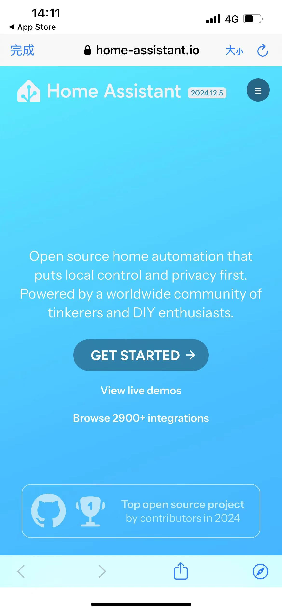

# 五、总结
- 米家集成云端控制全球支持
- 本地化控制的小米中枢网关（含内置中枢网关）的固件尚未发布
- 保管好自己 Home Assistant 配置文件，小米用户信息泄露风险
- 许可证是小米协议
- 原来米家设备接入HA是极客行为，但有数量、类型、延迟等各种限制
- 现在米家集成是小米开发接口，提供了无限的可能性，最典型的就是支持HA的设备都可以用小爱来控制
- 米家集成推动整个智能家居行业的进步
- 米家集成意味着IOT的核心是智能设备