嵌入式科普(26)“相面”各大厂MCU和MPU
===
[toc]
# 一、概述
- 相由心生--->相面术--->面相和人格
- 本文不看销售数字、不看股票、不看第三方排名。
  仅对各大厂半导体芯片官网“相面”，来分析个大厂的产品定位和优势
- 仅供娱乐，力求逻辑自洽 

# 二、芯片分类
- 芯片粗略分为：主动芯片和被动芯片
- 主动芯片之前分享过CPU MCU MPU SOC DSP FPGA：[一、瑞萨RZN2L介绍和各处理器概念---4.2 CPU MCU MPU SOC DSP FPGA](https://mp.weixin.qq.com/s/K2ETAjzZVisdSp5dcwIsLQ?token=1942811917&lang=zh_CN)
- 被动芯片太广泛暂不予分析

# 三、国外

## 3.1 TI 德州仪器
https://www.ti.com.cn/zh-cn/microcontrollers-mcus-processors/overview.html
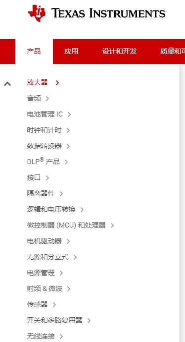

- 综合型半导体公司；C2000、ARM R、ARM A

## 3.2 NXP 恩智浦
https://www.nxp.com.cn/products/processors-and-microcontrollers:MICROCONTROLLERS-AND-PROCESSORS
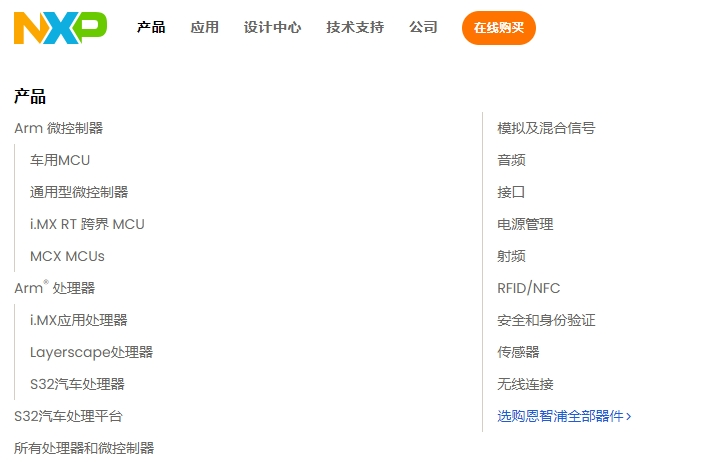
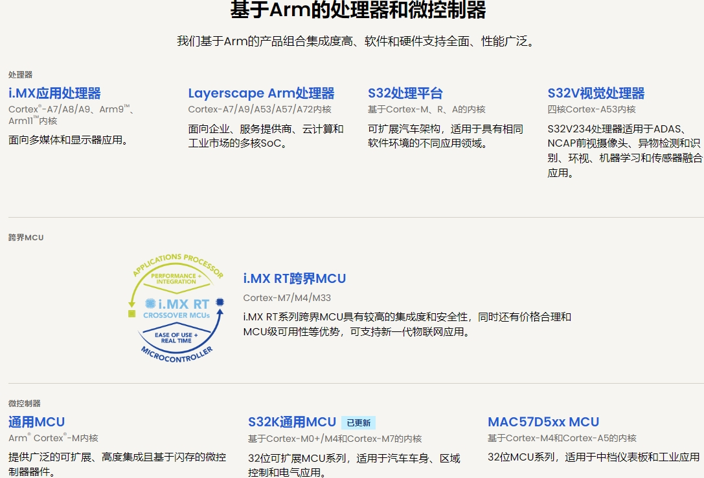
- 综合型半导体公司；i.MX RT、汽车

## 3.3 Renesas 瑞萨电子
https://www.renesas.cn/zh/products/microcontrollers-microprocessors#categories
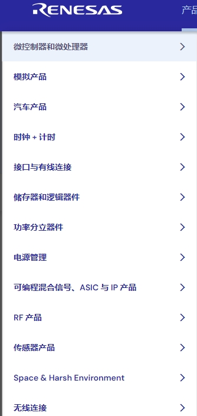
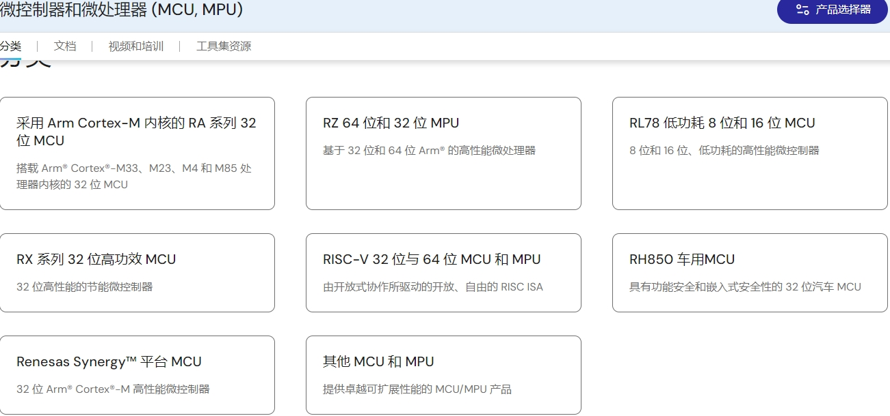
- 综合型半导体公司；ARM M、RL78/RX、汽车

## 3.4 ST 意法半导体
https://www.st.com.cn/content/st_com/zh.html
https://www.stmcu.com.cn/product

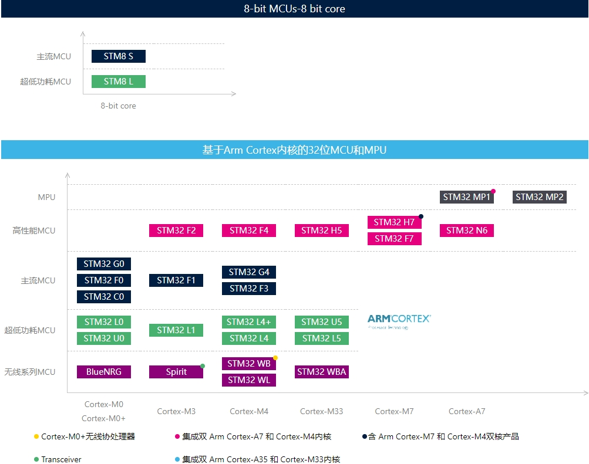
- 综合型半导体公司；ARM M、ARM A7

## 3.5 SliconLabs 芯科
https://cn.silabs.com/wireless
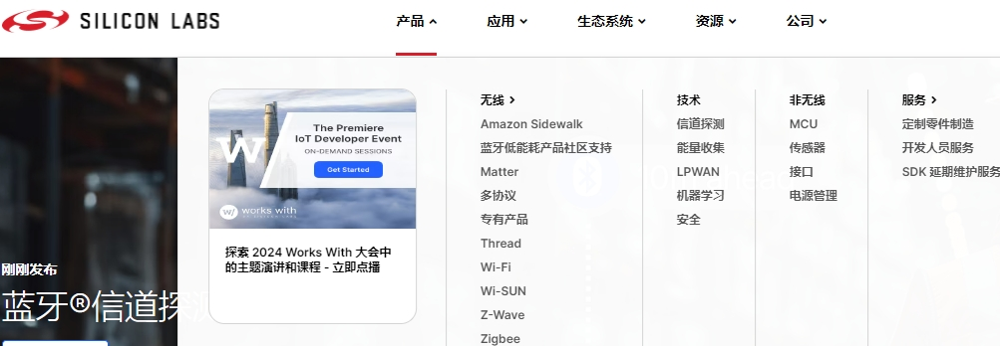

- 无线soc

## 3.6 Microchip 微芯
https://www.microchip.com/en-us/products/microcontrollers-and-microprocessors#Product%20Categories
https://www.microchip.com.cn/newcommunity/

  

# 四、国产
## 4.1 gigadevice 兆易创新
https://www.gigadevice.com.cn/product/mcu
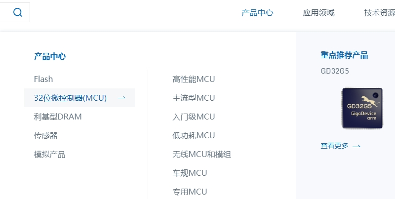

- Flash、ARM M等

## 4.2 Rockchip 瑞芯微
https://www.rock-chips.com/a/cn/product/index.html
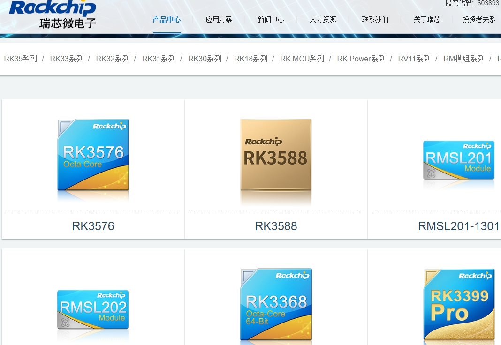
- ARM A、显示方案等

## 4.3 ALLWINNER全志
https://www.allwinnertech.com/index.php?c=product&a=index&topid=1
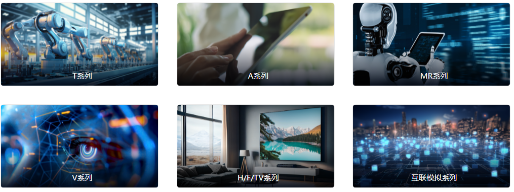
- ARM A、显示方案等
- 
## 4.4 HPmicro 先辑
https://47.108.71.172/product-center/microcontroller
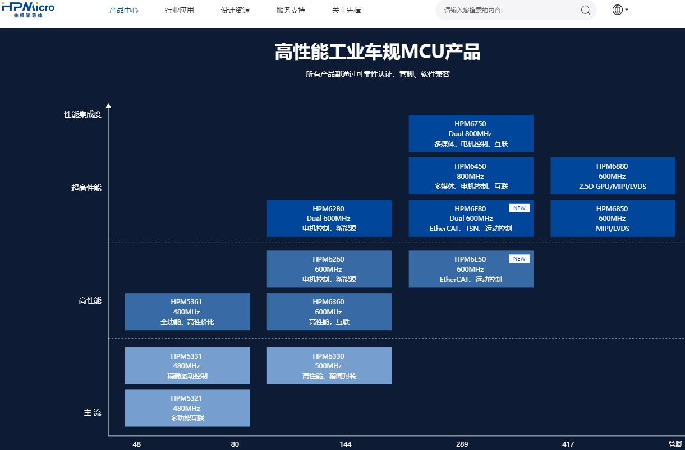
- 高性能工业车规MCU

## 4.5 hdsc 华大小华
https://www.hdsc.com.cn/
https://www.xhsc.com.cn/产品线
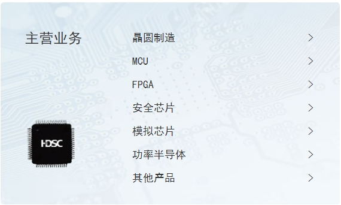
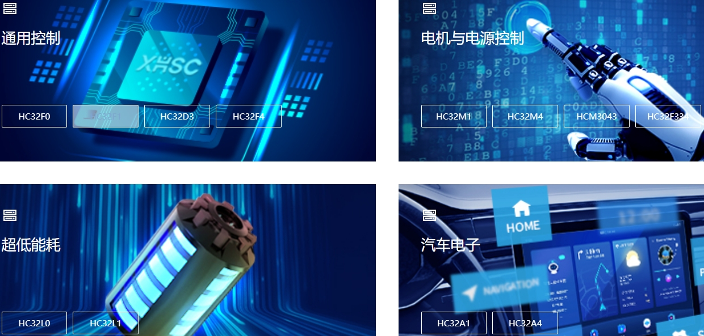
- 晶圆、MCU、模拟功率、行业MCU等

## 4.6 Geehy 极海
https://www.geehy.com/product/second/mcu
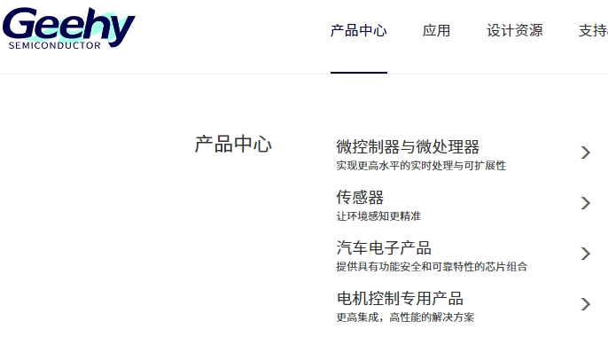

- 行业MCU等

## 4.7 ARTERY 雅特力
https://www.arterytek.com/cn/product/index.jsp?t=1734920135141
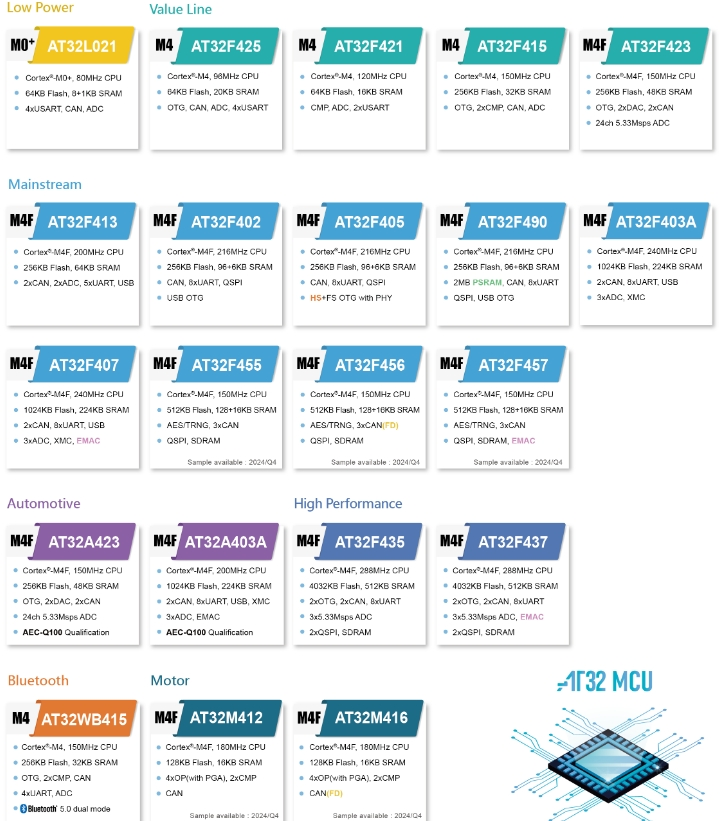
- 通用MCU

## 4.8 Cmsemicon 中微
https://www.mcu.com.cn/products.html

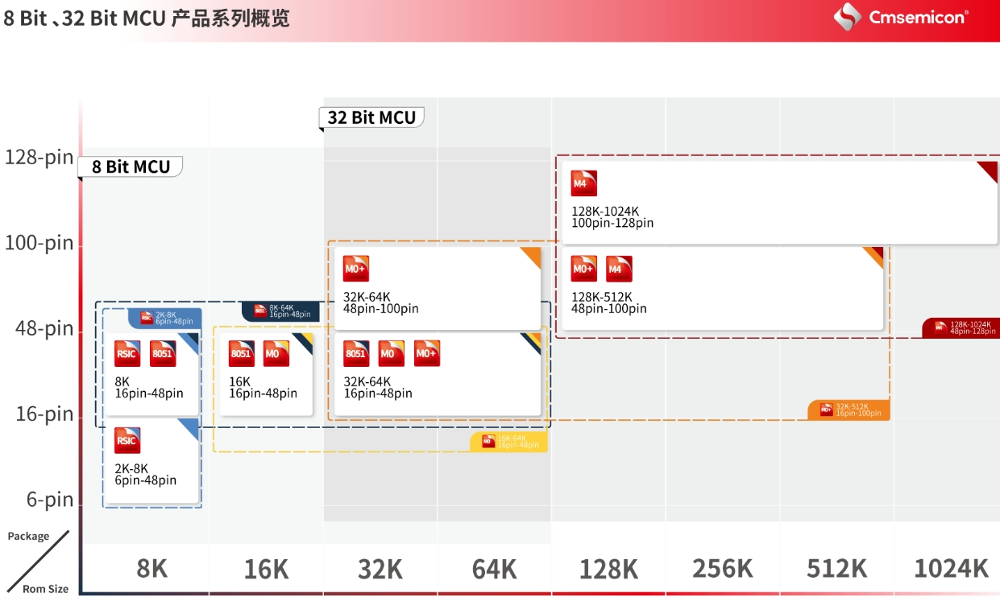
- 通用MCU

## 4.9 ESPRESSIF 乐鑫
https://www.espressif.com.cn/zh-hans

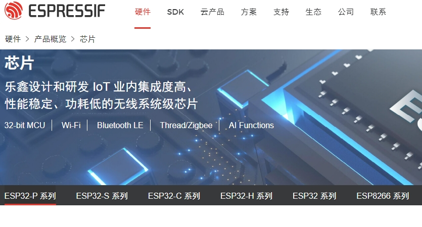
- IOT、软件等

## 4.10 Telink 泰凌微
https://www.telink-semi.cn/

- 无线soc

## 4.11 MindMotion 灵动微
https://www.mindmotion.com.cn/products/

- 通用MCU

## 4.12 CHIPSEA 芯海
https://www.chipsea.com/product/fmcu/
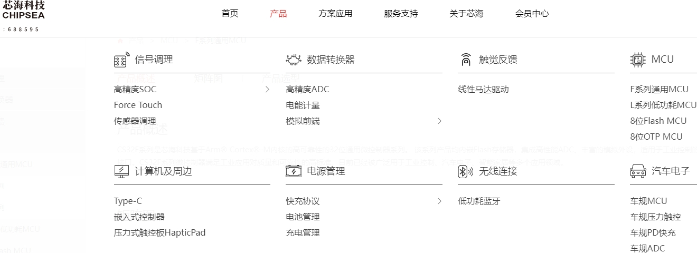
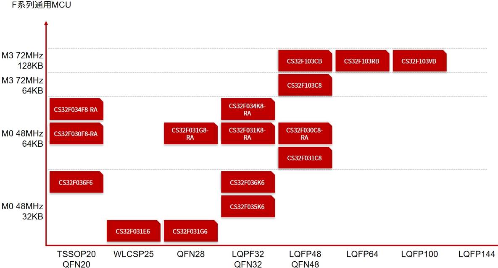
- 通用MCU

## 4.13 SINOWEALTH 中颖
https://www.sinowealth.com/homes

- 行业MCU

## 4.14 Sigmastar 星宸
https://www.sigmastar.com.cn/market/5
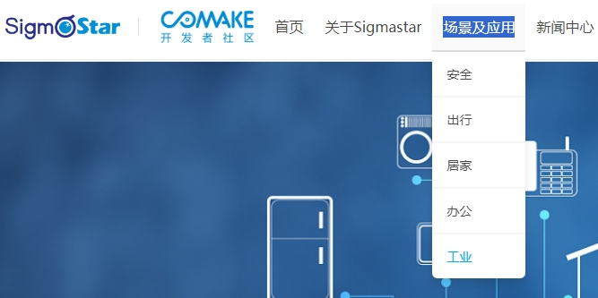
- 行业ARM A

## 4.15 SemiDrive 芯驰
https://www.semidrive.com/product/X9

- 汽车、工业行业MCU/MPU

## 4.16 STC 国芯
https://www.stcmicro.com/cn/cp.html
https://www.stcai.com/sy
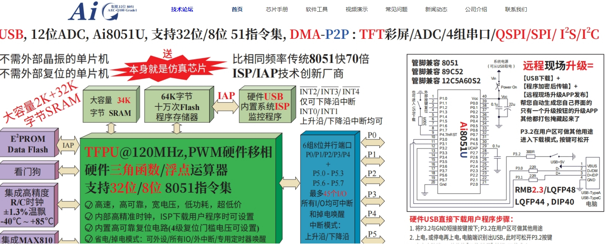
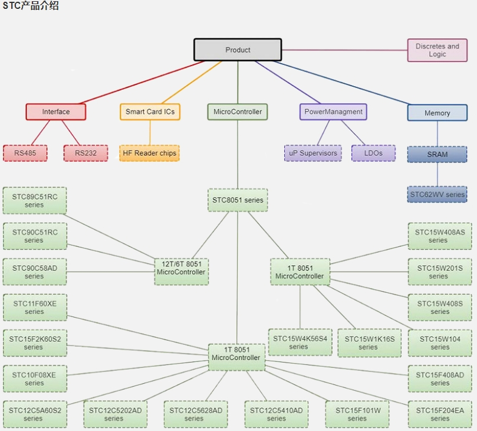
- 国产51
## 4.17 hisilicon海思
https://www.hisilicon.com/cn/products/MCU

# 五、台湾
## 5.1 nuvoton 新唐
https://www.nuvoton.com.cn/products/

- 综合型半导体公司；ARM M、ARM A

## 5.2 SONIC 松翰
https://www.sonix.com.tw/category-cn-508
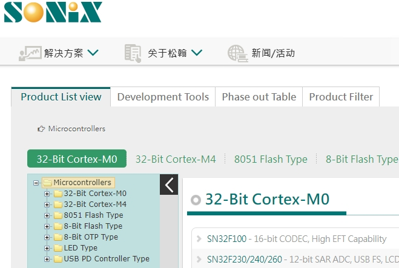
- 行业mcu

## 5.3 ITE 聯陽
https://www.ite.com.tw/tw/product

- 行业芯片

# 六、总结
返回看目录
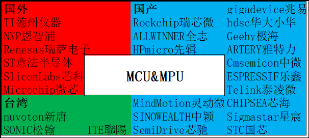