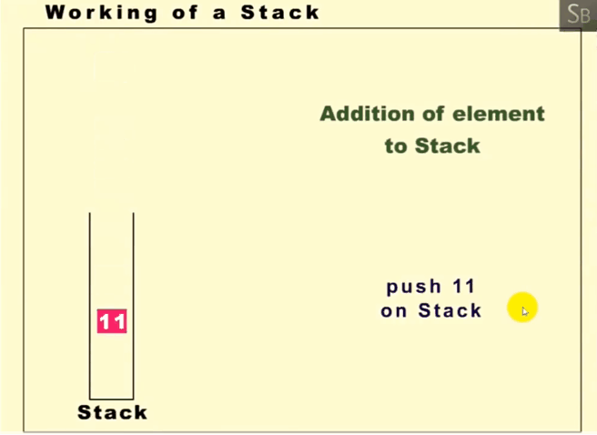
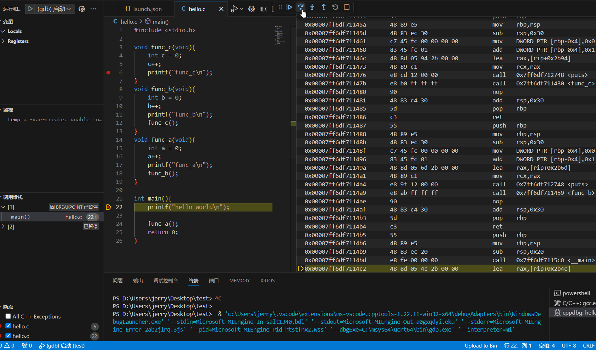
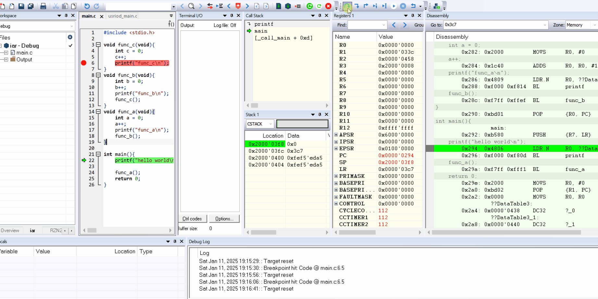
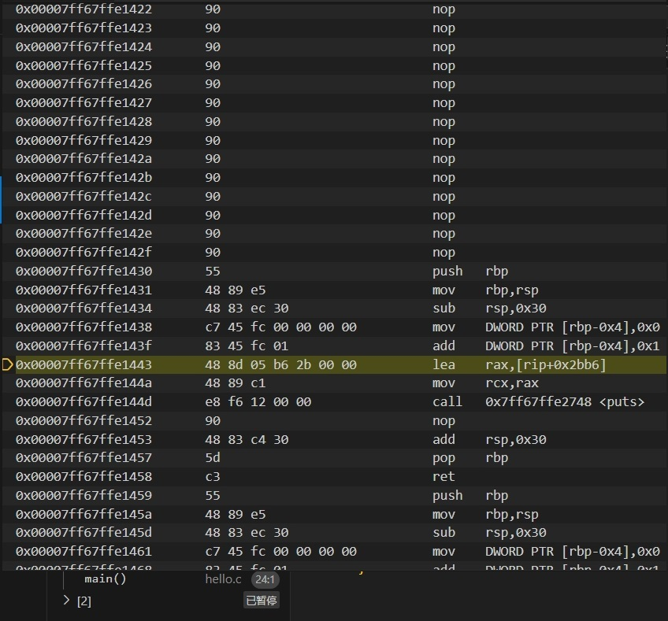

嵌入式科普(29)c代码究竟是如何一步步运行的之C语言运行的本质
===
[toc]
# 一、概述
- 我们讨论C语言运行的本质，是在工程师软件角度上的，不讨论内核和硬件电路运行本质
- C语言是贴近硬件的高级语言，C语言是跨平台的，本文主要讨论嵌入式C语言
- 先给结论：C语言运行的本质是**栈式函数调用**和**编译型语言**
- 通过一个简单的 C 语言程序，展示了函数调用栈的工作原理

# 二、相关资料

- https://baike.baidu.com/item/C11/3245086
- https://www.iso.org/standard/82075.html
- https://cn.bing.com/search?q=cppreference
- https://cppreference.cn/w/


- https://zhuanlan.zhihu.com/p/133874308

# 三、C语言是跨平台的
C语言之所以能在 MCU、嵌入式Linux、Windows 和 Ubuntu 等不同平台上运行，是因为 C 语言具有 跨平台性 和 可移植性。但仍然存在一些区别。

## 3.1 跨平台的含义
跨平台 是指程序能够在不同的**硬件平台**或**操作系统**上运行。

### 3.1.1 CPU 架构的不同

C 语言通过**编译器**实现跨 CPU 架构（如 x86、ARM、MIPS、RISC-V）的支持运行。编译器会根据目标 CPU 架构生成对应的机器码。

### 3.1.2 操作系统的不同

C 语言通过标准库（如 stdio.h、stdlib.h） 和条件编译（如 #ifdef） 实现跨操作系统如 Windows、Linux、macOS、RTOS等）的支持。


## 3.2 跨平台的实现

### 3.2.1 标准库
C 标准库（如 stdio.h、stdlib.h）提供了跨平台的函数接口。

例如，printf 函数在 Windows 和 Linux 上的行为是一致的。

### 3.2.3 条件编译
使用预处理器指令（如 #ifdef）区分不同平台的代码。

### 3.2.4 跨平台库
使用跨平台库（如 Qt）简化开发。

### 3.2.5 编译器支持
使用支持多平台的编译器（如 GCC、Clang）。

例如，GCC 可以为 x86、ARM、MIPS 等架构生成机器码。

# 四、C语言运行的本质
## 4.1 栈式函数调用
### 4.1.1 "栈式函数调用"和"函数调用栈"的区别
- 栈式函数调用主要强调**机制**，即通过**栈**来**管理**函数调用和返回
- 函数调用栈主要强调**状态**，即**栈**中**保存**的函数调用信息。
- 栈式函数调用 是实现 函数调用栈 的**机制**。
- 函数调用栈 是 栈式函数调用 的具体**表现**。
- 现代编程语言大多数都是栈式函数调用

### 4.1.2 函数调用的本质
- 函数调用：
    程序执行流程从一个函数跳转到另一个函数。

- 函数返回：
    程序执行流程从被调用函数返回到调用函数。

### 4.1.3 栈的作用
- 保存上下文：
    栈用于保存函数调用的上下文（如返回地址、局部变量、寄存器的值）。

- 管理执行流程：
    栈式调用确保了函数调用和返回的顺序性和正确性。

### 4.1.4  递归调用
栈式函数调用支持递归调用，每次递归调用都会创建一个新的栈帧。

## 4.2 编译型语言
### 4.2.1 编译型语言和非编译型语言的区别
编译型语言和非编译型语言的区别主要在于 代码的执行方式，而不是函数调用机制
- **编译型语言;**
  - 编译过程：
        源代码通过编译器转换为机器码。
  - 执行方式：
        机器码直接运行在硬件上。
  - 优点：
        执行效率高。
        编译器可以进行各种优化。
  - 示例：
        C、C++、Rust。
- **非编译型语言:**
  - 解释执行：
        源代码通过解释器逐行解释执行。
  - 字节码编译：
        源代码编译为中间代码（字节码），然后在虚拟机上执行。
   - 优点：
        跨平台。
        开发效率高。
    - 示例：
        Python、JavaScript、Ruby。

### 4.2.2 C语言的编译过程
- .c ---> .o ---> .exe/.elf ---> .bin
- 编译：[嵌入式科普(22)c代码究竟是如何一步步运行的之链接](https://mp.weixin.qq.com/s/S4zgB_YtJawDGHqGXkU71Q?token=1946762107&lang=zh_CN)
- 链接：[嵌入式科普(21)c代码究竟是如何一步步运行的之编译](https://mp.weixin.qq.com/s/xirMI0LaH6VJruCWwh1Pcw?token=1946762107&lang=zh_CN)

# 五、本文主题：C代码的运行
为了方便理解，c语言的**编译**可以细分为**编译**和**链接**两个过程；
c语言的**运行**可以细分为**加载**和**执行**两个过程，我在嵌入式c语言的角度称为“**运行环境准备**”和“**栈式函数调用**”

## 5.1 加载/运行环境准备
### 5.1.1 mcu运行环境准备
startup.s启动文件
- 初始化最基本的硬件（如内核、cpu、cache、时钟、rom/ram等）。
- 从存储设备（如 内置Flash、外置Flash、SD 卡等）初始化栈（Stack）、堆（Heap）、.data 段、.bss 段、浮点、标准库、部分外设等
- 跳转到main

#### 5.1.1.1 普通mcu stm32
```
    .section	.text.Reset_Handler
	.weak	Reset_Handler
	.type	Reset_Handler, %function
Reset_Handler:
  ldr   sp, =_estack    /* set stack pointer */
/* Call the clock system initialization function.*/
  bl  SystemInit

/* Copy the data segment initializers from flash to SRAM */
  movs	r1, #0
  b	LoopCopyDataInit

CopyDataInit:
	ldr	r3, =_sidata
	ldr	r3, [r3, r1]
	str	r3, [r0, r1]
	adds	r1, r1, #4

LoopCopyDataInit:
	ldr	r0, =_sdata
	ldr	r3, =_edata
	adds	r2, r0, r1
	cmp	r2, r3
	bcc	CopyDataInit
	ldr	r2, =_sbss
	b	LoopFillZerobss
/* Zero fill the bss segment. */
FillZerobss:
	movs	r3, #0
	str	r3, [r2], #4

LoopFillZerobss:
	ldr	r3, = _ebss
	cmp	r2, r3
	bcc	FillZerobss

/* Call static constructors */
    bl __libc_init_array
/* Call the application's entry point.*/
	bl	main

LoopForever:
    b LoopForever
```

#### 5.1.1.2 跨界mcu/mpu RZN2L
- [从0开始卷出一个新项目之瑞萨RZN2L](https://mp.weixin.qq.com/mp/appmsgalbum?__biz=MzkxNDQyMTU4Mg==&action=getalbum&album_id=3167963498191110153#wechat_redirect)
```
BSP_TARGET_ARM void system_init (void)
{
    __asm volatile (
        "set_hactlr:                              \n"
        "    MOVW  r0, %[bsp_hactlr_bit_l]        \n" /* Set HACTLR bits(L) */
        "    MOVT  r0, #0                         \n"
        "    MCR   p15, #4, r0, c1, c0, #1        \n" /* Write r0 to HACTLR */
        ::[bsp_hactlr_bit_l] "i" (BSP_HACTLR_BIT_L) : "memory");

    __asm volatile (
        "set_hcr:                                 \n"
        "    MRC   p15, #4, r1, c1, c1, #0        \n" /* Read Hyp Configuration Register */
        "    ORR   r1, r1, %[bsp_hcr_hcd_disable] \n" /* HVC instruction disable */
        "    MCR   p15, #4, r1, c1, c1, #0        \n" /* Write Hyp Configuration Register */
        ::[bsp_hcr_hcd_disable] "i" (BSP_HCR_HCD_DISABLE) : "memory");

    __asm volatile (
        "set_vbar:                                \n"
        "    LDR   r0, =__Vectors                 \n"
        "    MCR   p15, #0, r0, c12, c0, #0       \n" /* Write r0 to VBAR */
        ::: "memory");

#if (0 == BSP_CFG_CORE_CR52)
    __asm volatile (
        "LLPP_access_enable:                      \n"

        /* Enable PERIPHPREGIONR (LLPP) */
        "    MRC   p15, #0, r1, c15, c0,#0        \n" /* PERIPHPREGIONR */
        "    ORR   r1, r1, #(0x1 << 1)            \n" /* Enable PERIPHPREGIONR EL2 */
        "    ORR   r1, r1, #(0x1)                 \n" /* Enable PERIPHPREGIONR EL1 and EL0 */
        "    DSB                                  \n" /* Ensuring memory access complete */
        "    MCR   p15, #0, r1, c15, c0,#0        \n" /* PERIPHREGIONR */
        "    ISB                                  \n" /* Ensuring Context-changing */
        ::: "memory");
#endif
....
....
....
/* Jump to main. */
    main();
```

### 5.1.2 嵌入式Linux启动U-boot和内核
U-boot和内核都有c代码
- 汇编代码，负责完成最基本的硬件初始化（如设置堆栈指针、关闭中断、初始化内存控制器）。
- 在汇编代码完成初始化后，U-Boot 跳转到 C 语言代码的入口点（通常是 board_init_f 或 board_init_r）
- C 语言代码进一步初始化硬件（如串口、网络、存储设备）
- 加载 Linux 内核和设备树到内存
- 跳转到 Linux 内核的入口点汇编代码（如 head.S），负责完成最基本的硬件初始化（如设置页表、启用 MMU）
- Linux 内核跳转到 C 语言代码的入口点（start_kernel）
- C 语言代码进一步初始化硬件（如中断控制器、设备驱动）
- 挂载根文件系统。
- 启动第一个用户空间进程（通常是 init 或 systemd）

### 5.1.3 window和Ubuntu c程序加载

- 操作系统负责C运行环境准备，c代码直接运行到main函数
- 程序执行
    ./hello
    .\hello.exe

## 5.2 执行/栈式函数调用
C语言运行环境准备好了之后，代码运行到main函数，mcu、嵌入式Linux、window、Ubuntu中c代码执行的国产是一样的，即栈式函数调用

### 5.2.1 数据结构---栈
栈是一种**后进先出LIFO**的数据结构，通常用一个数组或链表实现。栈有两个主要操作：
- 压栈（Push）：将数据放入栈顶。
- 出栈（Pop）：从栈顶移除数据。
- 栈有一个指针（通常称为栈顶指针SP），指向当前栈顶的位置。



### 5.2.2 Windows vscode运行
```
#include <stdio.h>

void func_c(void){
    int c = 0;
    c++;
    printf("func_c\n");
}
void func_b(void){
    int b = 0;
    b++;
    printf("func_b\n");
    func_c();
}
void func_a(void){
    int a = 0;
    a++;
    printf("func_a\n");
    func_b();
}

int main(){
    printf("hello world\n");

    func_a();
    return 0;
}
```




### 5.2.3 IAR运行CM3内核



### 5.2.4 CM3栈示意图
- 注意地址高低在图中的位置


#### 5.2.4.1 分析"静态栈"
- 在[十六、e2studio VS STM32CubeIDE之"静态栈"分析窗口](https://mp.weixin.qq.com/s/2EqA11YOvn-nT_OuhoeVKA?token=1946762107&lang=zh_CN)的分享可以分析"静态栈"

#### 5.2.4.2 分析"动态栈"
- 在[十二、e2studio VS STM32CubeIDE之栈回溯cmbacktrace](https://mp.weixin.qq.com/s?__biz=MzkxNDQyMTU4Mg==&mid=2247485435&idx=1&sn=2c22cb1e04dc1f9a8973f923f777a55a&token=1655026831&lang=zh_CN&scene=21#wechat_redirect)可以分析“动态栈”

### 5.2.5 不同的cpu指令集
- Windows 64



- CM3内核


# 六、总结
- C语言运行的本质是**栈式函数调用**和**编译型语言**
- C函数调用栈的分析是重要技能
- 理解C语言的编译链接原理
- 最后对该系列（*嵌入式科普(29)c代码究竟是如何一步步运行的*）总结：
  - 1、嵌入式C代码经过编译、链接生成可执行文件和bin文件；
  - 2、在ROM boot作用下执行到汇编代码，汇编代码初始化c语言的运行环境（cpu、flash、ram、text、data、bss、时钟等），跳转到main函数；
  - 3、用户C代码按照栈式函数调用的方式执行


