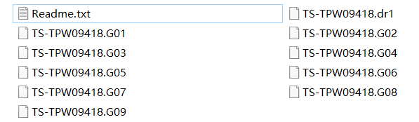
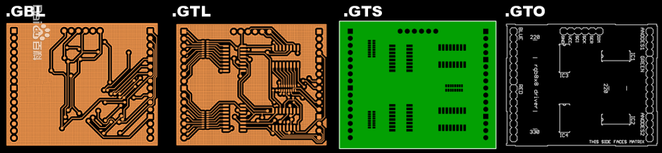
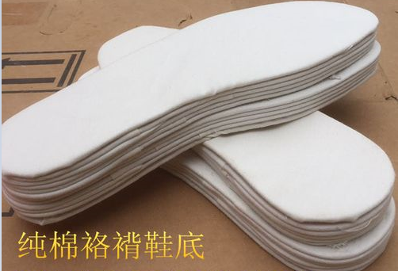
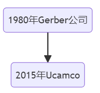
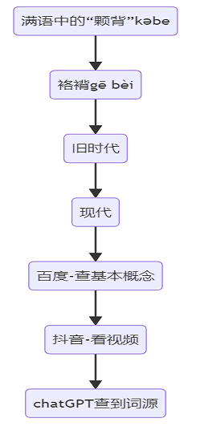

**嵌入式科普(2)据说理解“Gerber”和“袼褙”两个词的不到1%？**
[toc]

# 一、概述/目的
- 推荐一个在线查看Gerber文件的网站
- 通过“袼褙”解释“Gerber”和电路板到底是什么

# 二、什么是“Gerber”和“袼褙”
- Gerber：
    印刷电路板的文件格式，统一标准和保护知识产权的作用
 [在线查看Gerber：https://gerber-viewer.ucamco.com/](https://gerber-viewer.ucamco.com/)  

    
  

- 袼褙：
    做“千层底”鞋底的原材料，用浆糊将破布一层层粘起来
   

# 三、“Gerber”和“袼褙”共同点
|词语|发音|特征|生产流程|重要性|
|:-:|:-:|:-:|:-:|:-:|
|Gerber|/gɛbə/|多层|印刷电路板|“电子产品的基础”|
|袼褙|[gē bèi] [geber]|多层|“打袼褙”|“千里之行始于足下”|

- 发展过程

旧时代的落幕，新时代的开启。