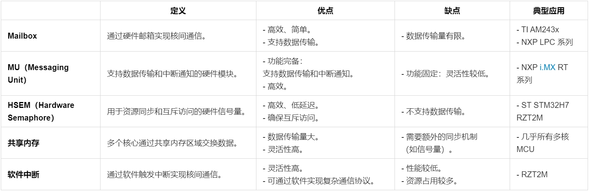
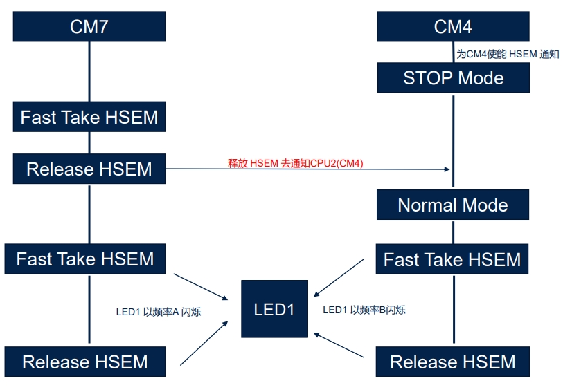

嵌入式科普(30)一文看懂嵌入式MCU/MPU多核架构与通信
===
[toc]

# 一、概要
- 快速了解嵌入式MCU/MPU的多核架构、通信与调试。
- 重点介绍同构Cortex-M/R多核

# 二、相关资料
- https://blog.csdn.net/weixin_42135087/article/details/123191551
- https://www.nxp.com.cn/company/about-nxp/smarter-world-videos/CORTEX-M4-DUAL-CORE-IMPLEMENTAT
- https://blog.csdn.net/weixin_41493155/article/details/142206668
- https://docs.espressif.com/projects/esp-idf/zh_CN/stable/esp32/api-reference/system/freertos_idf.html#id3
- [FreeRTOS 的对称多处理 (SMP)](https://www.freertos.org/zh-cn-cmn-s/Documentation/02-Kernel/02-Kernel-features/13-Symmetric-multiprocessing-introduction)
- [多核异构核间通信–ipcc](https://doc.embedfire.com/linux/stm32mp1/driver/zh/latest/linux_driver/framework_ipcc.html)
- [AM263P Technical Reference Manual](./doc/AM263P%20Technical%20Reference%20Manual.pdf)
- [i.MX RT1170 Dual Core Application](./doc/i.MX%20RT1170%20Dual%20Core%20Application.pdf)
- [LAT1396_STM32CubeIDE实用技巧之STM32H7双核调试的配置_V1.0](./doc/LAT1396_STM32CubeIDE实用技巧之STM32H7双核调试的配置_V1.0.pdf)
- [LPC55xx LPC55Sxx 的双核通信](./doc/LPC55xx%20LPC55Sxx%20的双核通信.pdf)
- [RT600 双核通信与调试](./doc/RT600%20双核通信与调试.pdf)
- [STM32H7 Product Training of Techincal_20210119](./doc/STM32H7%20Product%20Training%20of%20Techincal_20210119.pdf)
- [STM32H7x5x7 dual core microcontroller debugging](./doc/STM32H7x5x7%20dual%20core%20microcontroller%20debugging.pdf)

# 三、多核架构

| **架构类型**       | **同构多核**                                                                 | **异构多核**                                                                 | **锁步核（Lockstep）**                                                   |
|--------------------|-----------------------------------------------------------------------------|-----------------------------------------------------------------------------|--------------------------------------------------------------------------|
| **定义**           | 多个核心完全相同（多Cortex-A 或 多Cortex-M7/M4）。                         | 多个核心不同（如 Cortex-M7 + Cortex-M4 或 Cortex-A + Cortex-M）。            | 两个核心执行相同的指令，通过比较结果确保功能安全。                        |
| **优点**           | - 负载均衡：任务可以均匀分配到多个核心。Linux系统负责；根据内核定义功能。   | - 分工明确：高性能核心处理复杂任务，低功耗核心处理实时任务。 - 能效优化。 | - 高可靠性：适用于功能安全（Functional Safety）应用。                     |
| **缺点**           | - 资源浪费：均匀分配问题；主核心和副核心。                     | - 开发复杂：需要针对不同核心编写和调试代码。                                | - 资源占用：需要额外的硬件和软件支持。                                    |
| **典型应用**       | - 高性能（多Cortex-A）。          | - 高性能 + 实时控制（如 STM32H7 的 Cortex-M7 + Cortex-M4）。 - 应用处理器 + 实时控制。 | - 汽车电子（如 TI AM263x 的 Cortex-R5F 锁步核）。 - 工业安全系统。     |

- 同构多核

定义：多个相同核心（多Cortex-A 或 多Cortex-M7/M4）。

优点：负载均衡、开发简单。

缺点：资源浪费。

应用：高性能计算。

- 异构多核

定义：多个不同核心（如 Cortex-A + Cortex-M）。

优点：分工明确、能效优化。

缺点：开发复杂。

应用：高性能 + 实时控制。

- 3.3 锁步核

定义：两个核心执行相同指令，确保功能安全。

优点：高可靠性。

缺点：资源占用。

应用：汽车电子、工业安全。

# 四、多核通信机制

|  | **定义** | **优点** | **缺点** | **典型应用** |
| --- | --- | --- | --- | --- |
| **Mailbox** | 通过硬件邮箱实现核间通信。 | - 高效、简单。 - 支持数据传输。 | - 数据传输量有限。 | - TI AM243x - NXP LPC 系列 |
| **MU（Messaging Unit）** | 支持数据传输和中断通知的硬件模块。 | - 功能完备：支持数据传输和中断通知。 - 高效。 | - 功能固定：灵活性较低。 | - NXP i.MX RT 系列 |
| **HSEM（Hardware Semaphore）** | 用于资源同步和互斥访问的硬件信号量。 | - 高效、低延迟。 - 确保互斥访问。 | - 不支持数据传输。 | - ST STM32H7 RZT2M |
| **共享内存** | 多个核心通过共享内存区域交换数据。 | - 数据传输量大。 - 灵活性高。 | - 需要额外的同步机制（如信号量）。 | - 几乎所有多核 MCU |
| **软件中断** | 通过软件触发中断实现核间通信。 | - 灵活性高。 - 可通过软件实现复杂通信协议。 | - 性能较低。 - 资源占用较多。 | -  RZT2M |

# 五、典型举例

| **MCU**            | **架构**               | **通信机制**         | **特点**                                                                 |
|--------------------|------------------------|----------------------|--------------------------------------------------------------------------|
| **NXP i.MX RT1170** | Cortex-M7 + Cortex-M4  | MU + SEMA4           | - 高性能 + 实时控制。 - 支持数据传输和同步。                           |
| **ST STM32H7 瑞萨 RZT2M**     | Cortex-M7 + Cortex-M4  | HSEM           | - 高性能 + 实时控制。 - 支持资源同步和互斥访问。                       |
| **TI AM243x**      | Cortex-R5F             | Mailbox + IPCC   | - 实时控制 + 工业通信。 - 支持大数据传输。                             |
| **瑞萨 RZT2M**      | Cortex-R52             | 软件中断             | - 高灵活性。 - 适合安全性要求高的场景。                                |

# 六、总结
- 同构Cortex-A多核由Linux复制内核通信，IPC进程通信，高性能
- 同构Cortex-M/R多核有多种通信机制，如FreeRTOS SMP、MU、IPC、信号量、Mailbox、共享内存、CPU中断等
- 异构多核通常用AMP等机制