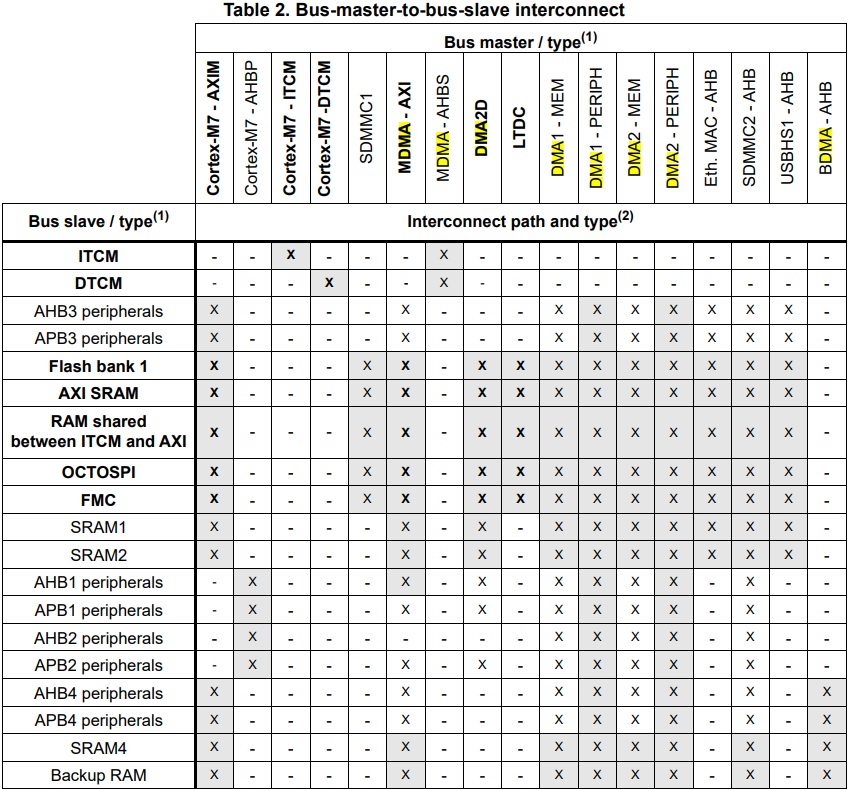
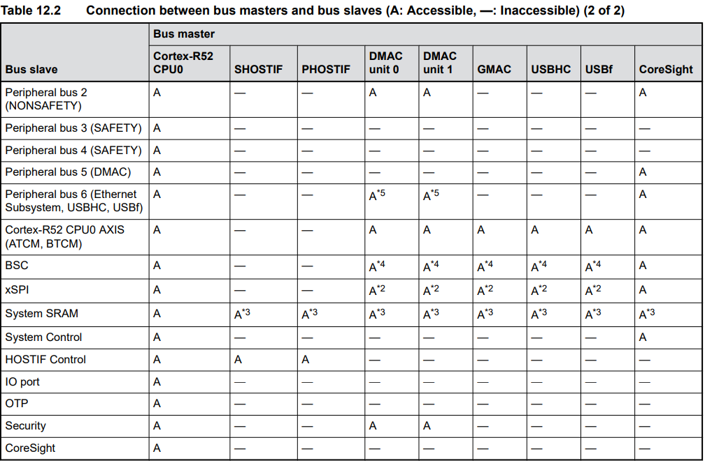
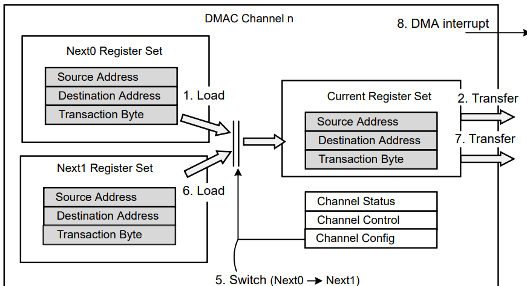
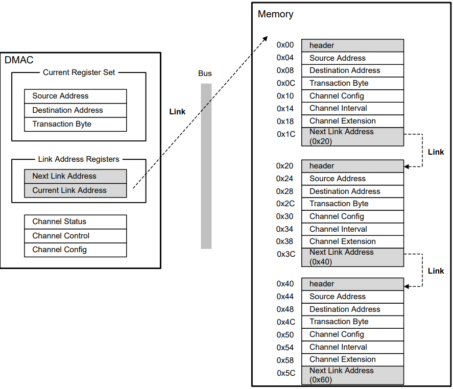

嵌入式科普(34)通过对比看透DMA的本质
===
[toc]

# 1.概述
- 众所周知，使用DMA能高效传输数据，因为无需CPU参与。
  但高性能/跨界的MCU/MPU有更复杂的DMA功能，需要有更深层次的理解。
- 通过对比STM32和RZN2L的DMA功能，了解其中的复杂性，尝试总结DMA的本质
- DMA通过**硬件并行、释放CPU、减少中断、批量传输**，显著提升数据传输效率，确保关键任务实时性
  

# 2.DMA高级功能对比

| **对比项**               | **RZN2L DMA**                                                                 | **STM32H7 DMA**                                                                 | **备注**                                                                 |
|--------------------------|-------------------------------------------------------------------------------|---------------------------------------------------------------------------------|--------------------------------------------------------------------------|
| **架构**                 | 双DMAC单元（DMAC0和DMAC1），共16通道                                         | 双DMA控制器（DMA1和DMA2），每个控制器8个流（Stream）                           | RZN2L的DMAC为独立单元，STM32H7通过流（Stream）和DMAMUX管理多通道请求。  |
| **通道/流数量**          | 每DMAC 8通道，共16通道                                                       | 每DMA控制器8个流，共16流，每个流支持115个通道请求（通过DMAMUX）                | STM32H7通过DMAMUX灵活映射外设请求到流，通道扩展性更强。                  |
| **数据 传输模式**         | 支持单次传输（Per-request）、块传输（Block）、寄存器模式（Register）、链接模式（Link） | 支持常规模式（内存↔外设）、双缓冲模式（Double Buffer）、内存↔内存、FIFO模式 | RZN2L的链接模式支持描述符链式传输；STM32H7双缓冲适合连续数据流处理。     |
| **数据宽度**             | 8/16/32/64/128/256/512位                                                     | 8/16/32位                                                                      | RZN2L支持更宽的数据宽度（如512位），适合高带宽场景。                     |
| **最大 传输大小**         | 单次传输最大为3字节（2^32-1）                                   | 每个传输项支持1~65535次传输（DMA流控制器）                                     | RZN2L支持更大规模的连续数据传输。                                      |
| **触发方式**             | 外部请求（DRECQ）、外设请求、软件请求                                        | 硬件触发（外设请求）、软件触发、DMAMUX事件触发                                 | STM32H7的DMAMUX支持事件触发，灵活性更高。                                |

| **对比项**               | **RZN2L DMA**                                                                 | **STM32H7 DMA**                                                                 | **备注**                                                                 |
|--------------------------|-------------------------------------------------------------------------------|---------------------------------------------------------------------------------|--------------------------------------------------------------------------|
| **优先级控制**           | 固定优先级或循环调度（Round-Robin）                                          | 4级软件可编程优先级（非常髙/高/中/低）或硬件默认优先级                         | RZN2L支持动态调度，STM32H7优先级更细分。                                 |
| **地址增量**             | 支持源/目标地址独立增量                                                      | 支持源/目标地址独立增量，且支持突发传输（4/8/16拍）                           | STM32H7突发传输优化总线利用率。                                          |
| **中断类型**             | 传输完成、传输错误（每DMAC单元独立）                                         | 传输完成、半传输、传输错误、FIFO错误、直接模式错误                             | STM32H7中断类型更细分，支持实时监控多种状态。                            |
| **FIFO功能**             | 无明确FIFO描述，但支持缓冲区刷新（Buffer Flush）                             | 4级深度FIFO，支持阈值配置（1/4、1/2、3/4）或直接模式                          | STM32H7的FIFO优化了数据传输连续性。                                      |
| **双缓冲 /循环模式**      | 支持双缓冲（Double Buffer）                                                  | 支持双缓冲和循环缓冲（Circular Buffer）                                        | 两者均适合连续数据流处理。                                               |
| **错误处理**             | 传输错误中断，支持自动暂停和缓冲区刷新                                       | 传输错误、FIFO错误、直接模式错误检测                                           | RZN2L支持暂停和刷新，STM32H7错误检测更全面。                             |
| **特殊功能**             | 链表模式（Link Mode）、传输间隔调整（Interval Function）                    | DMAMUX请求多路复用器（支持115个外设请求映射）、突发传输                       | RZN2L的链表模式支持复杂传输链；STM32H7的DMAMUX扩展了外设兼容性。        |
| **适用场景**             | 工业通信（以太网、CAN-FD）、高速数据采集                                     | 实时控制（电机驱动）、多通道传感器采集、音频流处理                             | RZN2L侧重高带宽工业协议；STM32H7侧重灵活外设管理和实时控制。            |

# 3.硬件并行

| 对比项            | 无DMA的传统传输                           | DMA传输                                       | 对比结果                                   |
|-------------------|-------------------------------------------|----------------------------------------------|------------------------------------------|
| 总线占用方式      | CPU与外设共享总线，需频繁仲裁             | DMA通过专用总线独立操作，与CPU并行             | DMA减少总线竞争，提升带宽利用率           |
| 传输控制          | CPU逐字节操作，指令周期占用总线           | DMA硬件控制器管理传输，突发模式批量搬运数据   | 突发传输优化总线占用周期                 |
| 吞吐量峰值        | 受限于CPU指令效率（如32位MCU约50MB/s）   | 依赖总线宽度（如64位AXI总线可达3.2GB/s）     | DMA吞吐量提升10倍以上                   |
| 典型场景          | 小数据量传输（如GPIO控制）               | 高速数据流（如千兆以太网、摄像头采集）       | DMA适合高带宽需求场景                   |

# 4.释放CPU

| 对比项            | 无DMA的传统传输                           | DMA传输                                       | 对比结果                                   |
|-------------------|-------------------------------------------|----------------------------------------------|------------------------------------------|
| CPU占用率         | 高（需执行LOAD/STORE指令，占用80%+算力） | 低（仅初始化参数，占用<5%算力）             | CPU算力释放给核心算法（如AI推理、控制逻辑） |
| 任务并行性        | CPU阻塞在数据搬运中，无法处理其他任务     | CPU与DMA并行工作，实现多任务流水线           | 系统整体效率显著提升                     |
| 实时性保障        | 高负载下响应延迟不可控                   | 确定性传输保障硬实时任务（如PWM波形更新）     | 关键任务（电机控制）延迟降低至微秒级     |
| 代码复杂度        | 需手动编写数据搬运逻辑，代码冗余           | 硬件自动处理，代码简洁易维护                 | 开发效率提升，减少潜在错误                 |

# 5.减少中断对比表

| 对比项            | 无DMA的传统传输                           | DMA传输                                       | 对比结果                                   |
|-------------------|-------------------------------------------|----------------------------------------------|------------------------------------------|
| 中断频率          | 每个数据项触发一次中断（如1KB数据需1024次中断） | 整块传输完成触发一次中断                     | 中断频率降低99.9%                        |
| 上下文切换开销    | 高频中断导致大量寄存器保存/恢复操作       | 极低的中断次数减少上下文切换                 | CPU有效算力提升20%-30%                    |
| 实时任务影响      | 中断延迟可能阻塞高优先级任务             | 确定性中断触发，优先级可配置                 | 硬实时任务（如ADC采样）抖动小于1μs         |
| 功耗优化          | 频繁中断唤醒CPU，增加动态功耗             | CPU可进入低功耗模式，仅响应最终完成中断       | 系统待机功耗降低50%+                     |

# 6.批量传输对比表

| 对比项            | 无DMA的传统传输                           | DMA传输                                       | 对比结果                                   |
|-------------------|-------------------------------------------|----------------------------------------------|------------------------------------------|
| 传输粒度          | 单字节/单字传输，效率低下                 | 支持突发传输（4/8/16拍）或整块传输（如1KB）   | 有效带宽利用率提升至90%+                 |
| 数据一致性        | 逐项处理易因中断导致数据错位             | 硬件保证数据块原子性传输                     | 避免数据丢失或错位（如SD卡写入）         |
| 复杂数据流支持    | 需软件手动管理非连续数据                 | 支持描述符链表（如RZN2L）自动跳转传输         | 协议栈分包处理效率提升3倍+               |
| 典型优化场景      | 小文件读写                               | 大文件传输、音视频流、网络协议栈             | DMA使能后，FPS（帧率）稳定性提升40%       |

# 7.总结
- DMA的本质是硬件级并行化，释放CPU、减少中断，数据批处理。
- 理解DMA的本质便于理解/学习更复杂的DMA功能。
- 后续会有通过DMA输出PWM、DMA连续传输ADC等例子分享。