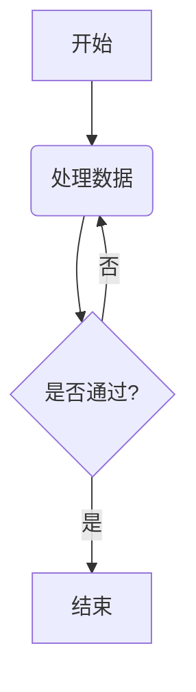

嵌入式科普(35)当AI遇上Markdown：一场“全民工程师”的排版革命
===
[toc]

# 一、概述
- 央视等媒体的#**10岁小孩哥挑战用AI软件3分钟做完PPT**火爆网络
  通过DeepSeek生成文案，Kimi渲染PPT。其中最最重要环节就是**Markdown**
- [嵌入式科普(13)汽车OTA---这些年被大众熟知的嵌入式词语](https://mp.weixin.qq.com/s?__biz=MzkxNDQyMTU4Mg==&mid=2247484860&idx=1&sn=51d4be65f2911379510728050f9b9512&chksm=c16fe79df6186e8b205271408d3c18cb64cc0cfd40da2b1aa21fcf3b11d094850fe037aff878&scene=178&cur_album_id=3188272463181365248#rd)
- 学习AI/精通AI必须要学会Markdown
- 本文介绍**小众语言——Markdown**


# 二、Markdown是什么？——极简主义的文本革命
- 1 诞生与定位
Markdown由约翰·格鲁伯（John Gruber）于2004年创建，初衷是用纯文本实现优雅排版，避免传统排版工具（如Word）的复杂操作。它的核心设计理念是：“专注内容，而非格式”。

- 2 核心特点

    - 轻量化：仅需几个符号（如#、*）即可完成标题、列表、链接等排版。

    - 兼容性：纯文本格式可在任何设备上打开，且能一键转换为HTML、PDF等格式。

    - 跨平台：从GitHub技术文档到微信公众号排版，Markdown无处不在。
  
# 三、为什么Markdown突然火了
- 1 AI工具的推波助澜
如今，DeepSeek等AI工具能直接解析Markdown笔记，实现智能检索、内容生成。例如：

    - 知识管理：用Obsidian+AI插件，自动关联笔记并生成知识图谱。

    - 自动化写作：AI根据Markdown模板生成技术文档、会议纪要。

- 2 效率至上的需求
在信息爆炸的时代，人们渴望“少点鼠标，多敲键盘”。Markdown的快捷键（如Ctrl+B加粗）和简洁语法，完美契合这一需求。
    - 一位博主形容：“用Markdown写文章，就像在纯白画布上挥毫——没有干扰，只有心流。”

# 四、Markdown的“破圈”场景：不止于工程师

1. 学生党：用Markdown记笔记，一键导出为复习PDF。
2. 自媒体人：在Typora中排版公众号，直接粘贴到编辑器。
3. 团队协作：GitHub+Markdown，让需求文档版本清晰。
4. 生活管理：旅行计划、菜谱列表——万物皆可Markdown！

# 五、5分钟上手Markdown：这些符号让你秒变排版达人
https://markdown.com.cn/basic-syntax/headings.html

## 5.1 基础语法
### 5.1.1 标题分级

```
# 一级标题  
## 二级标题  
### 三级标题  
#### 四级标题  
##### 五级标题  
###### 六级标题  
```
效果：

一级标题
二级标题
三级标题

### 5.1.2 文字样式
```
**粗体** 或 __粗体__  
*斜体* 或 _斜体_  
~~删除线~~  
==高亮==（部分编辑器支持）  
`行内代码`  
```
效果：
**粗体** 斜体 ~~删除线~~ ```print("Hello")```

### 5.1.3 列表
```
- 无序列表项  
  - 子列表（缩进2空格）  
1. 有序列表项  
2. 第二项  
```
效果：

- 苹果

    - 红富士

### 5.1.4 链接与图片
```
[文字链接](https://example.com)  
  
<https://自动链接.com>  
```
[deepseek](https://chat.deepseek.com)

### 5.1.5 引用与分割线
```
> 引用内容  
> 多行引用

--- 或 ***（分割线）
```

## 5.2 扩展语法（GFM支持）
### 5.2.1 表格
```
| 姓名   | 年龄 | 技能       |
|--------|------|------------|
| 张三   | 25   | Python     |
| 李四   | 30   | JavaScript |
```
| 姓名   | 年龄 | 技能       |
|--------|------|------------|
| 张三   | 25   | Python     |
| 李四   | 30   | JavaScript |

### 5.2.2 代码块（语法高亮）


```python
def hello():
    print("Markdown真香！")
```


### 5.2.3 任务列表
```

- [x] 已完成任务  
- [ ] 未完成任务  
```

### 5.2.4 脚注
```
这是一个带脚注的句子[^1]  
[^1]: 脚注内容在此  
```

## 5.3 高级用法
### 5.3.1 流程图/Mermaid图
```

```


# 六、总结
- Markdown的普及，正是技术民主化的又一缩影。就像新能源汽车的OTA（远程升级）功能
- 核心设计理念是：“专注内容，而非格式”
- AI时代，更是一场“全民工程师”的时代，让我们先来学好Markdown
