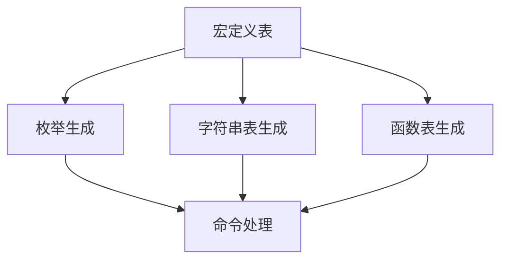
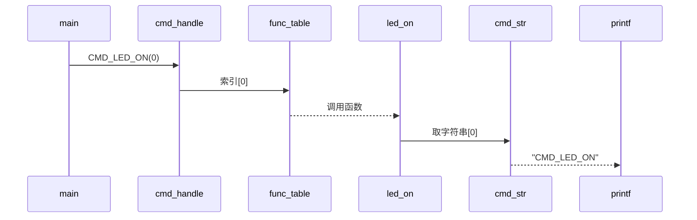
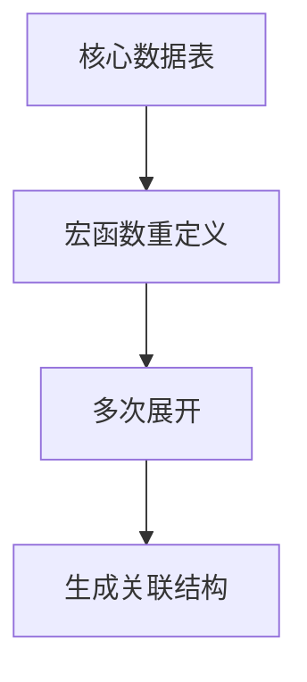
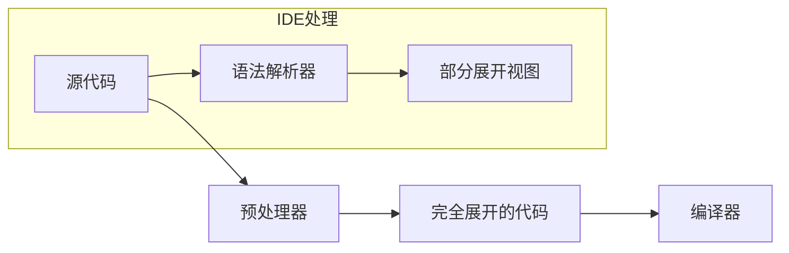
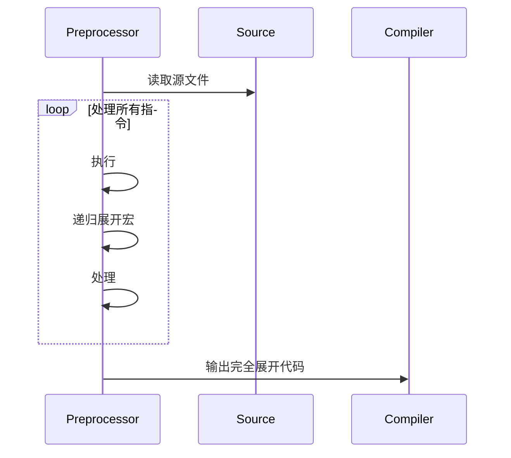
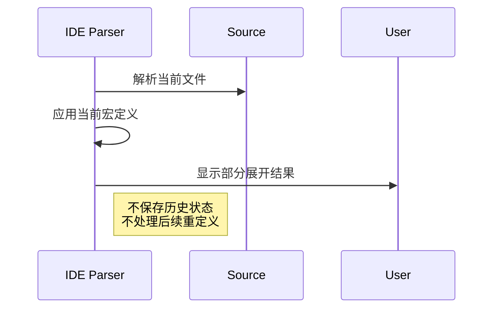
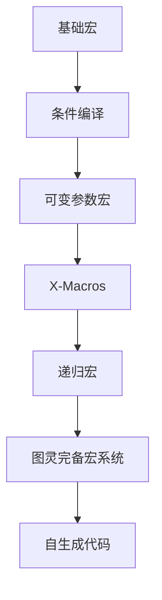

嵌入式科普(38)C语言预编译X-Macros深度分析和实际项目代码分享
===
[toc]

# 一、概述
- X-Macros是C语言一种古老的、编译时代码生成技术，并不是数据结构。简单说是一种代码技巧，是一种复杂的宏。
- 介绍X-Macros的工作流程和主要特征
- 通过经典例子介绍使用X-Macros代码的运行时的工作原理
- 实际项目代码分享：西门子profidrive使用X-Macros技术的源码

# 二、参考资料
- https://zhuanlan.zhihu.com/p/521073931
- https://www.drdobbs.com/cpp/the-new-c-x-macros/184401387
- https://tetzank.github.io/posts/x-macros/
- https://github.com/garcia/xdata
- https://github.com/swansontec/map-macro
- [瑞萨RZN2L产品-第22章](https://mp.weixin.qq.com/mp/appmsgalbum?__biz=MzkxNDQyMTU4Mg==&action=getalbum&album_id=3167963498191110153&subscene=190&scenenote=https%3A%2F%2Fmp.weixin.qq.com%2Fs%3F__biz%3DMzkxNDQyMTU4Mg%3D%3D%26mid%3D2247486280%26idx%3D1%26sn%3D268f6fe35e25884151c34c6dd692a6ce%26chksm%3Dc16fe969f618607f8c38162b0372dea69b85e465395b7daebd6e4ec1a51badcd93934c52b90b%26cur_album_id%3D3167963498191110153%26scene%3D190%26ascene%3D0%26devicetype%3DiOS15.2%26version%3D1800383b%26nettype%3D3G%2B%26abtest_cookie%3DAAACAA%253D%253D%26lang%3Dzh_CN%26countrycode%3DAL%26fontScale%3D100%26exportkey%3Dn_ChQIAhIQJVfuFN7QF%252B8hAAp6gGWLbhLXAQIE97dBBAEAAAAAAJJBCDsn4s4AAAAOpnltbLcz9gKNyK89dVj0KdtEHPPFUWk8AsjGTHH8c3C%252BtKT7Z1gQyEfo6SClTtao3n%252FaSlq3%252BS4QgyAQiJTtborhYPrGCK09NCHDGJgoVXM8hN1OXPSeybS8YTxxUVXi2FfEU2REeVtzLECCevkLu%252FdMdZst5KqG%252BvS9eKU%252FP0qRlxpeqU2%252Bkjl1AytleYxEgYxAWo%252B8w6zT51WiC5PaetVuSiMUlovEvNULKI0CM9BZ%252BjN8tD7fHiGLyQ%252BcP05M%26pass_ticket%3Dr2cbIHJnl90DtlyaMvIU8r3RZ%252Fm8AQYfVuFJ877aQwGsPjXJzPyTB2oBaIeNsv57%26wx_header%3D3&nolastread=1#wechat_redirect) 分析西门子profidrive使用X-Macros技术的源码


# 三、经典X-Macros代码分析
## 3.1 经典代码
```
#include <stdio.h>

#define MACROS_TABLE                    \
    X_MACROS(CMD_LED_ON,  led_on)       \
    X_MACROS(CMD_LED_OFF, led_off)      \

/*定义命令列表*/
typedef enum
{
    #define X_MACROS(a, b) a,
    MACROS_TABLE
    #undef X_MACROS
    CMD_MAX
}cmd_e;


/*定义字符串列表用作Log打印*/
const char* cmd_str[] = 
{
    #define X_MACROS(a, b) #a,
    MACROS_TABLE
    #undef X_MACROS
};


typedef void (*func)(void* p);

static void led_on(void* p)
{
    printf("%s \r\n", (char *)p);
}

static void led_off(void* p)
{
    printf("%s \r\n", (char *)p);
}

/*定义函数列表*/
const func func_table[] = 
{
    #define X_MACROS(a, b) b,
    MACROS_TABLE
    #undef X_MACROS
};


/*直接通过索引的方式调用函数*/
static void cmd_handle(cmd_e cmd)
{
    if(cmd < CMD_MAX)
    {
        func_table[cmd]((void*)cmd_str[cmd]);
    }
}


void main(void)
{
    cmd_handle(CMD_LED_ON);
    cmd_handle(CMD_LED_OFF);
}
```

## 3.2 代码结构解析（四步构建自动化系统）


### 3.2.1 中央数据表（唯一数据源）
```
#define MACROS_TABLE \
    X_MACROS(CMD_LED_ON,  led_on) \
    X_MACROS(CMD_LED_OFF, led_off)
```
这是系统的唯一数据源，定义了：

- 命令枚举名 CMD_LED_ON
- 对应函数名 led_on
- 自动保持顺序一致性

### 3.2.2 动态生成枚举
```
typedef enum {
    #define X_MACROS(a, b) a,  // 展开为 CMD_LED_ON, CMD_LED_OFF
    MACROS_TABLE
    #undef X_MACROS
    CMD_MAX  // 自动计算命令总数
} cmd_e;
```
展开后等价于：
```
typedef enum {
    CMD_LED_ON, 
    CMD_LED_OFF,
    CMD_MAX
} cmd_e;
```
### 3.2.3 自动生成字符串表
```
const char* cmd_str[] = {
    #define X_MACROS(a, b) #a,  // 字符串化：CMD_LED_ON -> "CMD_LED_ON"
    MACROS_TABLE
    #undef X_MACROS
};
```
展开效果：
```
const char* cmd_str[] = {
    "CMD_LED_ON", 
    "CMD_LED_OFF"
};
```
### 3.2.4 函数指针表自动映射（核心执行逻辑）
```
const func func_table[] = {
    #define X_MACROS(a, b) b,  // 提取函数名：led_on, led_off
    MACROS_TABLE
    #undef X_MACROS
};
```
等价于：
```
const func func_table[] = {
    led_on, 
    led_off
};
```

## 3.3 运行时工作原理


# 四、优劣势解析
- 零同步成本
  所有关联数据（枚举/字符串/函数）自动同步，避免人工维护不一致
- 扩展极简
  新增命令只需在宏表中添加一行：
  ```
  X_MACROS(CMD_DOOR_OPEN, door_open)
  ```
- 安全保证
  **CMD_MAX** 自动计算数组边界，防止越界访问
- 自文档化
  字符串表自动生成，日志输出与代码完全一致
- 代码可读性降低
- 绝大多数的阅读软件或IDE无法预览/展开
  需要编译器在预编译阶段宏展开
# 五、X-Macros的四大本质特征

## 5.1 集中式数据表
用 #define 定义的垂直结构表，每个条目包含关联数据

典型形式：
```
#define COLOR_TABLE \
    ENTRY(RED,    0xFF0000) \
    ENTRY(GREEN,  0x00FF00) \
    ENTRY(BLUE,   0x0000FF)
```
## 5.2 可重定义的宏函数
名为 ENTRY 或 X 的通用处理宏

通过重定义改变其行为
```
/* 阶段1：生成枚举 */
#define ENTRY(name, value) COLOR_##name,

/* 阶段2：生成字符串 */
#define ENTRY(name, value) #name,
```

## 5.3 多次展开机制
同一数据表被多次使用，每次生成不同代码
```
// 第一次展开：生成枚举
enum Colors {
    COLOR_TABLE  // 展开为 COLOR_RED, COLOR_GREEN...
};

// 第二次展开：生成字符串数组
const char* color_names[] = {
    COLOR_TABLE  // 展开为 "RED", "GREEN"...
};
```
## 5.4 生成关联结构
输出逻辑相关但语法不同的代码结构

# 六、为什么VSCode无法展开X-Macro？
- IDE 限制：
    VSCode 的 C/C++ 扩展基于 Clang/IntelliSense
    这些工具不模拟完整的预处理流程（尤其多次重定义的宏）
    只能显示当前作用域的宏定义，无法展示多阶段展开
- 宏的工作机制：
  ```
    #define X_MACROS(a, b) a,  // 阶段1：定义枚举
    MACROS_TABLE             // 此处展开
    #undef X_MACROS          // 立即取消定义

    #define X_MACROS(a, b) #a, // 阶段2：定义字符串
    MACROS_TABLE             // 重新展开
    ```
    VSCode 只能显示最后一次展开的结果

- 预处理 vs 编辑时：
  - X-Macro 是预处理阶段的特性
  - VSCode 是源代码编辑器，不执行完整预处理

## 6.1 解决方案
### 6.1.1 使用编译器预处理（推荐）
```
# GCC/Clang
gcc -E your_file.c -o expanded.c
```
```
// 枚举展开后
typedef enum
{
    CMD_LED_ON,
    CMD_LED_OFF,
    CMD_MAX
} cmd_e;

// 字符串表展开后
const char* cmd_str[] = 
{
    "CMD_LED_ON",
    "CMD_LED_OFF"
};

// 函数表展开后
const func func_table[] = 
{
    led_on,
    led_off
};
```
### 6.1.2 VSCode 插件辅助

- C/C++ Advanced Lint：显示宏展开警告
- Preprocessor Macro Expander：手动展开选中宏
- Clangd（替代默认C++扩展）：更好的宏支持

## 6.2 深入探讨宏处理和 IDE 支持的本质区别
### 6.2.1  所有宏都是预处理的，但 IDE 支持分层次
  
| 宏类型                                      | 预处理阶段       | IDE 支持级别 | VSCode 悬停效果       |
| :------------------------------------------ | :--------------- | :----------- | :-------------------- |
| **简单对象宏**<br>`#define PI 3.14`         | ✅ 完全支持       | ★★★★★        | 显示 `3.14`           |
| **函数式宏**<br>`#define MIN(x,y) ((x)<(y)?(x):(y))` | ✅ 完全支持 | ★★★★☆         | 显示展开表达式        |
| **链式宏**<br>(多层嵌套宏)                  | ✅ 完全支持       | ★★★☆☆         | 部分展开              |
| **X-Macro**<br>(依赖重定义和多次展开)       | ✅ 完全支持       | ★☆☆☆☆         | 通常无法显示          |

### 6.2.2  关键差异：宏展开的"阶段可见性"
- 预处理器：执行完整递归展开（深度优先）

- IDE 语法解析器：执行浅层展开（通常只展开1-2层）


### 6.2.3 为什么普通宏可见而X-Macros不可见？
- 普通宏 IDE 只需简单替换即可展示
```#define PI 3.1415926
#define CIRCLE_AREA(r) (PI * (r) * (r))

// 悬停在 CIRCLE_AREA(5) 显示：
// (3.1415926 * (5) * (5))
```
- X-Macros示例（VSCode 难解析）：
  IDE 无法同时保存两种 ENTRY 定义状态
```#define TABLE \
    ENTRY(red) \
    ENTRY(blue)

// 第一次展开
#define ENTRY(color) COLOR_##color,
enum Colors {
    TABLE
};
// 期望：COLOR_red, COLOR_blue

// 第二次展开（不同定义）
#define ENTRY(color) #color,
const char* color_names[] = {
    TABLE
};
// 期望："red", "blue"
```

- 预处理器的完整工作流程

-  IDE 的实时解析


# 七、比X-Macros更复杂的宏
- X-Macros只是宏技术的"中级阶段"


- 宏的替代方案：

    - C++ 模板：类型安全的泛型

    - C++ constexpr：编译时计算

    - 代码生成器：Python/Lua 脚本

    - LLVM 插件：编译时元编程

    - 专用预处理器：如 Qt 的 moc
  
# 八、西门子profidrive使用X-Macros技术的源码
```


/* for parameter descriptions see PDRV V4.2 table 144 and others */

/* PNU00001..PNU00899: device specific, insert your parameters here -------------------------------------------------*/

/** PNU00100: gradient of ramp in [%/ms] for the Ramp Function Generator
 * @details Setting parameter for the Ramp Function Generator (PDRV V4.2 Figure 29)
 *          application specific, can be changed by the PDRV user
 */
PDRV_PARAMETER(
    100U,               /**< parameter number */
    (PDRV_PARID_N4),    /**< identifier */
    0U,                 /**< number of elements or length of string */
    PDRV_UNIT_PCT,      /**< variable attribute */
    60000U,             /**< DO IO DATA reference parameter */
    0x801EU,            /**< DO IO DATA normalisation */
    FLOAT_N4_FAC,       /**< standardisation factor */
    0U,                 /**< low limit */
    0x10000000U,        /**< high limit */
    "Ramp Gradient",    /**< pointer at name (16 valid characters) */
    PDRV_NULL_T,        /**< function pointer - function is called if additional text is read */
    uPdrv_RfPnu00100,   /**< function pointer - function is called before value is read */
    uPdrv_WfPnu00100    /**< function pointer - function is called after value is written */
)

/** PNU00110: +- allowed speed tolerance for ZSW1 bit 8 "speed errror within tolerance range"
 * @details Setting parameter for calculation of ZSW1 bit 8 (PDRV V4.2 Figure 29)
 *          application specific, can be changed by the PDRV user
 */
PDRV_PARAMETER(
    110U,               /**< parameter number */
    (PDRV_PARID_N4),    /**< identifier */
    0U,                 /**< number of elements or length of string */
    PDRV_UNIT_PCT,      /**< variable attribute */
    60000U,             /**< DO IO DATA reference parameter */
    0x801EU,            /**< DO IO DATA normalisation */
    FLOAT_N4_FAC,       /**< standardisation factor */
    0U,                 /**< low limit */
    0x7FFFFFFFU,        /**< high limit */
    "range speederror", /**< pointer at name (16 valid characters) */
    PDRV_NULL_T,        /**< function pointer - function is called if additional text is read */
    uPdrv_RfPnu00110,   /**< function pointer - function is called before value is read */
    uPdrv_WfPnu00110    /**< function pointer - function is called after value is written */
)


/** pre declaration of parameter object */
typedef struct PDRV_PAR_OBJ PDRV_PAR_OBJ;

/** parameter object inclusive description elements (see PDRV V4.2 table 17)
 * @details no reserved datas, different order from PDRV description, order is arbitrary (consider alignment)
 */
struct PDRV_PAR_OBJ
{
    PDRV_UINT16 uPnu;           /**< parameter number */
    PDRV_UINT16 uIdentifier;    /**< identifier */
    PDRV_UINT16 uNrOfElements;  /**< number of elements or length of string */
    PDRV_UINT16 uVarAttrib;     /**< variable attribute */
    PDRV_UINT16 uRefPar;        /**< DO IO DATA reference parameter */
    PDRV_UINT16 uNormalisation; /**< DO IO DATA normalisation */
    PDRV_FLT32  fStdFactor;     /**< standardisation factor */
    PDRV_UINT32 uLoLimit;       /**< low limit */
    PDRV_UINT32 uHiLimit;       /**< high limit */
    const char* puName;         /**< pointer at name */
    char* (*pfnText)(const PDRV_PAR_OBJ *p_ptParObj, PDRV_UINT16 p_uSubindex); /**< function pointer - function is called if additional text is read */
    PDRV_UINT32 (*pfnRead)(const PDRV_PAR_OBJ *p_ptParObj, PDRV_UINT16 p_uSubindex, PDRV_UINT16 p_uNrOfElements, PDRV_ParValues * p_ptValues); /**< function pointer - function is called before value is read */
    PDRV_UINT32 (*pfnWrite)(const PDRV_PAR_OBJ *p_ptParObj, PDRV_UINT16 p_uSubindex, PDRV_UINT16 p_uNrOfElements, PDRV_ParValues * p_ptValues); /**< function pointer - function is called after value is written */
};


/*------------  extern  functions  ------------*/
/** declaration of all text functions */
#define PDRV_PARAMETER(Pnu, Identifier, NrOfElements, VarAttrib, RefPar, Normalisation, StdFactor, LoLimit, HiLimit, Name, TextFunc, ReadFunc, WriteFunc) \
        extern char * TextFunc (PDRV_PAR_OBJ const *p_ptParObj, PDRV_UINT16 p_uSubindex);

#include "pdrv_parameter_ac4.inc"

#undef PDRV_PARAMETER

/** declaration of all read functions */
#define PDRV_PARAMETER(Pnu, Identifier, NrOfElements, VarAttrib, RefPar, Normalisation, StdFactor, LoLimit, HiLimit, Name, TextFunc, ReadFunc, WriteFunc) \
        extern PDRV_UINT32 ReadFunc (PDRV_PAR_OBJ const *p_ptParObj, PDRV_UINT16 p_uSubindex, PDRV_UINT16 p_uNrOfElements, PDRV_ParValues * p_ptValues);

#include "pdrv_parameter_ac4.inc"

#undef PDRV_PARAMETER

/** declaration of all read functions */
#define PDRV_PARAMETER(Pnu, Identifier, NrOfElements, VarAttrib, RefPar, Normalisation, StdFactor, LoLimit, HiLimit, Name, TextFunc, ReadFunc, WriteFunc) \
        extern PDRV_UINT32 WriteFunc (PDRV_PAR_OBJ const *p_ptParObj, PDRV_UINT16 p_uSubindex, PDRV_UINT16 p_uNrOfElements, PDRV_ParValues * p_ptValues);

#include "pdrv_parameter_ac4.inc"

#undef PDRV_PARAMETER

/*------------  extern  data  ------------*/


/*------------  type definitions, constants, enums  ------------*/

/** complete list of all parameters for implementation of parameters PNU00980 to PNU00989 */
static const PDRV_O2 m_tParList[] =
{
#define PDRV_PARAMETER(Pnu, Identifier, NrOfElements, VarAttrib, RefPar, Normalisation, StdFactor, LoLimit, HiLimit, Name, TextFunc, ReadFunc, WriteFunc) \
                       Pnu,
#include "pdrv_parameter_ac4.inc"
#undef PDRV_PARAMETER
};

#define PDRV_NOOFPARAMETERS (sizeof(m_tParList)/sizeof(m_tParList[0]))  /**< number of all parameters */

/** table with parameter objects */
static const PDRV_PAR_OBJ m_tParObjDatas[] =
{
#define PDRV_NULL_T PDRV_NULL   /**< redefinition to NULL pointer */
#define PDRV_NULL_R PDRV_NULL   /**< redefinition to NULL pointer */
#define PDRV_NULL_W PDRV_NULL   /**< redefinition to NULL pointer */
#define PDRV_PARAMETER(Pnu, Identifier, NrOfElements, VarAttrib, RefPar, Normalisation, StdFactor, LoLimit, HiLimit, Name, TextFunc, ReadFunc, WriteFunc) \
       {.uPnu = Pnu, \
        .uIdentifier = Identifier, \
        .uNrOfElements = NrOfElements, \
        .uVarAttrib = VarAttrib, \
        .uRefPar = RefPar, \
        .uNormalisation = Normalisation, \
        .fStdFactor = StdFactor, \
        .uLoLimit = LoLimit, \
        .uHiLimit = HiLimit, \
        .puName = Name, \
        .pfnText = TextFunc, \
        .pfnRead = ReadFunc, \
        .pfnWrite = WriteFunc},

#include "pdrv_parameter_ac4.inc"

#undef PDRV_PARAMETER
#undef PDRV_NULL_W
#undef PDRV_NULL_R
#undef PDRV_NULL_T
};


/** PROFIdrive search for parameter number and get pointer of found parameter object
 *  @details
 *  @return     pointer with parameter object, PDRV_NULL if not found
*/
const PDRV_PAR_OBJ * ptPdrvPar_GetParObj
    (PDRV_UINT16 p_uPnu     /**< [in] search this parameter number */
    )
{
    PDRV_PAR_OBJ const *ptParObj = PDRV_NULL;
    PDRV_UINT uI;

    for(uI = 0U; uI < PDRV_NOOFPARAMETERS; uI++)
    {
        /* parameter found? */
        if (m_tParList[uI] == p_uPnu)
        {
            ptParObj = &m_tParObjDatas[uI];
            break;
        }
    }

    return ptParObj;
}
```

# 九、总结
- X-Macros是一种代码技术/技巧，适用于中小型项目中。
- X-Macros在Linux内核和工业自动化领域非常普遍（如西门子 SINAMICS、倍福 TwinCAT）
- 推荐使用gcc -E命令在预编译阶段展开
- 我们在后续的[瑞萨RZN2L产品-第22章](https://mp.weixin.qq.com/mp/appmsgalbum?__biz=MzkxNDQyMTU4Mg==&action=getalbum&album_id=3167963498191110153&subscene=190&scenenote=https%3A%2F%2Fmp.weixin.qq.com%2Fs%3F__biz%3DMzkxNDQyMTU4Mg%3D%3D%26mid%3D2247486280%26idx%3D1%26sn%3D268f6fe35e25884151c34c6dd692a6ce%26chksm%3Dc16fe969f618607f8c38162b0372dea69b85e465395b7daebd6e4ec1a51badcd93934c52b90b%26cur_album_id%3D3167963498191110153%26scene%3D190%26ascene%3D0%26devicetype%3DiOS15.2%26version%3D1800383b%26nettype%3D3G%2B%26abtest_cookie%3DAAACAA%253D%253D%26lang%3Dzh_CN%26countrycode%3DAL%26fontScale%3D100%26exportkey%3Dn_ChQIAhIQJVfuFN7QF%252B8hAAp6gGWLbhLXAQIE97dBBAEAAAAAAJJBCDsn4s4AAAAOpnltbLcz9gKNyK89dVj0KdtEHPPFUWk8AsjGTHH8c3C%252BtKT7Z1gQyEfo6SClTtao3n%252FaSlq3%252BS4QgyAQiJTtborhYPrGCK09NCHDGJgoVXM8hN1OXPSeybS8YTxxUVXi2FfEU2REeVtzLECCevkLu%252FdMdZst5KqG%252BvS9eKU%252FP0qRlxpeqU2%252Bkjl1AytleYxEgYxAWo%252B8w6zT51WiC5PaetVuSiMUlovEvNULKI0CM9BZ%252BjN8tD7fHiGLyQ%252BcP05M%26pass_ticket%3Dr2cbIHJnl90DtlyaMvIU8r3RZ%252Fm8AQYfVuFJ877aQwGsPjXJzPyTB2oBaIeNsv57%26wx_header%3D3&nolastread=1#wechat_redirect) 分析西门子profidrive使用X-Macros技术的源码