嵌入式科普(39)如何写出没有bug的C代码---MISRA C 175条规则锁死漏洞
===
[toc]
# 一、概述
- 代码规范、代码审核、注释、文档等等都会保证代码的可维护性和减量少写bug，
    是否有标准的规范来保证医疗、工厂、汽车、航天等的设备不出bug呢？
- 早在1990年就有人开始考虑到这个问题了，MISRA-C全称 Motor Industry Software Reliability Association (汽车工业软件可靠性协会)逐渐诞生了
    自2021年起，MISRA由一个独立的非营利实体——MISRA Consortium Limited管理
    MISRA是一组安全编码规则，不是语言、语法、API
- 我们从2009年丰田“幽灵刹车”事件，来感受一些规范的重要性
- 最后，仅仅靠MISRA C/C++是远远不够的，引出功能安全的概念

# 二、资料来源
- https://misra.org.uk
- [NHTSA美国交通部交通安全管理局](https://www.transportation.gov/briefing-room/us-department-transportation-releases-results-nhtsa-nasa-study-unintended-acceleration#:~:text=NASA%20engineers%20found%20no%20electronic%20flaws%20in%20Toyota,required%20to%20create%20dangerous%20high-speed%20unintended%20acceleration%20incidents.)
- [NHTSA-NASA Study of Unintended Acceleration in Toyota Vehicles](https://www.theautochannel.com/news/2012/02/09/024227-nhtsa-nasa-study-unintended-acceleration-toyota-vehicles.html)
- [MISRA C 2012 Guidelines for the use of.pdf](./Doc/MISRA%20C%202012%20Guidelines%20for%20the%20use%20of.pdf)
- [MISRA C(中文版).pdf](./Doc/MISRA%20C(中文版).pdf)
- [nasa-ua_report.pdf](./Doc/nasa-ua_report.pdf)

# 三、MISRA C介绍
引用文章：https://www.cnblogs.com/xywml/p/18742061#1-misra-c-%E6%A6%82%E8%BF%B0

## 3.1 概述
MISRA C (Motor Industry Software Reliability Association C) 是汽车工业 C 编码标准的缩写，由 MISRA 协会发布。其目标是为嵌入式系统中的 C 语言开发提供一套严格的编码规范，旨在：

 - 提升代码可靠性 (Reliability): 减少因编码错误导致的程序缺陷，提高系统运行的稳定性。
- 提升代码可读性 (Readability): 统一代码风格，使代码更易于理解和维护，降低维护成本。
- 提升代码可移植性 (Portability): 减少对特定编译器或硬件平台的依赖，增强代码在不同环境下的适应性。
- 提升代码可维护性 (Maintainability): 规范的代码结构和风格，降低代码维护和升级的难度。
- 提升代码安全性 (Safety): 避免潜在的安全漏洞，保障系统运行的安全。

## 3.2 MISRA C:2012 的规则体系
MISRA C:2012 标准并非简单的代码风格指南，而是一套严谨的规则体系，它包含 **指令 (Directives)** 和 **规则(Rules)** 两大类。

- 大部分人做不到的三条规则
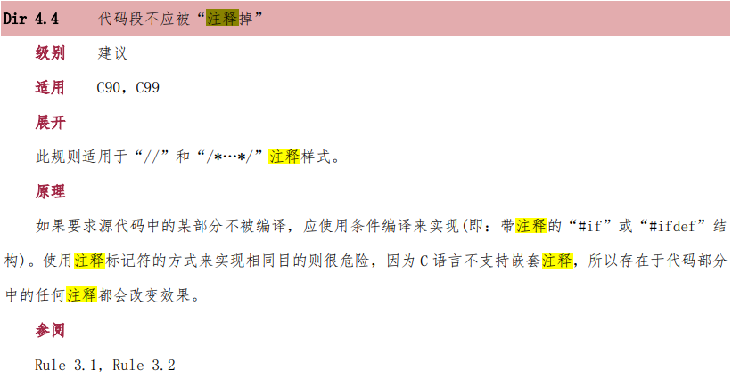

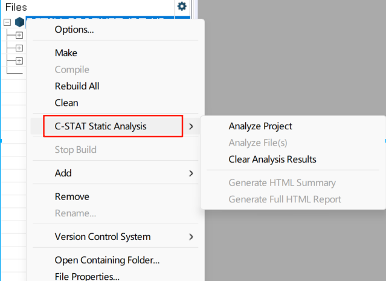

## 3.3 MISRA C:2012 规则覆盖情况
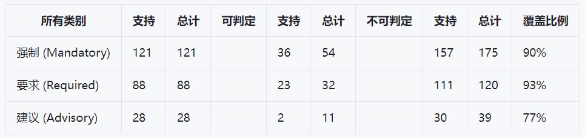

## 3.4 MISRA C:2012 规则列表
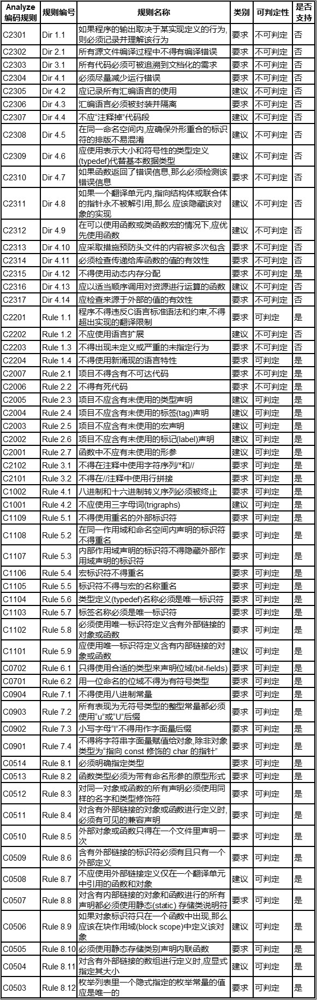
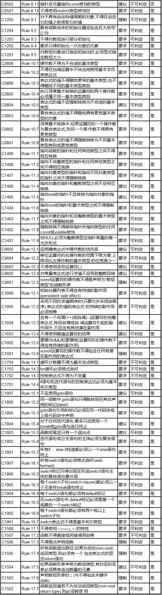
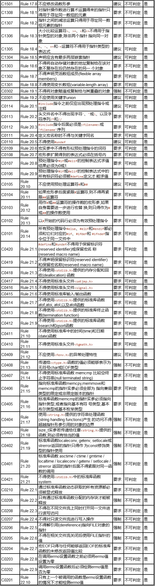

# 四、丰田“幽灵刹车”事件中的MISRA C
2009年的丰田“幽灵刹车”事件，召回非常多，也有很多赔偿，涉及法务等等非常多的事情，我们仅仅对可能涉及MISRA C的部分介绍。
## 4.1 网络/媒体宣传
- 丰田的软件包含了超过一万一千个全局变量
- 至少有67条函数复杂度超过50,还有12条复杂度超过100
- 大小为4KB的Task 堆栈（Stack）”溢出等等

## 4.2 NHTSA美国交通部交通安全管理局报告
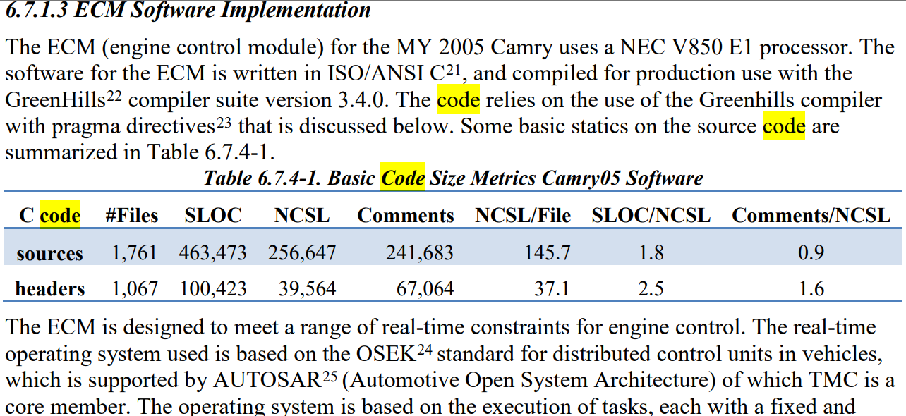
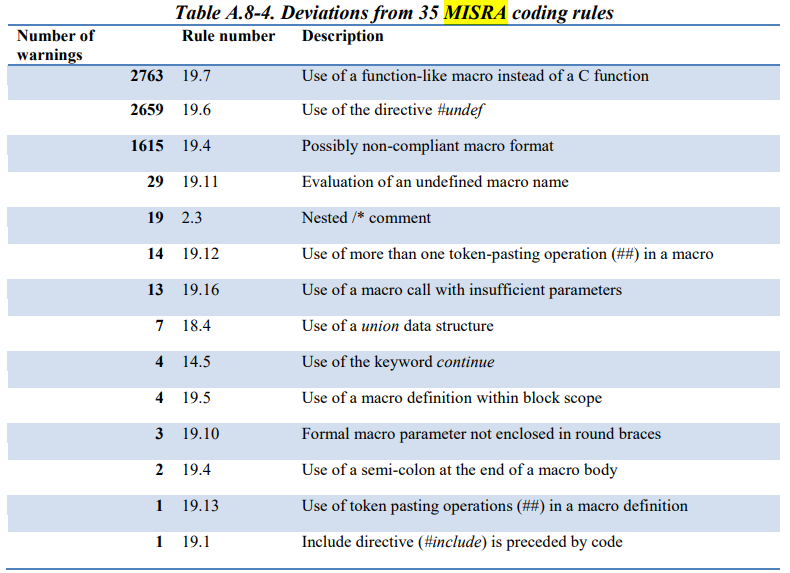
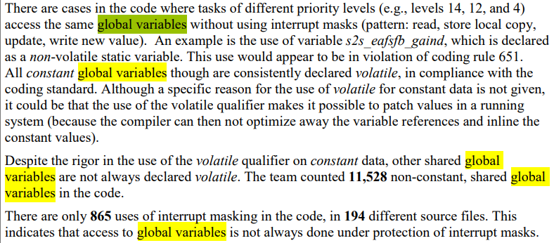
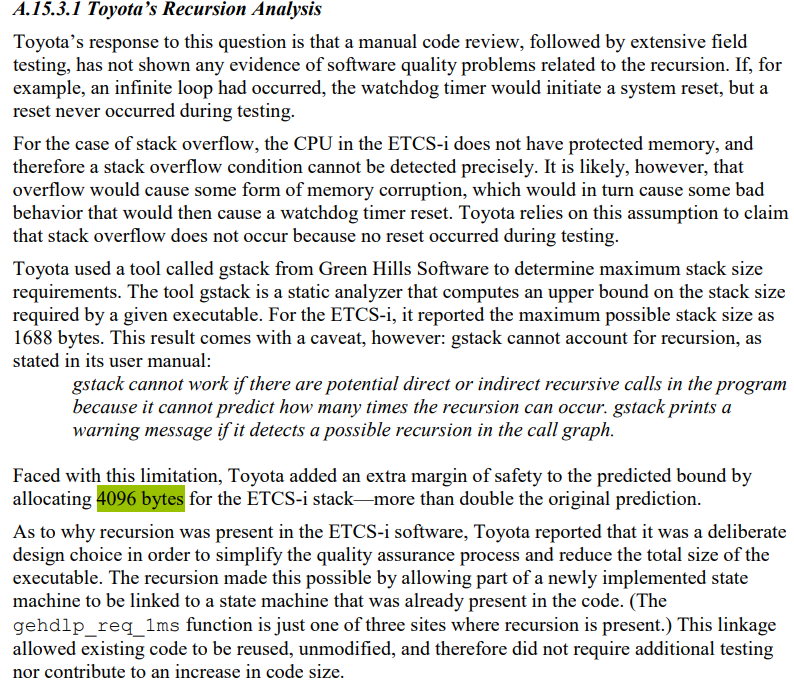
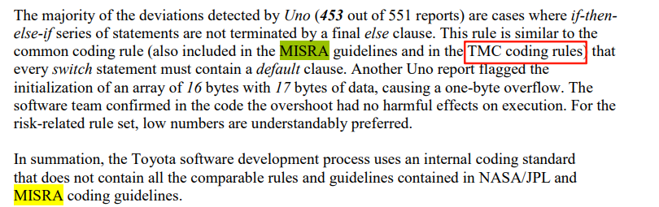
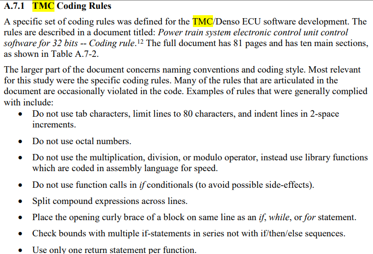

- 报告的大概结论是没有明确的证据表明代码与事故有直接关联，但是代码不规范基本属实，
丰田解释了TMC coding rules，这里我们似乎能体会标准规范的重要性了吧。
- 任何一条规则背后都是生命的代价

# 五、功能安全

- [瑞萨工业功能安全技术研讨会](https://mp.weixin.qq.com/s/AEidLxLHp-g_Lks2ri2e9g)

- [瑞萨功能安全](https://www.renesas.cn/zh/key-technologies/functional-safety)

- [TI功能安全](https://www.ti.com.cn/zh-cn/technologies/functional-safety.html)

- [NXP能安全](https://www.nxp.com.cn/applications/technologies/functional-safety:FUNCTIONAL-SAFETY)

- [ST能安全](https://www.st.com.cn/zh/applications/factory-automation/industrial-safety.html)

- [IAR功能安全](https://www.iar.com/zh/embedded-development-tools/functional-safety)
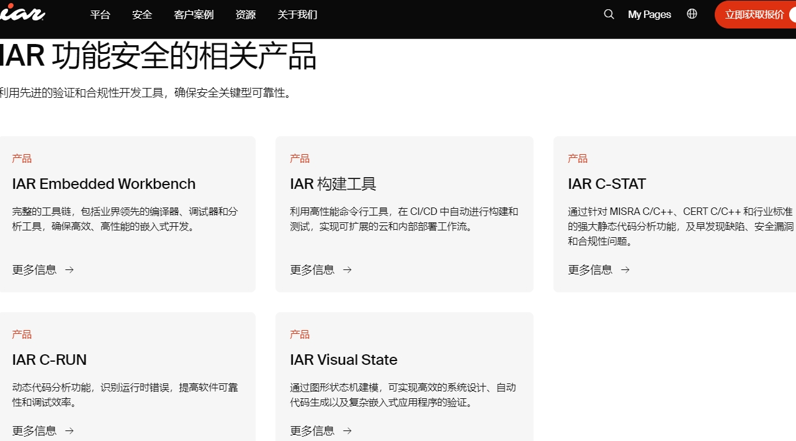
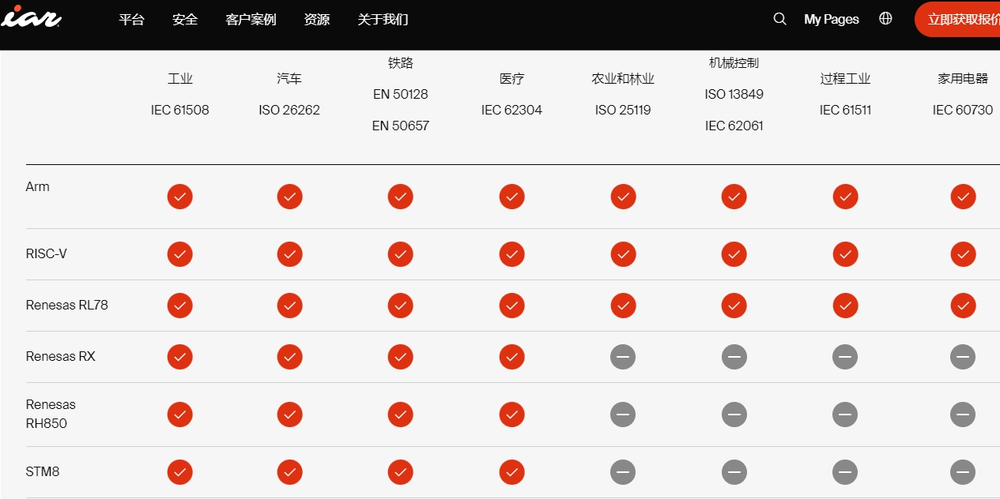

# 六、总结
- 从丰田“幽灵刹车”事件中代码分析中更能体会到标准规则MISRA C的重要性
- MISRA C是代码规范，已经推广到多个行业。我们也可以从中吸收精华，转换成自己的编码习惯
- 功能安全是体系化的保证，这样才能保证代码尽可能的少写bug，即使有bug也可保证安全

