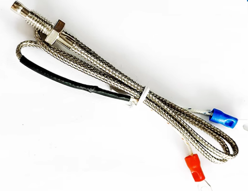

**嵌入式科普(3)NTC、PTC和热电偶测温的实现方法**
[toc]

# 一、概述/目的
介绍电子、自动化、嵌入式行业中使用最普遍的3种测温方法，即NTC、PTC和热电偶。简介原理，着重介绍实现方式和区别。

# 二、测温原理
理论复杂，不去展开。
- PTC电阻：电阻随着温度升高，电阻===>温度
- NTC电阻：电阻随着温度降低，电阻===>温度
- 热电偶：不同金属的热电效应产生的电势差，电压===>温度
- 符号：

# 三、测温的实现
## 3.1 pt100二线制
- pt100二线制，精度不高，mcu自带10-12adc均可以

## 3.2 pt100三线制
- 工业测温最常见，使用adc芯片MAX31865等+mcu解决方案；瑞萨rx23e单mcu方案

## 3.3 pt100四线制
- 精度最高，使用adc芯片MAX31865等+mcu解决方案；瑞萨rx23e单mcu方案

## 3.4 10K NTC
- 10K NTC，±0.1℃

## 3.5 K型热电偶，
- 极端，低精度，使用MAX6675等+mcu解决方案；瑞萨rx23e单mcu方案

## 3.6 保护电路热敏电阻

## 3.7 数字温度传感器
- SHT30、DHT11、HS3001、HDC1080

## 3.8 红外测温
- 热电堆数字接口，模拟接口+运放ad8603

# 四、常见测温区别
||热敏电阻|RTD|热电偶|芯片型|红外|
|:-:|:-:|:-:|:-:|:-:|:-:|
|温度|0-100|-250-900|-270-1800|-55-150|0-100|
|线性|最差|好|较差|最好|一般|
|精度|一般|最好|好|好|一般|
|优点|快、广|准，稳|无需供电，极端环境|数字接口|非接触|
|应用|保护电路|环境、气体、液体、流体|高箱、高温环境|电子设备|额温枪|
|举例|10D-11|pt100/1000|K型热电偶|SHT30|热电堆|
|实现||MAX31865、RX23E|MAX6675、RX23E|IIC|数字/ad8603|