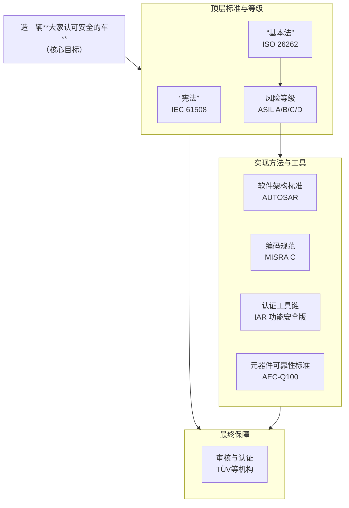
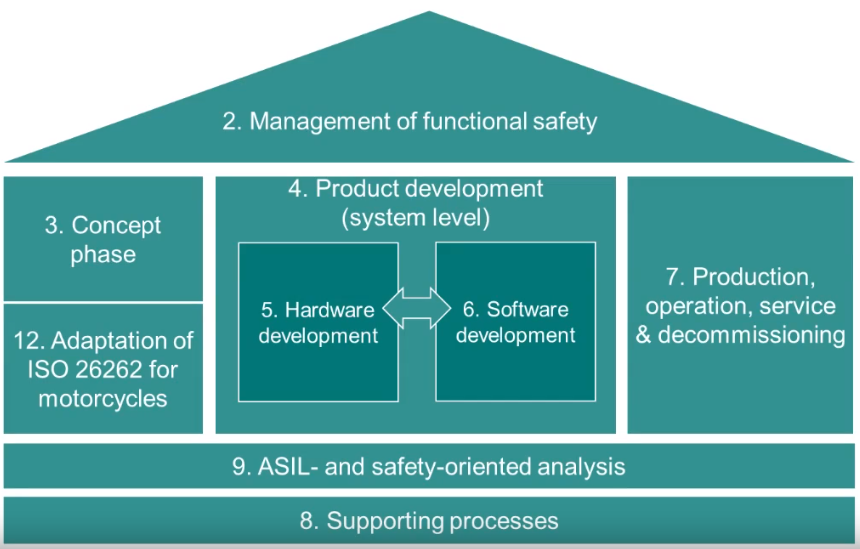
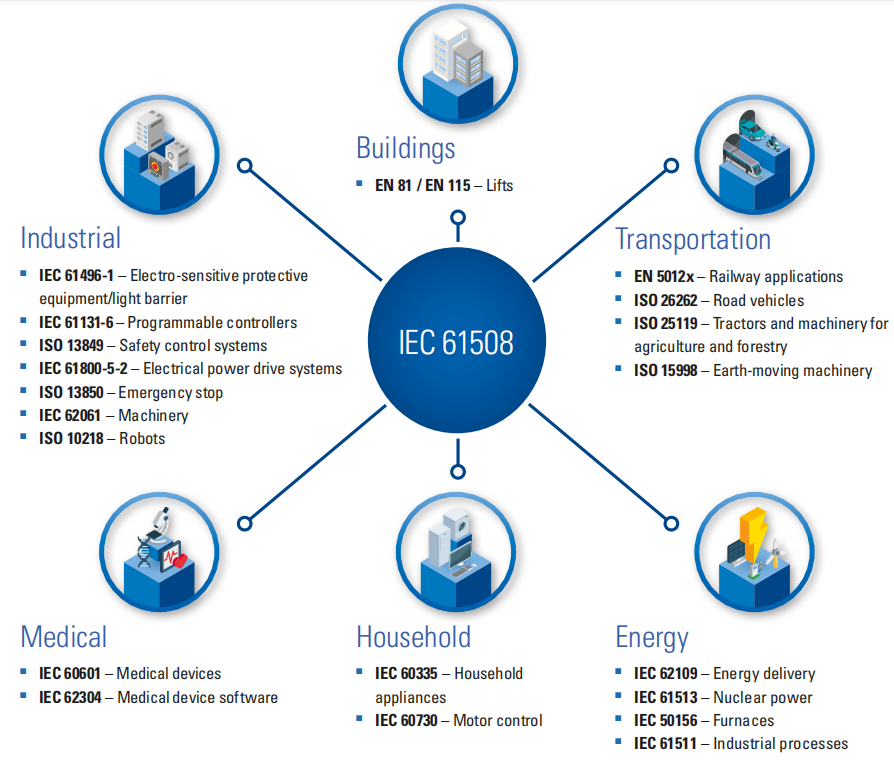
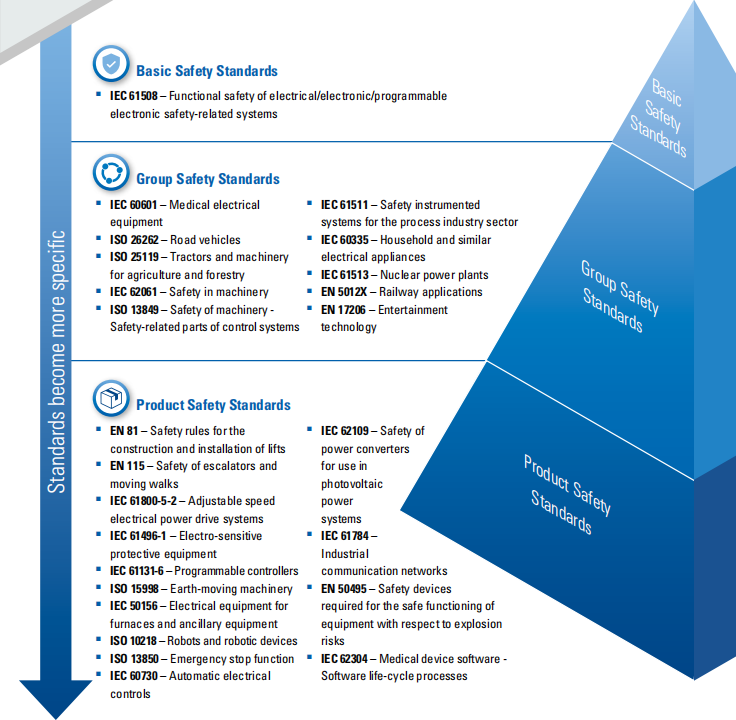
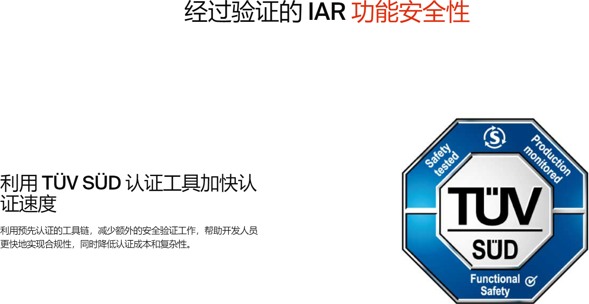
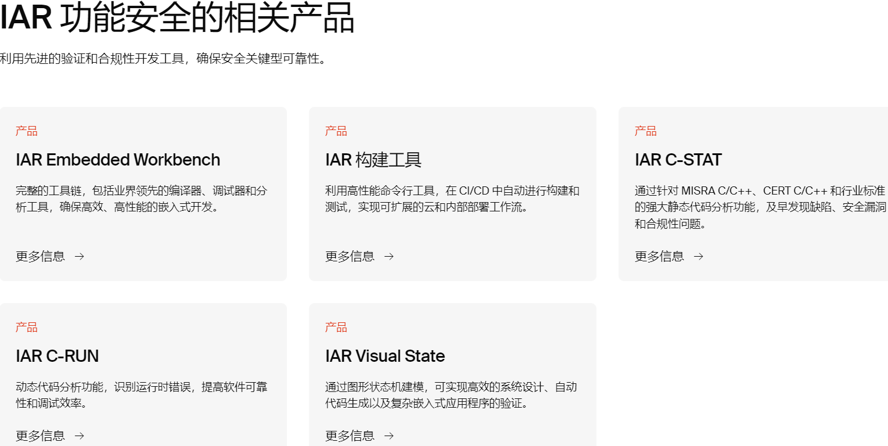
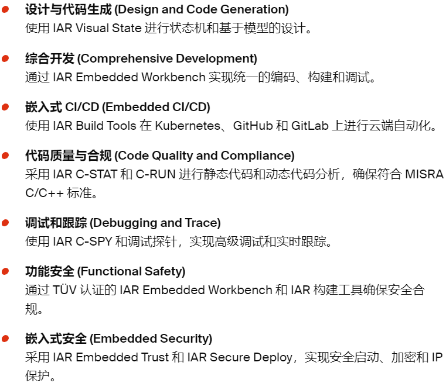
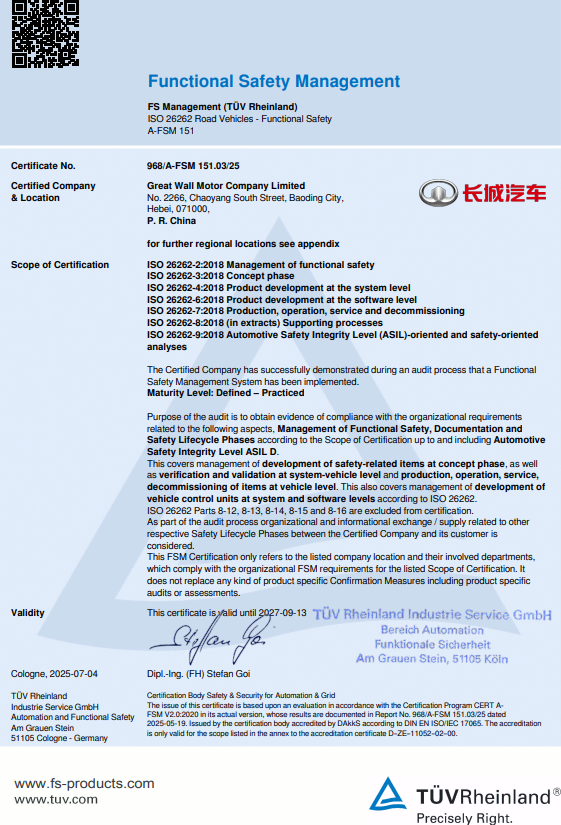

嵌入式科普(40)浅谈"功能安全"概念，深悟"功能安全"本质
===
[toc]
# 一、概述

1、尝试从2个**日常生活中的例子**引出“功能安全”的重要
2、对比分析如何造一辆**大家认可安全的车**
3、简介与“功能安全”**相关概念**，捋顺这些**概念之间的逻辑**
4、由于"功能安全"是较**大课题**，**浅谈**"功能安全"**概念**，**深悟**"功能安全"**本质**

# 二、资料来源
- TUV：https://www.tuvsud.cn/zh-cn/services/functional-safety
- IAR：https://www.iar.com/zh/embedded-development-tools/functional-safety
- [瑞萨工业功能安全技术研讨会](https://mp.weixin.qq.com/s/AEidLxLHp-g_Lks2ri2e9g)
- [瑞萨功能安全](https://www.renesas.cn/zh/key-technologies/functional-safety)
- [TI功能安全](https://www.ti.com.cn/zh-cn/technologies/functional-safety.html)
- [NXP能安全](https://www.nxp.com.cn/applications/technologies/functional-safety:FUNCTIONAL-SAFETY)
- [ST能安全](https://www.st.com.cn/zh/applications/factory-automation/industrial-safety.html)
- [IAR功能安全](https://www.iar.com/zh/embedded-development-tools/functional-safety)

# 三、例子1：如何做出一碗好吃又卫生的面
1、连锁品牌
2、优质服务
3、合理价格
4、**开放透明**的厨房/供应链

# 四、例子2：如何判断一个博士后真有才学
1、名牌高校
2、成绩优异
3、期刊论文
4、教授**专业推荐**

# 五、如何造一辆大家认可安全的车
1、大品牌
2、销量高
3、名人背书？
4、直播工厂？
5、开发布会？

很显然，简单的事情“公开透明”就能提高质量，建立信任；复杂/专业的事情需要“专业权威”才能保证质量，提高信息。

# 六、功能安全
“功能安全”定义了**开发过程**中所使用到的安全相关的**功能**以及**流程**、**方法**和**工具**所需要满足的要求，确保在整个**生命周期**内达到并且保持足够的安全水平。
## 6.1 相关概念的逻辑关系

## 6.2 TUV：
https://www.tuvsud.cn/zh-cn/services/functional-safety
https://www.tuvsud.cn/zh-cn/industries/mobility-and-automotive/automotive-and-oem/iso-26262-functional-safety
https://www.tuvsud.cn/zh-cn/-/media/global/pdf-files/infographics/tuvsud-functional-safety-in-a-nutshell-infographic.pdf

## 6.2 IAR：
https://www.iar.com/zh/embedded-development-tools/functional-safety
https://www.iar.com/zh/knowledge/learn/safety-certified-tools-make-the-difference

## 6.3 长城汽车：
https://www.certipedia.com/search/matching_product_certificates?&q=Great%20Wall%20Motor%20Company%20Limited
https://fs-products.tuvasi.com/certificates?cert_id=12496
https://fs-products.tuvasi.com/files/certificates/certificates_asi/2025/A-FSM/968_A-FSM_151_03_25/968_A-FSM_151_03_25_en_el.pdf

# 七、总结
- “功能安全”的本质就是**信任和权威**
- “功能安全”定义了**开发过程**中所使用到的安全相关的**功能**以及**流程**、**方法**和**工具**所需要满足的要求，确保在整个**生命周期**内达到并且保持足够的安全水平。
- 与嵌入式工程师相关信较高的有**文档、编译器、芯片、环境、软件标准、测试过程**等等
- 第3个例子：军事/航空航天是否需要“功能安全”？
