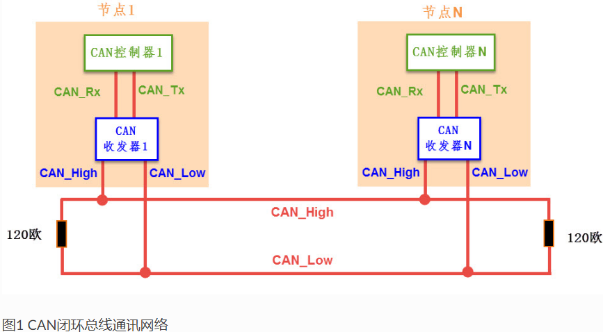
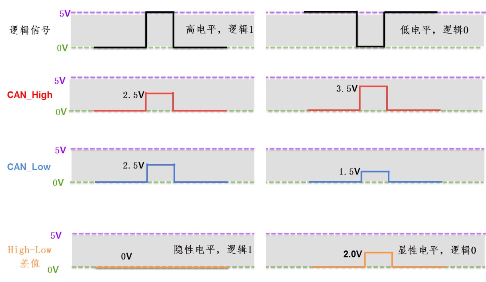
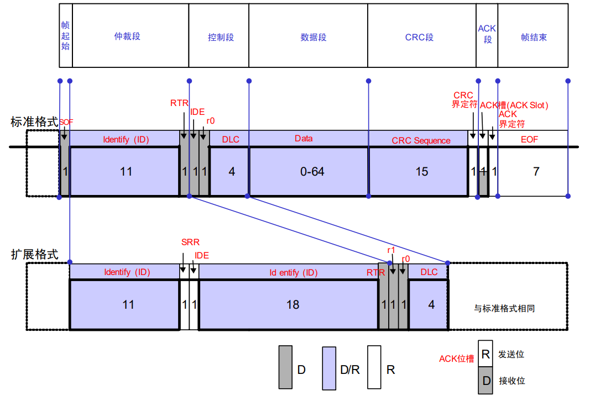

嵌入式科普(41)通过对比深刻理解CAN总线协议特性
===
[toc]
# 一、概述
1、网上众多CAN总线教程过于复杂，不利于初学者抓住关键点
2、通过对比嵌入式常见通信协议，让初学者深入理解CAN总线特性
3、横向对比可以发现各个协议的都具有不可替代性

# 二、嵌入式通信协议全方位对比表

| 协议特性     | IIC (I2C)             | SPI                  | UART                 | **CAN**                          | USB                     | 以太网                 |
|-------------|-----------------------|----------------------|----------------------|----------------------------------|-------------------------|-----------------------|
| 通信距离     | 板内(<1m)             | 板内(<1m)            | 短(几米)             | **长(≤1km)**                     | 短(5m)                  | 中长(100m+) 交换机/光纤 |
| 通信速度     | 中(~3.4Mbps)          | 高(~50Mbps)          | 中(~1Mbps)           | **中(1-5Mbps)**                  | 极高(~20Gbps)           | 超高速(~100Gbps)       |
| **拓扑结构** | 总线型                | 星型/菊花链          | 点对点               | **总线型**                       | 星型                    | 星型                  |
| **错误 检测机制** | ACK应答 从机 每字节应答 | 无机制 完全依赖 软件实现 | 奇偶校验 可选奇/偶校验位 | **五重保障** **1. 位监控** **2. 格式检查** **3. 应答校验** **4. 填充校验** **5. CRC校验** | CRC校验 握手机制(ACK/NAK) | 物理层链路检测 数据层CRC校验 传输层TCP确认 |
| **错误处理** | 软件超时重发          | 无自动处理           | 无自动处理           | **硬件自动重发** **+错误计数隔离** | 协议栈重传 端点管理  | TCP重传 路由重选   |
| **软件复杂度** | 极低                  | 极低                 | 极低                 | **低至中**                       | 高                      | 极高                  |
| **开发接口** | 寄存器                | 寄存器               | 寄存器               | **寄存器**                       | USB协议栈API            | Socket API            |
| 成本         | 极低                  | 低                   | 极低                 | **中等**                         | 中高                    | 高                    |
| 应用         | 传感器、EEPROM        | Flash、显示屏        | 调试接口、简单通信    | **汽车电子、工业控制**           | 外设连接                | 网络通信              |

# 三、协议核心机制详细对比

## 3.1 抗干扰能力对比

| 协议 | 支持情况 | 具体实现方式 |
|------|----------|-------------|
| **CAN** | **优秀 (硬件级)** | **1. 差分信号 (CAN_H/CAN_L)** **2. 15位CRC校验** **3. 位监控机制** |
| UART | 差 | 单端信号传输，无内置抗干扰机制 |
| SPI | 差 | 单端信号，短距离板内通信 |
| I2C | 差 | 单端信号，上拉电阻设计 |
| RS485 | 良好 | 差分信号传输，物理层抗干扰能力良好 |
| **USB** | **优秀** | **差分信号 + 数据包CRC校验** |
| **以太网** | **优秀** | **差分信号 + 32位CRC校验 + 复杂的编码机制** |

## 3.2 自动重发机制对比

| 协议 | 支持情况 | 具体实现方式 |
|------|----------|-------------|
| **CAN** | **硬件自动重发** | **控制器硬件自动检测错误并重发** |
| UART | 软件实现 | 需在应用层实现超时重传逻辑 |
| SPI | 不支持 | 无任何自动重发机制 |
| I2C | 不支持 | 无任何自动重发机制 |
| RS485 | 协议层实现 | 依赖上层协议(如Modbus)实现软件重传 |
| USB | 协议层重发 | 通过NAK握手协议请求主机重发 |
| 以太网 | 传输层重发 | TCP协议通过序列号和ACK实现可靠传输 |

## 3.3 故障节点隔离对比

| 协议 | 支持情况 | 具体实现方式 |
|------|----------|-------------|
| **CAN** | **硬件自动隔离** | **TEC > 255时自动进入Bus-Off状态** |
| UART | 不支持 | 故障节点可能阻塞整个通信 |
| SPI | 有限支持 | 主机可通过禁用片选(CS)隔离从设备 |
| I2C | 不支持 | 故障节点可能拉死整个总线 |
| RS485 | 不支持 | 需要额外硬件实现故障隔离 |
| USB | 主机控制隔离 | 主机检测到设备异常后可禁用该设备 |
| 以太网 | 网络层隔离 | 交换机通过MAC地址学习实现逻辑隔离 |

## 3.4 断线检测对比

| 协议 | 支持情况 | 具体实现方式 |
|------|----------|-------------|
| CAN | 间接检测 | 通过TEC增长和Bus-Off状态推断断线 |
| UART | 软件超时检测 | 应用层心跳包和超时机制 |
| SPI | 无法检测 | 无任何断线检测机制 |
| I2C | 无法检测 | 无任何断线检测机制 |
| RS485 | 软件检测 | Modbus等协议的心跳机制 |
| **USB** | **硬件链路检测** | **PHY芯片直接检测物理连接状态** |
| **以太网** | **硬件链路检测** | **PHY芯片检测链路脉冲，自动报告Link状态** |

## 3.5 诊断系统对比

| 协议 | 支持情况 | 具体实现方式 |
|------|----------|-------------|
| **CAN** | **标准化诊断** | **UDS协议，完整的诊断服务** |
| UART | 自定义协议 | 需要自行定义诊断命令格式 |
| SPI | 无标准 | 无标准化诊断协议 |
| I2C | 无标准 | 无标准化诊断协议 |
| RS485 | 工业协议 | Modbus等协议提供基本诊断功能 |
| USB | 设备枚举 | 通过描述符识别设备状态和能力 |
| 以太网 | 网络诊断 | ICMP、SNMP等网络层诊断工具 |

## 综合评级总结

| 协议 | 抗干扰 | 自动重发 | 故障隔离 | 断线检测 | 诊断系统 | 适用场景 |
|------|--------|----------|----------|----------|----------|----------|
| **CAN** | ✓✓✓ | ✓✓✓ | ✓✓✓ | ✓✓ | ✓✓✓ | 汽车、工业控制 |
| UART | ✗ | ✓ | ✗ | ✓ | ✓ | 调试、简单通信 |
| SPI | ✗ | ✗ | ✓ | ✗ | ✗ | 板内高速通信 |
| I2C | ✗ | ✗ | ✗ | ✗ | ✗ | 板内低速设备 |
| RS485 | ✓✓ | ✓ | ✗ | ✓ | ✓✓ | 工业自动化 |
| USB | ✓✓✓ | ✓✓ | ✓✓ | ✓✓✓ | ✓✓✓ | 外设连接 |
| 以太网 | ✓✓✓ | ✓✓ | ✓✓ | ✓✓✓ | ✓✓✓ | 网络通信 |

**图例说明：**
- ✓✓✓：优秀/硬件级支持
- ✓✓：良好/协议级支持  
- ✓：基本/软件实现支持
- ✗：不支持/效果差

**关键结论:**

1. **CAN总线**在可靠性相关机制上全面领先，特别适合高可靠性要求的控制场景
2. **USB**和**以太网**在数据传输和连接性方面表现优异，但在实时控制方面不如CAN
3. **RS485**物理层优秀，但缺少智能的错误管理功能
4. **UART/SPI/I2C**简单易用，但在可靠性和错误处理方面较弱
5. 协议选择需要根据具体应用场景在可靠性、成本和复杂度之间权衡

# 四、CAN总线协议几个特征
## 4.1 回环模式

1. 工作原理
    在该模式下，CAN控制器内部将TX引脚和RX引脚短接。当你发送一帧报文时，这帧报文不会（或即使发出也同时）被自己的接收器收到。它自己给自己发送ACK应答位，因此总能发送“成功”。

2. 为何需要回环模式？
    硬件验证：在生产或开发初期，验证MCU的CAN控制器硬件及驱动程序是否正常工作。

    软件调试：在只有单个节点或没有CAN分析仪的情况下，开发者可以调试应用程序的通信逻辑，例如验证数据打包/解包程序是否正确。

    孤立测试：测试工作完全在芯片内部进行，与外部环境隔离，非常安全可靠。

3. 注意事项
    与总线关系：在回环模式下，节点通常无法接收到总线上其他节点发送的真实报文。

    常见模式：许多控制器还提供 “回环静默模式（Silent Loopback Mode）” ，它结合了回环和静默模式的特点，主要用于监听总线 activity 而不影响总线，同时内部可以进行自发自收测试。

## 4.2 接收滤波器
1. 工作原理
    CAN总线是广播式的，所有节点都能“听到”所有报文。如果每帧报文都让CPU处理，其负载将不可承受。接收滤波器就是为解决此问题而设计的硬件“门卫”。

    它包含两个核心概念：

        标识符 (ID)：你想要接收的报文ID。

        掩码 (Mask)：决定ID中哪些位必须严格匹配，哪些位可以忽略（不关心）。

    掩码规则：

        掩码位 = 1：对应的ID位必须严格匹配。

        掩码位 = 0：对应的ID位不关心（可以是1也可以是0）。

2. 滤波器配置示例
    假设你只想接收ID为 0x123 的报文：

    设置 滤波器ID = 0x123

    设置 掩码 = 0x7FF (所有11位标准ID位都需匹配)

    结果：只有ID恰好为 0x123 的报文才能通过。

    假设你想接收ID在 0x120 到 0x12F 范围内的所有报文：

    分析：这个范围的特征是前8位（高8位）相同 (0x12)，最后4位变化。

    设置 滤波器ID = 0x120

    设置 掩码 = 0x7F0 (高8位必须匹配，低4位不关心)

    结果：所有ID符合 0x12X 的报文都能通过，实现了对一组ID的过滤。

3. 为何需要接收滤波器？
    极大降低CPU中断负载：这是最主要的目的。总线可能充斥大量无关报文，滤波器确保CPU只处理它关心的数据。

    实现协议分离：例如，在一个复杂的系统中，动力系统报文、车身控制报文、诊断报文都有不同的ID段。可以通过设置多个滤波器，将它们分别路由到不同的软件模块进行处理。

    提高系统实时性：CPU免于处理大量无用中断，可以更及时地响应关键任务。

## 4.3 邮箱Mailbox和FIFO
Mailbox和FIFO是CAN控制器的资源，不同的芯片是有不同的，让你可以将不同过滤器灵活地映射到不同的FIFO上，从而在成本和性能之间取得平衡。

## 4.4 CAN和CANFD兼容
CAN FD（Flexible Data-rate）作为CAN的升级版，设计上是向下兼容经典CAN的

1. 若进行小规模升级或过渡，可优先考虑使用带CAN FD屏蔽功能的收发器。
2. 若需在经典CAN和CAN FD网络段间建立可靠通信，CAN网桥/网关更合适。
3. 若为全新项目或追求最佳性能和未来性，且预算允许，全部采用CAN FD节点是长远之选

## 4.5 其他

.png)

# 五、总结
- CAN是一种基于差分信号的中高速总线协议，其多种硬件错误检测机制赋予它极强的抗干扰能力。
- 该协议无需中间件或协议栈，可直接操作寄存器，从而实现了高实时性。
- 内置的邮箱和FIFO等缓冲结构有效降低了CPU负载。
- 可使用逻辑分析仪、CAN盒、wireshark、UDS等多种诊断方法。
- CAN在汽车工业和工业控制等领域具有不可替代的地位。
- 随着成本降低和速度要求越来越高，是否有一种新协议，既有CAN总线的实时性，又有以太网的高吞吐量的，我想可能就是工业以太网的EtherCAT和profinet了。