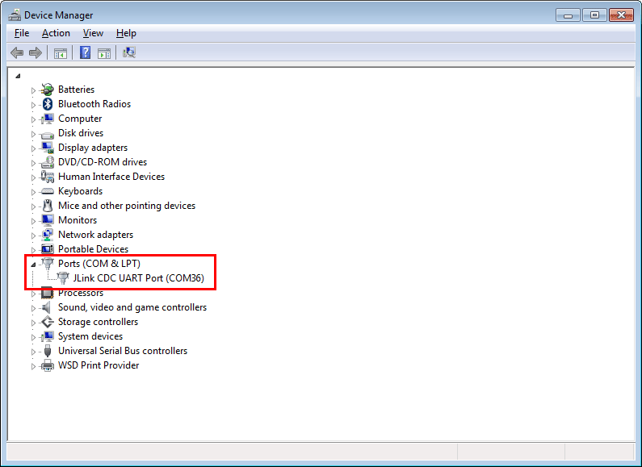
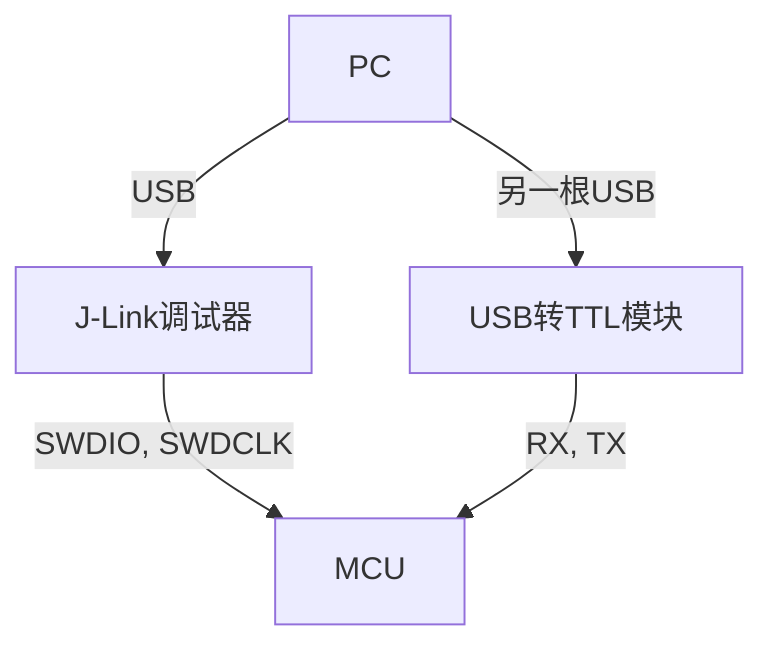
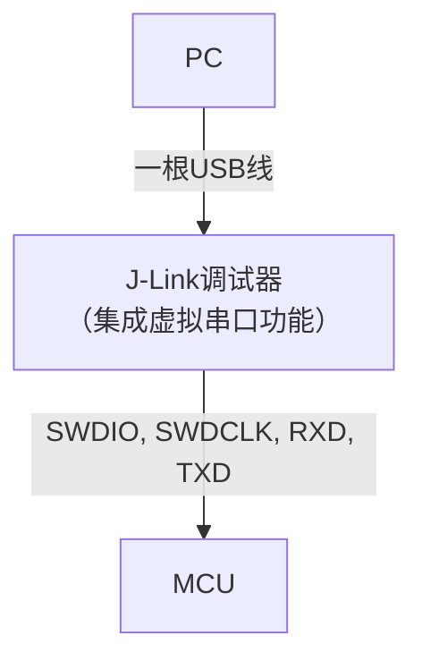
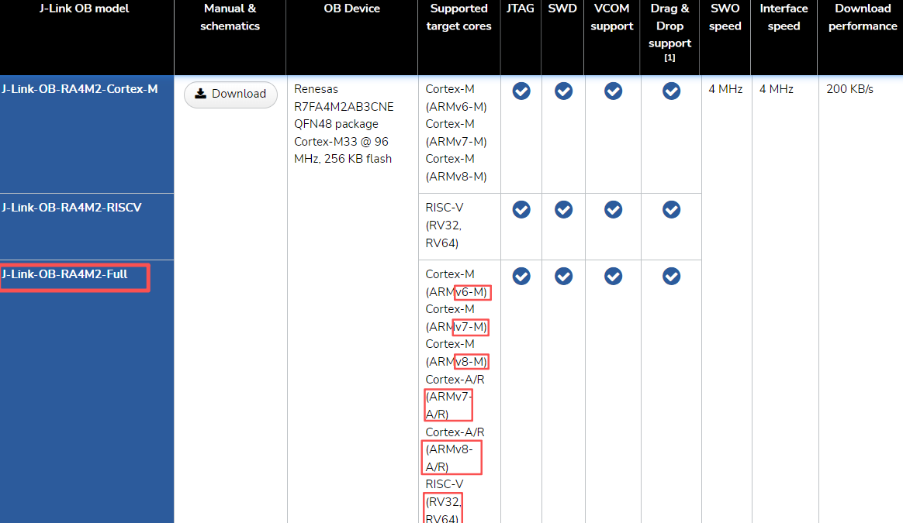
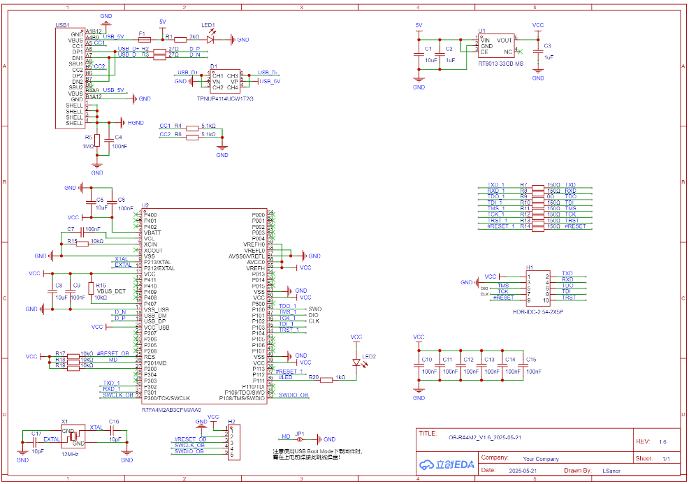
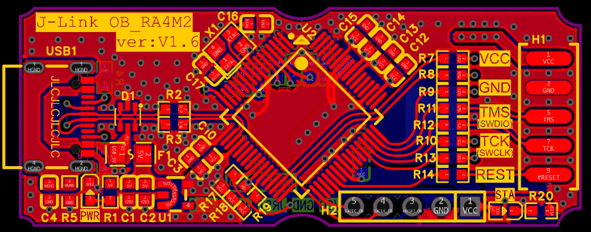
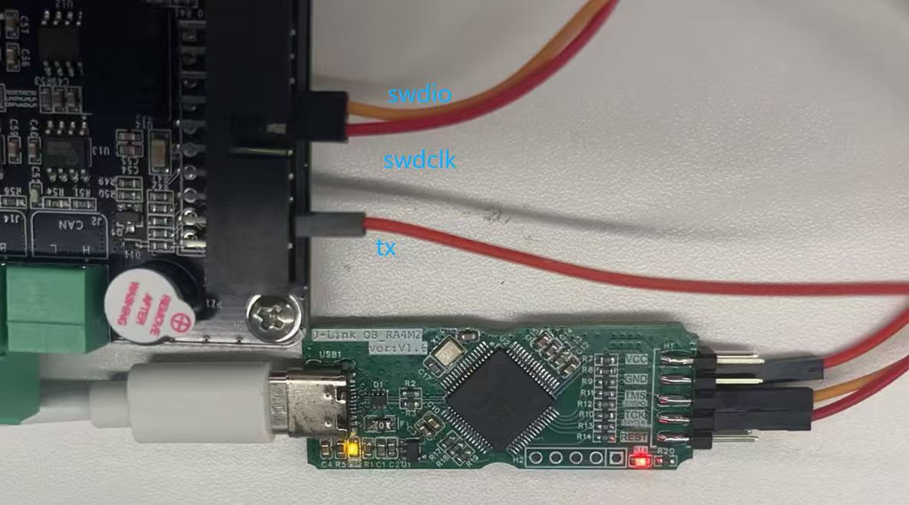

嵌入式科普(42)J-Link/ST-Link Virtual COM Port
===

[toc]

# 一、概述
1、传统的J-Link(v9以下)一般只提供SWD/Jtag调试，J-Link RTT节省接口但似乎也不如串口工具好用
2、随着新款的CM33 CM85等ARMV8架构芯片越来越多，往往都需要J-Link(v10以上)，较新的调试器都具备Virtual COM功能
3、横向对比J-Link、ST-Link、GD-Link、AT-Link

# 二、资料来源
- https://kb.segger.com/J-Link_Virtual_COM_Port
- https://grouper.ieee.org/groups/1149/1/
- https://www.goepel.com/zh/%E5%B5%8C%E5%85%A5%E5%BC%8Fjtag%E8%A7%A3%E5%86%B3%E6%96%B9%E6%A1%88/%E6%8A%80%E6%9C%AF%E6%94%AF%E6%8C%81/ieee-1149-1
- https://github.com/ARMmbed/DAPLink

# 三、调试接口的标准
调试器都是基于ARM公司定义的标准调试接口（如JTAG和SWD）实现的。它们之间的关系更像是在同一套行业标准下，针对不同市场定位和功能需求而开发的“同宗不同源”的产品。

## 3.1 JTAG标准 (IEEE 1149.1)
这是最古老和最基础的标准，最初用于芯片的边界扫描测试，后来被广泛用于调试。
- https://grouper.ieee.org/groups/1149/1/
- https://www.goepel.com/zh/%E5%B5%8C%E5%85%A5%E5%BC%8Fjtag%E8%A7%A3%E5%86%B3%E6%96%B9%E6%A1%88/%E6%8A%80%E6%9C%AF%E6%94%AF%E6%8C%81/ieee-1149-1

## 3.2 SWD协议
这是ARM公司为Cortex-M系列等内核推出的一种更精简的调试接口。它只需要两根线（SWDIO和SWCLK），在引脚资源紧张的场合非常有用。SWD是ARM架构的一部分，其规范通常包含在ARM的技术文档中。

## 3.3 DAP-Link开源项目
开源调试器的实现
- https://github.com/ARMmbed/DAPLink

## 3.4 各类调试器渊源与特性对比

| 特性维度 | J-Link (SEGGER) | ST-LINK (ST) | DAP-Link (ARM 开源) | ATLINK (极海) | GD-LINK (兆易创新) |
| :--- | :--- | :--- | :--- | :--- | :--- |
| **核心协议** | JTAG, SWD | JTAG, SWD | JTAG, SWD | SWD, JTAG | SWD, JTAG |
| **技术渊源** | SEGGER自研，软件生态成熟 | ST为自家STM8/STM32设计 | ARM官方开源项目（原名CMSIS-DAP） | 极海为其APM32系列设计 | 兆易创新为其GD32系列设计 |
| **主要支持芯片** | **全系列ARM内核**，兼容性极广 | **STM8和STM32系列** | **Arm Cortex全系列MCU** | **极海APM32系列** | **兆易创新GD32系列** |
| **特点** | **高性能、高稳定性**、功能丰富、软件支持好 | **性价比高**、多数STM32开发板板载、与ST生态集成好 | **开源、低成本**、跨平台支持好 | **专为极海芯片优化** | **专为兆易芯片优化** |

# 四、J-Link Virtual COM Port
从上述可以看出各个调试器是同宗同源的，所以我们再来看看J-Link Virtual COM Port如何实现
- https://kb.segger.com/J-Link_Virtual_COM_Port
- https://kb.segger.com/Using_J-Link_VCOM_functionality

- 传统方式

- 使用J-Link vcom的框图

- J-Link虚拟串口的核心优势就是节省了一个独立的USB转TTL模块，将调试和日志输出功能集成在同一个设备上，实现了“一线连”，简化了硬件连接和布线。

# 五、J-Link-OB-RA4M2
- J-Link OB The on-board debug probe
    - 支持多种内核
https://www.segger.com/products/debug-probes/j-link/models/j-link-ob/

- 嘉立创开源项目OB-RA4M2_V1.6_2025-05-21
    - 可以直接下单pcb和bom，甚至smt，也可以自己贴
    - 使用瑞萨RFP软件烧录J-Link-OB-RA4M2固件，详细自己看

https://oshwhub.com/lsanor/ob-ra4m2_v1-6_2025-05-21

# 六、总结
- J-Link Virtual COM Port比传统方式节省了串口转TTL模块
- ST-Link等其他厂商实现原理/标准应该一直，但J-Link更通用
- J-Link-OB-RA4M2支持多种内核，segger 和 嘉立创开源项目，提供了硬件和固件，可以自己下单制作
- 实测ST-Link vcom NUCLEO-U575ZI-Q使用vcom似乎影响DWT？