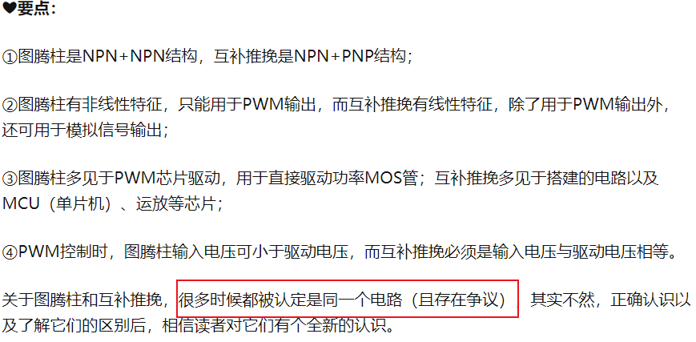

**嵌入式科普(4)图腾柱和互补推挽到底是不是一种？**
[toc]
# 一、目的/概述
发现光耦RV1S9209A为图腾柱(Totem Pole)输出,继而发现非常多的关于图腾柱和推挽电路的区别的各种观点。作为软件工程师应该都听过MCU IO的推挽输出模式。**我们列举资料，实际测试，总结我们的观点**。

# 二、资料来源
- [光耦RV1S9209A](https://www.renesas.cn/cn/zh/products/interface/photocouplers-optocouplers/photocouplers-optocouplers-motor-drive/ipm-drive-photocouplers-optocouplers/rv1s9209a-low-if-totem-pole-output-type-high-cmr-ipm-driver-5-pin-ssop-lsso5-photocoupler)
- [RV1S9209A Data Sheet](./DOC/rv1s9209a-data-sheet.pdf)
- [瑞萨 图腾柱PFC数字电源](https://www.renesas.cn/cn/zh/application/communication-computing-infrastructure/data-center-server/digital-power-conversion-totem-pole-interleaved-pfc)
- [analog 官网](https://www.analog.com/cn/design-center/glossary/totem_pole.html)
- [ST 图腾柱PFC数字电源](https://www.st.com/zh/evaluation-tools/steval-dpstpfc1.html#documentation)
- [ST 3.6 kW 图腾柱 PFC](./DOC/steval-dpstpfc1.pdf)
- [TI 搜索图腾柱](https://www.ti.com.cn/sitesearch/zh-cn/docs/universalsearch.tsp?langPref=zh-CN&searchTerm=%E5%9B%BE%E8%85%BE%E6%9F%B1%E9%A9%B1%E5%8A%A8&nr=577#q=%E5%9B%BE%E8%85%BE%E6%9F%B1%E9%A9%B1%E5%8A%A8&sort=relevancy&numberOfResults=25)
- [知乎：图腾柱和互补推挽的区别](https://zhuanlan.zhihu.com/p/651996232)
- [抖音](https://www.douyin.com/search/%E5%9B%BE%E8%85%BE%E6%9F%B1%E5%92%8C%E6%8E%A8%E6%8C%BD%E9%A9%B1%E5%8A%A8%E7%94%B5%E8%B7%AF%E7%9A%84%E5%8C%BA%E5%88%AB?aid=5825bc5a-f7d6-4e3b-82d0-0bed551952bb&publish_time=0&sort_type=0&source=search_sug&type=general)

# 三、两种观点
- 图腾柱就是推挽电路的“俗名”，即同一个电路
- 图腾柱是NPN+NPN结构，互补推挽是NPN+PNP，即两种电路

# 四、电路仿真
## 4.1 在线电路仿真推荐
scratch：http://scratch.trtos.com/circuitjs.html

## 4.2 推挽和图腾柱驱动仿真
- [circuit-20231203-1227.circuitjs.txt](./Tool/circuit-20231203-1227.circuitjs.txt)

# 五、总结
- **1️⃣图腾柱是NPN+NPN结构，互补推挽是NPN+PNP结构；**

- **2️⃣图腾柱有非线性特征，只能用于PWM输出，而互补推挽有线性特征，除了用于PWM输出外，还可用于模拟信号输出；**

- **3️⃣图腾柱多见于PWM芯片驱动，用于直接驱动功率MOS管；互补推挽多见于搭建的电路以及MCU（单片机）、运放等芯片；**

- **4️⃣PWM控制时，图腾柱输入电压可小于驱动电压，而互补推挽必须是输入电压与驱动电压相等。**

- **5️⃣广义概念与狭义概念的区别，你认为呢？**

