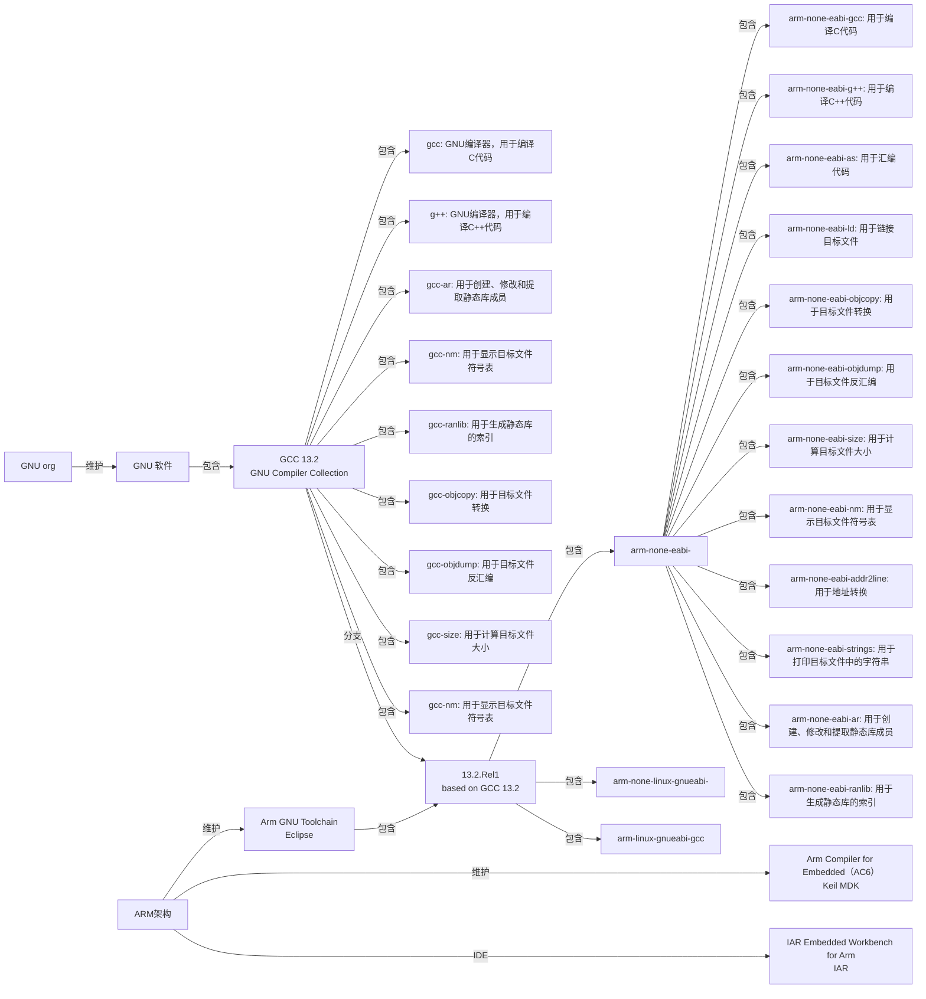

**嵌入式科普(5)ARM GNU Toolchain相关概念和逻辑**
[toc]
# 一、目的/概述
对比高集成度的IDE(MDK、IAR等)，Linux开发需要自己写Makefile等多种脚本。eclipse、Visual Studio等需要了解预处理、编译、汇编、链接的过程，但无需自己完整编写。并且各大芯片厂家都有基于eclipse的IDE（cube ide、e2studio、ccs、MCUX、Simplicity），支持vs code的插件，国产rtt也有基于eclipse的RT-Thread Studio。
**所以，我们介绍eclipse+Arm GNU Toolchain+newlib相关概念，使之有个宏观的概念认识。**

# 二、资料来源
Arm GNU Toolchain：
https://developer.arm.com/Tools%20and%20Software/GNU%20Toolchain

Arm Compiler for Embedded（AC6）:
https://developer.arm.com/Tools%20and%20Software/Arm%20Compiler%20for%20Embedded

IAR Embedded Workbench for Arm：
https://www.iar.com/cn/product/architectures/arm/iar-embedded-workbench-for-arm/

arm gcc编译选项:
https://blog.csdn.net/chshch83/article/details/131932972

# 三、逻辑和包含关系

- Arm GNU Toolchain命名规则：
arm-none-eabi-gcc
arm：架构是arm
none：不是特定的供应商提供的
eabi：eabi：嵌入式应用二进制接口（Embedded Application Binary Interface）
因为名称里没有“linux”类似的字样，说明不支持操作系统。


# 四、Arm GNU Toolchain最常用的命令
- arm-none-eabi-gcc
- arm-none-eabi-gdb
- arm-none-eabi-size
- arm-none-eabi-objdump
```
arm-none-eabi-gcc "../Core/Src/system_stm32h7xx.c" -mcpu=cortex-m7 -std=gnu11 -g3 -DDEBUG -DUSE_HAL_DRIVER -DSTM32H723xx -c -I../Core/Inc -IC:/Users/jerry/STM32Cube/Repository/STM32Cube_FW_H7_V1.11.1/Drivers/STM32H7xx_HAL_Driver/Inc -IC:/Users/jerry/STM32Cube/Repository/STM32Cube_FW_H7_V1.11.1/Drivers/STM32H7xx_HAL_Driver/Inc/Legacy -IC:/Users/jerry/STM32Cube/Repository/STM32Cube_FW_H7_V1.11.1/Drivers/CMSIS/Device/ST/STM32H7xx/Include -IC:/Users/jerry/STM32Cube/Repository/STM32Cube_FW_H7_V1.11.1/Drivers/CMSIS/Include -IC:/Users/jerry/STM32Cube/Repository/STM32Cube_FW_H7_V1.11.1/Middlewares/Third_Party/FreeRTOS/Source/include -IC:/Users/jerry/STM32Cube/Repository/STM32Cube_FW_H7_V1.11.1/Middlewares/Third_Party/FreeRTOS/Source/CMSIS_RTOS_V2 -IC:/Users/jerry/STM32Cube/Repository/STM32Cube_FW_H7_V1.11.1/Middlewares/Third_Party/FreeRTOS/Source/portable/GCC/ARM_CM4F -O0 -ffunction-sections -fdata-sections -Wall -fstack-usage -fcyclomatic-complexity -MMD -MP -MF"Core/Src/system_stm32h7xx.d" -MT"Core/Src/system_stm32h7xx.o" --specs=nano.specs -mfpu=fpv5-d16 -mfloat-abi=hard -mthumb -o "Core/Src/system_stm32h7xx.o"
arm-none-eabi-gcc -o "h723.elf" @"objects.list"   -mcpu=cortex-m7 -T"E:\st_workspace\h723\STM32H723VETX_FLASH.ld" --specs=nosys.specs -Wl,-Map="h723.map" -Wl,--gc-sections -static --specs=nano.specs -mfpu=fpv5-d16 -mfloat-abi=hard -mthumb -Wl,--start-group -lc -lm -Wl,--end-group
Finished building target: h723.elf
 
arm-none-eabi-size   h723.elf 
arm-none-eabi-objdump -h -S  h723.elf  > "h723.list"
```
- arm-none-eabi-objcopy
```
arm-none-eabi-objcopy -O ihex "rzn2l_coremark.elf"  "rzn2l_coremark.hex"
arm-none-eabi-size --format=berkeley "rzn2l_coremark.elf"
```

- --specs=nano.specs
- --specs=nosys.specs
- -u _printf_float
- .ld链接脚本
GNU LD脚本命令语言：
https://blog.csdn.net/tianizimark/article/details/125865933
- Makefile相关自动生成