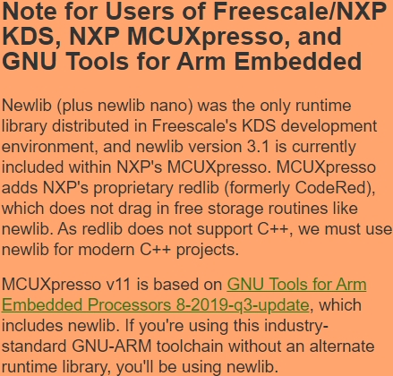
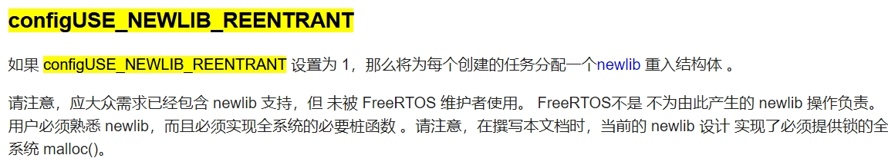

**嵌入式科普(6)你听说过FreeRTOS heap6吗？**
[toc]
# 一、目的/概述
上一节介绍eclipse+Arm GNU Toolchain+newlib是MCU/MPU开发中比较通用的，FreeRTOS+heap4也是比较常见的RTOS和动态内存管理。这些都结合到一起就足以应付较复杂功能的开发，例如：以太网相关编程。
**所以，在应用代码中、以太网协议栈、第三方库中不可避免的使用newlib c sprintf、malloc等功能，可能就会涉及多线程安全问题**

# 二、资料来源
- FreeRTOS堆内存管理：
https://freertos.org/zh-cn-cmn-s/a00111.html
- FreeRTOS Newlib support
https://nadler.com/embedded/newlibAndFreeRTOS.html
https://nadler.com/embedded/NXP_newlibAndFreeRTOS.html
- Red Hat newlib
https://sourceware.org/newlib/libc.html#Reentrancy
- FreeRTOS Helpers
https://github.com/DRNadler/FreeRTOS_helpers

# 三、问题或风险
- 问题描述：malloc溢出、sprintf hardfault。
- **库函数的多线程安全问题：函数不可重入、无互斥锁竞争**
st论坛：
https://community.st.com/t5/stm32cubemx-mcus/bug-cubemx-freertos-projects-corrupt-memory/m-p/267070
nxp论坛：
https://community.nxp.com/t5/Kinetis-Design-Studio/BUG-malloc-overruns-heap-returns-invalid-pointer-and-corrupts/m-p/645078
函数可重入性（Reentrancy)概念详解：
https://blog.csdn.net/acs713/article/details/20034511



1、STM32CubeIDE：这是STMicroelectronics提供的用于开发STM32微控制器的集成开发环境（IDE）。它集成了STM32CubeMX配置工具和STM32Cube HAL库，用于快速开发STM32微控制器的嵌入式应用程序。

2、Newlib 3.0：Newlib是一个用于嵌入式系统的C标准库实现，它提供了标准的C库函数，例如malloc、free、sprintf等。Newlib 3.0指的是Newlib的一个特定版本，可能在STM32CubeIDE中作为默认的C标准库实现。

3、FreeRTOS：FreeRTOS是一个用于嵌入式系统的开源实时操作系统（RTOS），它提供了任务调度、内存管理、同步机制等功能，适用于多任务处理的嵌入式应用。

4、malloc/free问题：在描述中提到，Cube-generated项目使用FreeRTOS时可能存在malloc/free等内存管理函数的问题。这意味着在使用FreeRTOS时，直接调用malloc/free函数、或者通过一些C标准库函数（如sprintf %f）间接调用malloc/free函数，甚至是通过STM提供的HAL库代码（如USB堆栈）间接调用malloc/free函数时，可能会导致内存损坏或其他问题。

**newlib C-RTL函数：这里指的是Newlib的C运行时库函数，包括标准的C库函数，如sprintf、malloc等。在描述中提到，通过这些函数间接调用malloc/free函数可能会导致问题。**

# 四、解决方案
## 4.1 FreeRTOS Newlib（heap6）的完整支持
**非常遗憾：FreeRTOS只解决了一半、芯片厂商并没有实现另一半**
FreeRTOS使能configUSE_NEWLIB_REENTRANT
https://freertos.org/zh-cn-cmn-s/a00110.html#configUSE_NEWLIB_REENTRANT



### 4.1.1 heap_useNewlib.c实现
- 感谢Dave Nadler这位喷子大佬
- 总结：用newlib动态内存代替FreeRTOS，实现malloc锁
- 从操作系统层面解决问题


### 4.1.2 问题复现和效果对比

- Newlib中的可重入性：
https://www.codeinsideout.com/blog/freertos/reentrant/#references
- FreeRTOS内存管理:
https://www.freertos.org/a00111.html
- 新功能界面:
http://pabigot.github.io/bspacm/newlib.html
- Newlib FreeRTOS内存管理:https://nadler.com/embedded/newlibAndFreeRTOS.html
- C库中的线程安全:
https://developer.arm.com/documentation/dui0492/I/the-c-and-c-libraries/thread-safe-c-library-functions

## 4.2、其他解决方案
- 自己封装需要的函数，增加互斥锁。
优点：按需封装
缺点：第三方库源码是否支持

- 关闭configUSE_TIME_SLICING
优点：不强制切换线程，间接解决
缺点：不强制切换线程，带来cpu利用率低

- vTaskSuspendAll();
优点：个别情况处理办法
缺点：频繁中断，效率低


# 五、引发思考
- 是否可以只实现newlic __malloc_lock、 __malloc_unlock，使用_vsnprintf_r等可重入函数，不修改pvPortMalloc为malloc呢？即同时使用FreeRTOS heap和newlib heap
- FreeRTOS heap4和newlib heap的效率和稳定性对比
```
#include <stdio.h>
#include <stdlib.h>
#include "FreeRTOS.h"
#include "task.h"

#define NUM_ALLOCATIONS 1000
#define ALLOCATION_SIZE 100

void testStandardMalloc() {
    for (int i = 0; i < NUM_ALLOCATIONS; i++) {
        void* ptr = malloc(ALLOCATION_SIZE);
        free(ptr);
    }
}

void testFreeRTOSHeap() {
    for (int i = 0; i < NUM_ALLOCATIONS; i++) {
        void* ptr = pvPortMalloc(ALLOCATION_SIZE);
        vPortFree(ptr);
    }
}

int main() {
    // Test standard malloc
    TickType_t start = xTaskGetTickCount();
    testStandardMalloc();
    TickType_t end = xTaskGetTickCount();
    printf("Standard malloc time: %d\n", end - start);

    // Test FreeRTOS heap
    start = xTaskGetTickCount();
    testFreeRTOSHeap();
    end = xTaskGetTickCount();
    printf("FreeRTOS heap time: %d\n", end - start);

    return 0;
}
```