嵌入式科普(7)你知道JTAG&SWD接口最少接几根线？
===
[toc]
# 一、目的/概述
- 1、那位同学直接抢答说2根线，数据+时钟。没错，提问中的“最少”二字、经验和直觉也告诉我们。
- 2、另外，JTAG&SWD接口、J-Link、ST-Link、ULINK、DP、JTAG-DP、SWJ-DP、I-Jet、20-pin 2.54mm端子、9-pin 2.0mm端子、20-pin 1.27mm端子等等，他们都是什么关系呢？
- 3、的确，最常用的调试接口，我甚至不需要去关注他了。
- 4、谈谈我碰到的问题，顺藤摸瓜的过程，最后的发问？

# 二、实际问题
## 2.1 原接线方式
- FC-20p 1.27mm容易损坏，使用1.25mm 单排转杜邦线
- **发现问题swd时灵时不灵**

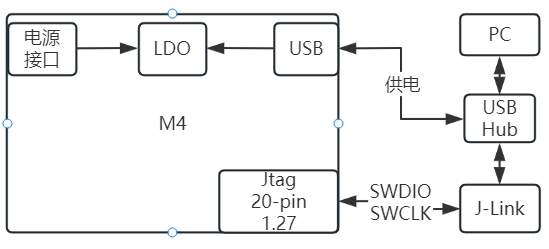
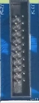
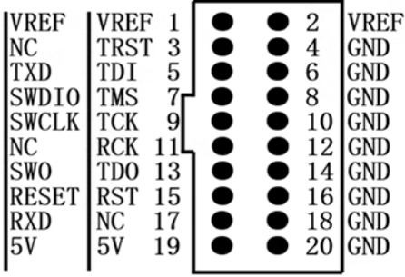
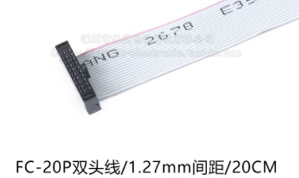
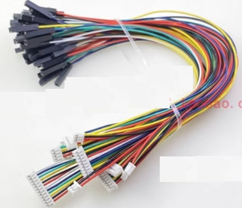

## 2.2 解决方案
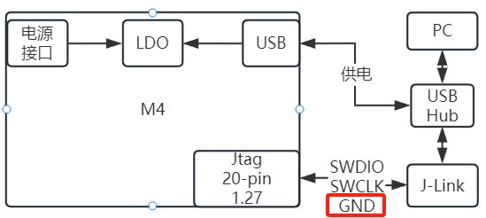

## 2.3 思考GND原因
SWD协议？SWD接口？J-Link？所谓干扰？标准在哪里？

# 三、资料来源
- [arm_cortex_m33_trm_100230_0100_07_en.pdf](./DOC/arm_cortex_m33_trm_100230_0100_07_en.pdf)
- [IHI0031G_debug_interface_v5_2_architecture_specification.pdf](./DOC/IHI0031G_debug_interface_v5_2_architecture_specification.pdf)
- [STM32数据手册、应用手册等](./DOC/CD00161566_ENV17.pdf)
- [UM08001 J-Link / J-Trace User Guide：https://wiki.segger.com/UM08001_J-Link_/_J-Trace_User_Guide#ARM_SWD_specifics](https://wiki.segger.com/UM08001_J-Link_/_J-Trace_User_Guide#ARM_SWD_specifics)
- [20-pin J-Link Connector：https://wiki.segger.com/20-pin_J-Link_Connector](https://wiki.segger.com/20-pin_J-Link_Connector)
- [9-pin JTAG/SWD connector：https://wiki.segger.com/9-pin_JTAG/SWD_connector](https://wiki.segger.com/9-pin_JTAG/SWD_connector)
- [J-Link Adapter：https://www.segger.com/products/debug-probes/j-link/accessories/adapters/ti-cti-20-adapter/](https://www.segger.com/products/debug-probes/j-link/accessories/adapters/ti-cti-20-adapter/)

# 四、JTAG&SWD相关概念的逻辑

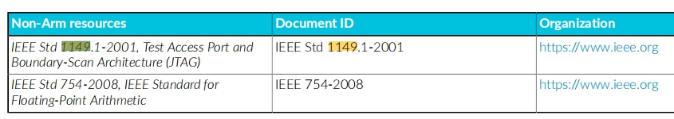  
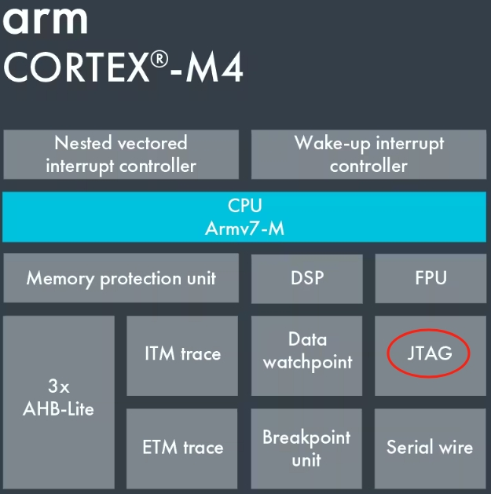
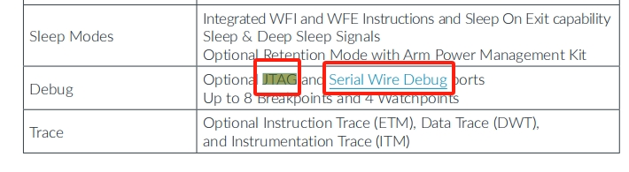

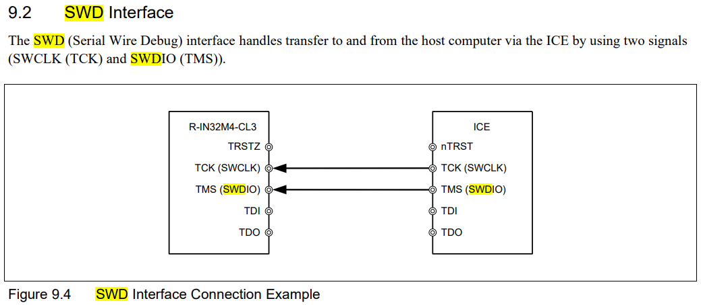
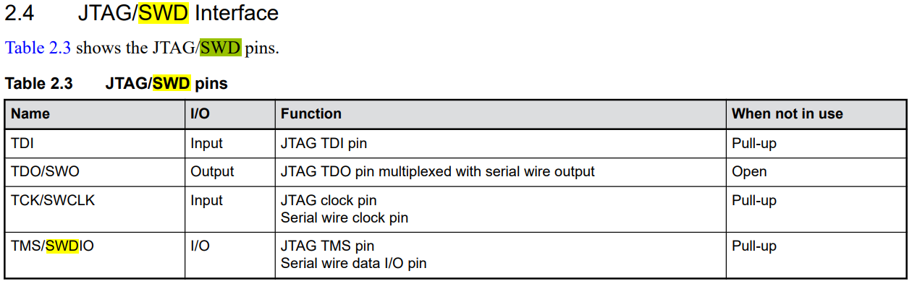
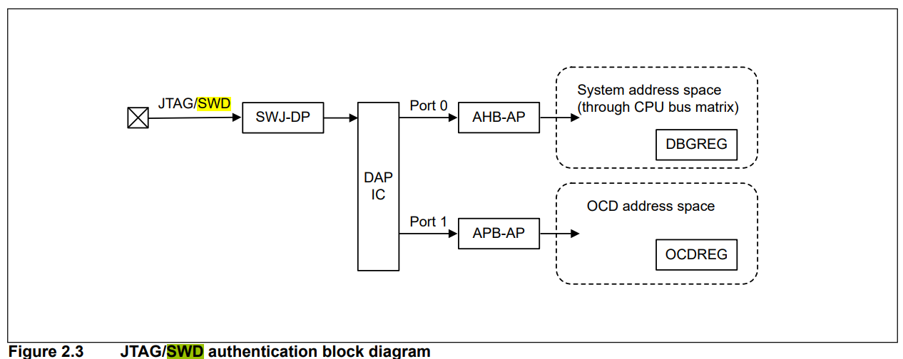
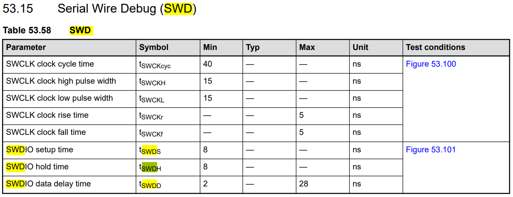
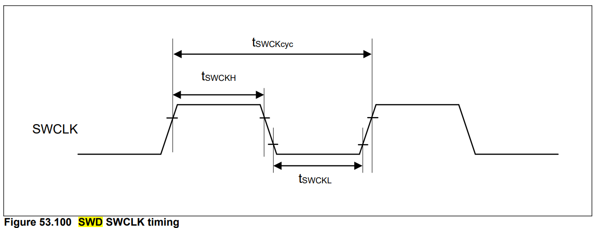
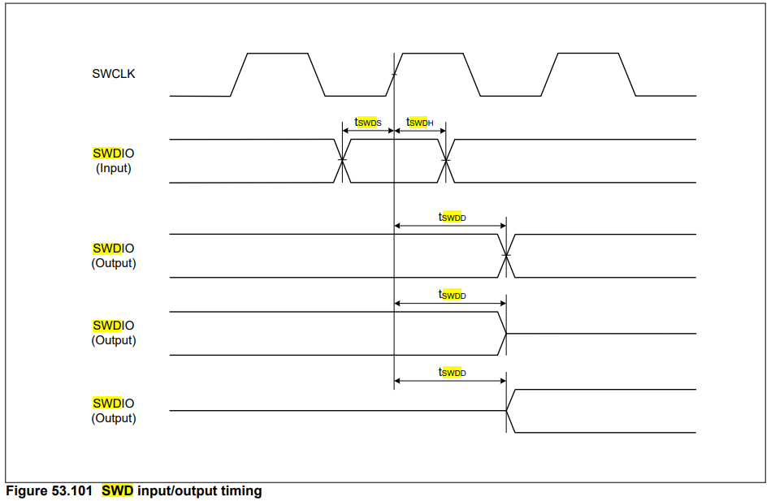


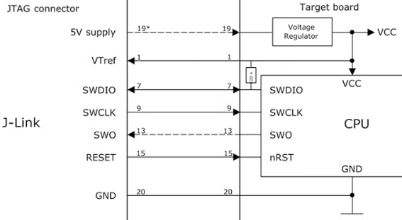


- **整理概念和逻辑关系：**

```mermaid
graph LR;
    A(IIEEE 1149.1<br>IEEE 1149.7) -->|使用| B(ARM);
    B -->|定义| B1(ADIv5.2标准：<br>JTAG-DP<br>SW-DP<br>SWJ-DP<br>AP)
    B1 -->|生产| C(Chip Manu);
    C -->|定义| C1(JTAG&SWD<br>电气特性)
    B1 -->|实现| D(1.SEGGER J-Link<br>2.IAR I-jet<br>3.ARM ULINK)
    C1 -->|实现| D(1.SEGGER J-Link<br>2.IAR I-jet<br>3.ARM ULINK)
  ```

```mermaid
graph LR;
   
    D(1.SEGGER J-Link<br>2.IAR I-jet<br>3.ARM ULINK) -->|使用| E(JTAG/SWD连接器：<br>1、20-pin 2.54mm<br>2、20-pin 2.0mm<br>3、20-pin 1.27mm<br>4、9-pin 2.54mm<br>5、9-pin 2.0mm<br>6、9-pin 1.27mm)
    E -->|发展| F(SWD连接器:<br>6-pin 2.54mm<br>4-pin 2.54mm)
  ```

# 五、总结和提问
- 标准、ARM、芯片都没有谈到GND，只有J-Link调试器谈到“共地”，但没有说具体要求
- 测试过其他芯片和开发板是可以通过usb/电源共地的
- 什么原因？进一步诊断？
- **所以，JTAG&SWD接口推荐最少接3根线**


  