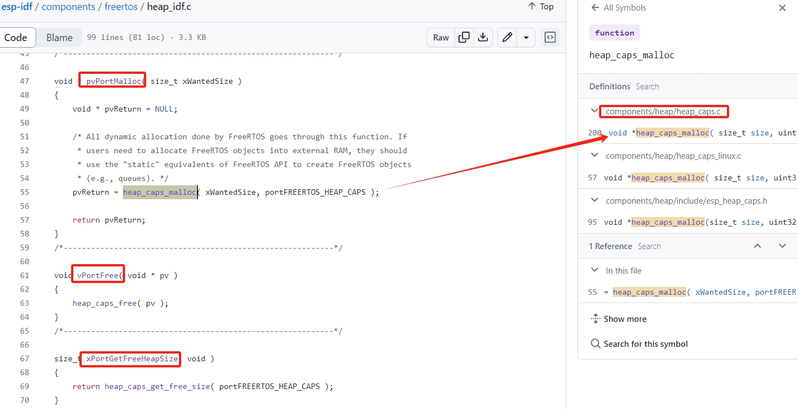
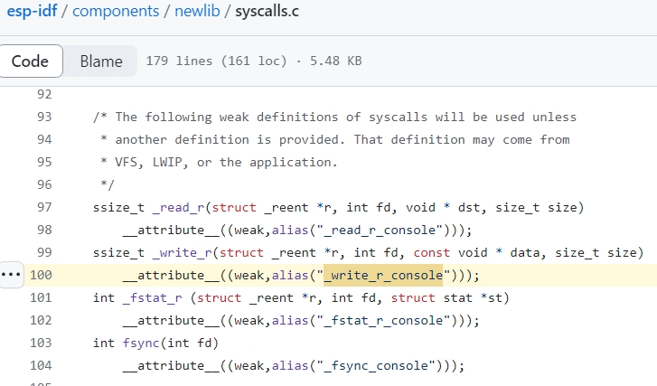

嵌入式科普(8)ESP-IDF newlib相关介绍和对比分析
===
[toc]
# 一、目的/概述
- 1、在我的[嵌入式科普(6)你听说过FreeRTOS heap6吗？](../6_FreeRTOS%20heap6/README.md)b站有评论ESP-IDF
- 2、我们就来简介ESP-IDF，重点看看与newlib相关的概念和源码
- 3、对比分析

# 二、资料来源
- ESP-IDF：https://www.espressif.com.cn/zh-hans/products/sdks/esp-idf
- ESP-IDF 编程指南：https://docs.espressif.com/projects/esp-idf/zh_CN/latest/esp32/
- esp-idf github：https://github.com/espressif/esp-idf/tree/master

# 三、ESP-IDF简介
- 首版ESP-IDFv0.9 Sep 30, 2016 ===> 里程碑ESP-IDFv5.0 2022年12月30日。
- 2019 年 7 月，乐鑫科技在上海证券交易所科创板挂牌上市
- ESP-IDF（Espressif IoT Development Framework 乐鑫物联网开发框架物联网开发框架）

|芯片         |         v4.3           |          v4.4          |          v5.0          |          v5.1          |          v5.2          |                                                                 |
|:----------- | :---------------------:| :---------------------:| :---------------------:| :--------------------: | :--------------------: | :-------------------------------------------------------------- |
|ESP32        | ![alt text][supported] | ![alt text][supported] | ![alt text][supported] | ![alt text][supported] | ![alt text][supported] |                                                                 |
|ESP32-S2     | ![alt text][supported] | ![alt text][supported] | ![alt text][supported] | ![alt text][supported] | ![alt text][supported] |                                                                 |
|ESP32-C3     | ![alt text][supported] | ![alt text][supported] | ![alt text][supported] | ![alt text][supported] | ![alt text][supported] |                                                                 |
|ESP32-S3     |                        | ![alt text][supported] | ![alt text][supported] | ![alt text][supported] | ![alt text][supported] | [芯片发布公告](https://www.espressif.com/zh-hans/news/ESP32_S3) |
|ESP32-C2     |                        |                        | ![alt text][supported] | ![alt text][supported] | ![alt text][supported] | [芯片发布公告](https://www.espressif.com/zh-hans/news/ESP32-C2) |
|ESP32-C6     |                        |                        |                        | ![alt text][supported] | ![alt text][supported] | [芯片发布公告](https://www.espressif.com/zh-hans/news/ESP32_C6) |
|ESP32-H2     |                        |                        |                        | ![alt text][supported] | ![alt text][supported] | [芯片发布公告](https://www.espressif.com/zh-hans/news/ESP32_H2) |
|ESP32-P4     |                        |                        |                        |                        | ![alt text][preview]   | [芯片发布公告](https://www.espressif.com/en/news/ESP32-P4)      |

[supported]: https://img.shields.io/badge/-%E6%94%AF%E6%8C%81-green "supported"
[preview]: https://img.shields.io/badge/-%E9%A2%84%E8%A7%88-orange "preview"

## 3.1 ESP-IDF FreeRTOS
- FreeRTOS-Kernel-SMP
- FreeRTOS-Kernel

## 3.2 ESP-IDF heap_caps
- Heap初始化: voidheap_caps_init(void)

- Heap分配:   void *heap_caps_malloc( size_t size,uint32_t caps )

- Heap释放:   void heap_caps_free(void *ptr)

- [esp32 heap 内存管理简析](https://blog.csdn.net/abc517789065/article/details/79680214)

## 3.3 ESP-IDF newlib
- ESP32 SDK中的malloc/calloc/free等系统调用，最终都是调用以上函数执行(参见syscall_stub_table)
- _write_r ===>  _write_r_console ===> esp_rom_uart_tx_one_char

# 四、对比
|类型|软件|对比特点|
|:-- | :--| :--|
|mcu/mpu|库+freertos+其他| 毛坯房+傲慢 |
|soc|esp-idf | 精装修+接地气 |
