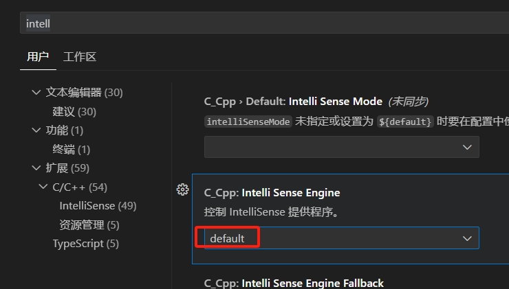

嵌入式科普(9)vscode无法跳转和恢复默认配置
===
[toc]
# 一、目的/概述
- 1、2024年的第一天突然vscode无法跳转,莫名其妙
- 2、尝试了各种设置和插件都无效，卸载重装vscode也无效，删除C:\Users\jerry\.vscode也无效
- 3、Intelli Sense Engine 和 vscode恢复默认配置
  

# 二、解决办法
vscode官方搜索go to references：https://code.visualstudio.com/docs/getstarted/tips-and-tricks#_go-to-references

## 2.1 使能Intelli Sense Engine

## 2.2 vscode恢复默认配置
- 如何恢复vscode默认设置呢？
- 删除C:\Users\jerry\AppData\Roaming\Code\User\settings.json

## 2.3 c/c++与clangd冲突

- bing搜索clangd和c c++ intellisense冲突：
  https://cn.bing.com/search?q=clangd%e5%92%8cc+c%2b%2b+intellisense%e5%86%b2%e7%aa%81&qs=SSA&pq=clangd+c_cpp%3a+intelli+sense+engine&sk=SSA5&sc=10-34&cvid=46542CE312A34B6FA107137F56C2A268&FORM=QBRE&sp=6&lq=0
- VSCode - 使用Clangd搭建C++开发环境
  https://zhuanlan.zhihu.com/p/583201222
- clangd到底怎么使用呢？